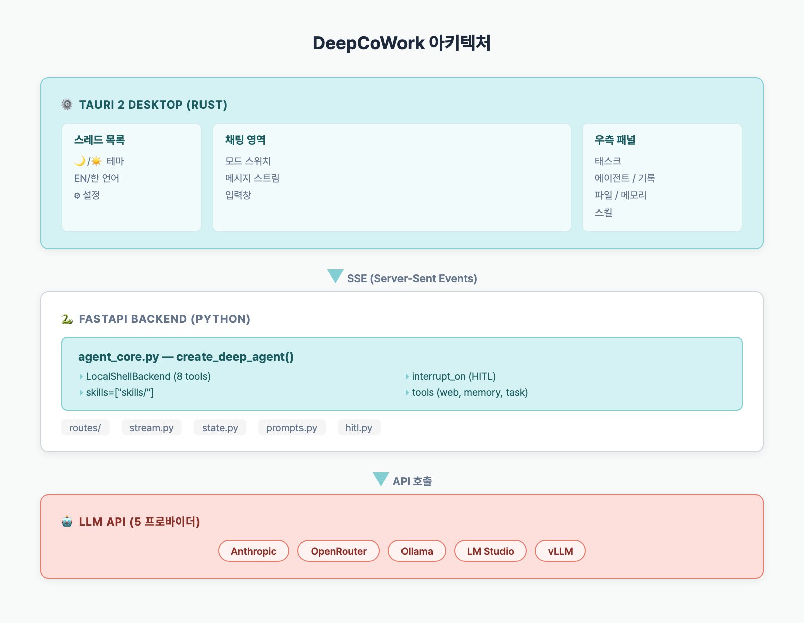

> **TL;DR**: DeepCoWork는 [Deep Agents SDK](https://github.com/langchain-ai/deepagents) + [Tauri 2](https://v2.tauri.app/) 기반 오픈소스 AI 에이전트 데스크톱 앱으로, 5개 LLM 프로바이더와 HITL 승인을 지원한다.

## Table of contents

## 왜 만들었나

Claude Cowork가 나왔을 때 "이걸 오픈소스로 만들 수 있겠다"고 생각했다. Anthropic의 [Deep Agents SDK](https://github.com/langchain-ai/deepagents)가 Apache 2.0으로 공개되어 있었고, [Tauri 2](https://v2.tauri.app/start/)의 sidecar 기능으로 Python 백엔드를 데스크톱에 임베딩할 수 있었다. 핵심 4대 요소가 명확했다:

| 구성요소 | 역할 |
|----------|------|
| **Planning Tool** | 태스크 분해 및 우선순위 관리 (Todo 리스트) |
| **Subagents** | 도메인 특화 격리 실행 worker |
| **Virtual Filesystem** | 에이전트 간 공유 메모리 / 정보 교환 |
| **System Prompt** | 복잡한 시나리오 대응 행동 지침 |

직접 만들면 모델 종속 없이, 로컬 LLM도 쓸 수 있고, 프롬프트도 자유롭게 설계할 수 있다.

## 전체 아키텍처



### 3계층 구조

1. **Tauri (Rust)** — OS 네이티브 윈도우, Python 프로세스 관리, 보안 (CSP)
2. **React (TypeScript)** — 채팅 UI, SSE 스트리밍, Zustand 상태관리
3. **FastAPI (Python)** — DeepAgents SDK, LLM 호출, 도구 실행, HITL

Tauri가 Python 백엔드를 sidecar로 실행하고, 프론트엔드는 SSE로 실시간 토큰을 받아 렌더링한다.

## 핵심 코드: 에이전트 생성

에이전트 코어는 `agent_core.py` 단 하나 파일에 집중되어 있다:

```python
from deepagents import create_deep_agent
from deepagents.backends import LocalShellBackend

def build_agent(workspace_dir, checkpointer, mode, tools):
    llm = build_llm()  # 5개 프로바이더 중 선택

    backend = LocalShellBackend(
        root_dir=str(workspace_dir),
        virtual_mode=False,
        timeout=60,
        max_output_bytes=50_000,
    )

    return create_deep_agent(
        model=llm,
        tools=tools,                    # web_search, memory, task
        backend=backend,                # 파일/셸 도구 8개 자동 제공
        interrupt_on={                  # HITL: 이 도구들은 사용자 승인 필요
            "write_file": True,
            "edit_file": True,
            "execute": True,
        },
        checkpointer=checkpointer,      # SQLite 기반 대화 영속
        system_prompt=prompt,           # 모드별 시스템 프롬프트
        skills=["skills/"],             # 폴더 기반 스킬 로딩
    )
```

`create_deep_agent()`가 내부적으로 해주는 것:
- **LangGraph ReAct 루프** — 모델 호출 → 도구 실행 → 반복
- **LocalShellBackend** — `read_file`, `write_file`, `edit_file`, `execute`, `ls`, `glob`, `grep`, `write_todos` 8개 도구
- **interrupt_on** — 지정된 도구 호출 시 자동 중단 (사용자 승인 대기)
- **SkillsMiddleware** — `SKILL.md` 파일을 시스템 프롬프트에 progressive disclosure로 주입

## 주요 기능

### 4가지 실행 모드

| 모드 | 역할 | 특징 |
|------|------|------|
| **Clarify** | 요구사항 수집 | 직접 조사 후 핵심 질문만 |
| **Code** | 페어 프로그래밍 | 최소 변경, 기존 스타일 준수 |
| **Cowork** | 자율 실행 | plan.md 생성 → 단계별 실행 |
| **ACP** | 멀티에이전트 | 서브에이전트에게만 위임 |

### Human-in-the-Loop (HITL)

파일 쓰기나 셸 실행 같은 위험한 작업은 에이전트가 자동 실행하지 않는다:

```
에이전트: write_file 호출 → interrupt_on 트리거
  → 프론트엔드 승인 모달 표시
  → 사용자: 승인 또는 거부
  → 승인 시 실행, 거부 시 에이전트가 대안 탐색
```

30초 타임아웃 후 자동 거부 — 방치해도 안전하다.

### Skills 시스템

`~/.cowork/workspace/skills/` 폴더에 `SKILL.md` 파일을 넣으면 에이전트 능력이 확장된다:

```yaml
---
name: code-review
description: 체계적인 코드 리뷰를 수행합니다
allowed-tools: read_file glob grep execute
---

# Code Review Skill

## When to Use
- 사용자가 코드 리뷰를 요청할 때
...
```

에이전트는 메타데이터만 먼저 보고, 필요할 때 전체 내용을 읽는다 (progressive disclosure).

### 5개 LLM 프로바이더

| 프로바이더 | 타입 | 모델 선택 |
|-----------|------|----------|
| Anthropic | 클라우드 | 텍스트 입력 |
| OpenRouter | 클라우드 | 텍스트 입력 |
| Ollama | 로컬 | 서버에서 자동 조회 |
| LM Studio | 로컬 | 서버에서 자동 조회 |
| vLLM | 로컬 | 서버에서 자동 조회 |

로컬 프로바이더는 서버 URL 입력 후 "조회" 버튼으로 사용 가능한 모델 목록을 자동으로 가져온다.

## 기술 스택

| 계층 | 기술 | 역할 |
|------|------|------|
| Desktop | Tauri 2 (Rust) | 윈도우, 프로세스 관리, CSP |
| Frontend | React 19 + Zustand | UI, 상태관리 |
| Styling | Tailwind CSS 4 | 다크/라이트 테마 |
| Backend | FastAPI + uvicorn | REST + SSE |
| Agent | Deep Agents SDK | ReAct 루프, 도구, HITL |
| LLM | LangChain | 프로바이더 추상화 |
| DB | SQLite (LangGraph) | 체크포인터, 스레드 메타 |
| Build | PyInstaller + GitHub Actions | 크로스 플랫폼 |

## 설치 & 실행

### 다운로드 (권장)

[GitHub Releases](https://github.com/BAEM1N/deep-cowork/releases)에서 OS별 설치 파일:

- macOS: `.dmg`
- Windows: `.exe`
- Linux: `.AppImage`

Python 설치 불필요 — PyInstaller로 번들링되어 있다.

### 개발 모드

```bash
git clone https://github.com/BAEM1N/deep-cowork.git
cd deep-cowork

# Frontend
cd app && npm install

# Backend
cd ../agent && python -m venv .venv && source .venv/bin/activate
pip install -e .

# API 키 설정
echo "LLM_PROVIDER=openrouter" > .env
echo "OPENROUTER_API_KEY=sk-or-..." >> .env
echo "MODEL_NAME=anthropic/claude-sonnet-4-5" >> .env

# 실행
cd ../app && npm run tauri dev
```

## 다음 편 예고

이 시리즈에서는 DeepCoWork의 각 계층을 깊이 파고듭니다:

1. **이번 글** — 소개, 아키텍처 개요
2. Tauri + Python 사이드카 아키텍처
3. DeepAgents SDK 핵심 해부
4. 모드별 시스템 프롬프트 설계
5. SSE 스트리밍 파이프라인
6. HITL 승인 플로우
7. 멀티에이전트 ACP 모드
8. 에이전트 메모리 4계층
9. Skills 시스템
10. LLM 프로바이더 통합
11. 보안 체크리스트
12. GitHub Actions 크로스 플랫폼 빌드

소스코드: [github.com/BAEM1N/deep-cowork](https://github.com/BAEM1N/deep-cowork)

## 실측 데이터

| 항목 | 수치 |
|------|------|
| Tauri 앱 바이너리 (sidecar 제외) | ~12MB (macOS arm64) |
| PyInstaller sidecar 바이너리 | ~95MB (DeepAgents + LangChain + FastAPI 포함) |
| 전체 .dmg 설치 파일 크기 | ~110MB |
| 콜드 스타트 (앱 실행 → 첫 채팅 가능) | ~4.2초 (M1 Mac 기준) |
| 메모리 사용량 (유휴 시) | ~180MB (Tauri ~45MB + Python ~135MB) |

## 자주 묻는 질문

### DeepCoWork와 Claude Cowork의 차이는?

Claude Cowork는 Anthropic의 클로즈드 소스 제품이다. DeepCoWork는 동일한 Deep Agents SDK를 사용하지만 완전 오픈소스(MIT)이고, 모델 종속이 없으며, 로컬 LLM도 지원한다.

### 왜 Tauri를 선택했나?

Electron 대비 바이너리 크기가 작고 (10MB vs 150MB+), 메모리 사용량이 낮다. Rust 기반이라 Python 프로세스 관리도 안정적이다.

### 왜 DeepAgents SDK인가? create_react_agent로 직접 만들면 안 되나?

`create_react_agent`의 `interrupt_before`는 노드 이름만 지원해서 도구별 HITL이 불가능하다. DeepAgents의 `interrupt_on`은 도구 이름별로 세밀하게 제어할 수 있고, `LocalShellBackend`이 파일/셸 도구 8개를 자동 제공해서 직접 구현할 필요가 없다.

### 로컬 LLM으로도 잘 동작하나?

Ollama + llama3.1 8B로 테스트했다. 파일 읽기/쓰기, 셸 실행 같은 기본 작업은 동작하지만, 복잡한 멀티에이전트 태스크는 Claude/GPT-4급 모델이 필요하다.
