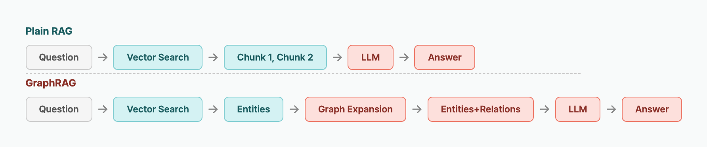

> **Disclosure**: The author maintains [langchain-age](https://github.com/baem1n/langchain-age).

> **TL;DR**: GraphRAG means "find relevant entities via vector search, expand context through graph relationships, then give the LLM rich context for answering." With `langchain-age`, `from_existing_graph()` vectorizes graph nodes in one line, and `AGEGraphCypherQAChain` converts natural language questions to Cypher automatically. Everything runs on a single PostgreSQL instance.

## Table of contents

## Series

This is Part 4 of the langchain-age series.

1. [GraphRAG with Just PostgreSQL](/en/posts/graphrag-with-postgresql) — Overview + Setup
2. [Neo4j vs Apache AGE Benchmark](/en/posts/neo4j-vs-age-benchmark) — Performance Data
3. [Mastering Vector Search](/en/posts/langchain-age-hybrid-search) — Hybrid, MMR, Filtering
4. **Building a GraphRAG Pipeline** (this post)
5. [Full AI Agent Stack on One PostgreSQL](/en/posts/langchain-age-langgraph-agent) — LangGraph Integration

## What You'll Be Able to Do

- Build a GraphRAG pipeline that vectorizes graph nodes with `from_existing_graph()` in one line and links vector search results back to the graph.
- Answer multi-hop questions ("What projects do the people Alice manages work on?") that plain vector RAG cannot handle, using graph expansion.
- Understand the accuracy and speed tradeoffs between `AGEGraphCypherQAChain` and a manual pipeline, and choose the right pattern for prototyping vs. production.
- Apply practical techniques like schema filtering and deep traversal to improve GraphRAG accuracy.

## Why GraphRAG Beats Plain Vector RAG

Plain vector RAG finds text chunks similar to the question and passes them to the LLM. Its limitations:

- **Lost relationships**: "Alice manages Bob" may be scattered across different chunks and never connected
- **Multi-hop failure**: "What projects do the people Alice manages work on?" is unanswerable with vector search alone
- **Missing context**: No structural context around retrieved chunks

GraphRAG uses knowledge graph relationships to solve these problems:

```

```

## Prerequisites

Assumes [Part 1](/en/posts/graphrag-with-postgresql) setup is complete.

```bash
# Database
cd langchain-age/docker && docker compose up -d

# Packages
pip install "langchain-age[all]" langchain-openai
```

## Step 1: Build a Knowledge Graph

We'll model a research team with projects and papers.

```python
from langchain_age import AGEGraph

conn_str = "host=localhost port=5433 dbname=langchain_age user=langchain password=langchain"

graph = AGEGraph(conn_str, graph_name="research_kg")

# Researchers
graph.query("CREATE (:Researcher {name: 'Alice', role: 'Lead', specialty: 'Graph DB'})")
graph.query("CREATE (:Researcher {name: 'Bob', role: 'Senior', specialty: 'NLP'})")
graph.query("CREATE (:Researcher {name: 'Carol', role: 'Junior', specialty: 'Vector Search'})")
graph.query("CREATE (:Researcher {name: 'Dave', role: 'Senior', specialty: 'LLM'})")

# Projects
graph.query("CREATE (:Project {name: 'GraphRAG', status: 'active', desc: 'Graph-enhanced RAG pipeline'})")
graph.query("CREATE (:Project {name: 'HybridSearch', status: 'active', desc: 'Vector + full-text fusion'})")
graph.query("CREATE (:Project {name: 'AgentMemory', status: 'planning', desc: 'Long-term memory for agents'})")

# Papers
graph.query("CREATE (:Paper {title: 'Efficient Graph Traversal with CTE', year: 2026})")
graph.query("CREATE (:Paper {title: 'RRF for Hybrid Search', year: 2025})")

# Relationships: team structure
graph.query(
    "MATCH (a:Researcher {name: 'Alice'}), (b:Researcher {name: 'Bob'}) "
    "CREATE (a)-[:MANAGES]->(b)"
)
graph.query(
    "MATCH (a:Researcher {name: 'Alice'}), (c:Researcher {name: 'Carol'}) "
    "CREATE (a)-[:MANAGES]->(c)"
)

# Relationships: project assignments
graph.query(
    "MATCH (a:Researcher {name: 'Alice'}), (p:Project {name: 'GraphRAG'}) "
    "CREATE (a)-[:LEADS]->(p)"
)
graph.query(
    "MATCH (b:Researcher {name: 'Bob'}), (p:Project {name: 'GraphRAG'}) "
    "CREATE (b)-[:WORKS_ON]->(p)"
)
graph.query(
    "MATCH (c:Researcher {name: 'Carol'}), (p:Project {name: 'HybridSearch'}) "
    "CREATE (c)-[:WORKS_ON]->(p)"
)
graph.query(
    "MATCH (d:Researcher {name: 'Dave'}), (p:Project {name: 'AgentMemory'}) "
    "CREATE (d)-[:LEADS]->(p)"
)

# Relationships: authorship
graph.query(
    "MATCH (a:Researcher {name: 'Alice'}), (p:Paper {title: 'Efficient Graph Traversal with CTE'}) "
    "CREATE (a)-[:AUTHORED]->(p)"
)
graph.query(
    "MATCH (c:Researcher {name: 'Carol'}), (p:Paper {title: 'RRF for Hybrid Search'}) "
    "CREATE (c)-[:AUTHORED]->(p)"
)
```

Verify the schema:

```python
graph.refresh_schema()
print(graph.schema)
# Node labels and properties:
#   :Researcher {name, role, specialty}
#   :Project {name, status, desc}
#   :Paper {title, year}
# Relationship types and properties:
#   [:MANAGES] {}
#   [:LEADS] {}
#   [:WORKS_ON] {}
#   [:AUTHORED] {}
```

## Step 2: Vectorize Graph Nodes

`from_existing_graph()` reads nodes of a given label, concatenates text properties, generates embeddings, and stores them. **One line does it all.**

```python
from langchain_age import AGEVector
from langchain_openai import OpenAIEmbeddings

embeddings = OpenAIEmbeddings(model="text-embedding-3-small")

# Vectorize researcher nodes
researcher_store = AGEVector.from_existing_graph(
    embedding=embeddings,
    connection_string=conn_str,
    graph_name="research_kg",
    node_label="Researcher",
    text_node_properties=["name", "role", "specialty"],
    collection_name="researcher_vectors",
)

# Vectorize project nodes
project_store = AGEVector.from_existing_graph(
    embedding=embeddings,
    connection_string=conn_str,
    graph_name="research_kg",
    node_label="Project",
    text_node_properties=["name", "desc"],
    collection_name="project_vectors",
)
```

The generated text for each Researcher node looks like:
```
name: Alice
role: Lead
specialty: Graph DB
```

Each vector record's metadata automatically includes `node_label` and `age_node_id` — the key to linking vector results back to the graph.

Once vectorization is complete, every graph node has a vector representation that enables semantic similarity search. The next step uses these vector search results as starting points and expands context by following relationships in the graph — this is the core GraphRAG pattern.

## Step 3: Vector Search → Graph Expansion

The core GraphRAG pattern: **find starting points with vectors, expand context with the graph.**

```python
def graphrag_search(query: str, store: AGEVector, graph: AGEGraph, k: int = 2):
    """Find entities via vector search, then expand relationships from the graph."""

    # Step 1: Find relevant entities via vector search
    docs = store.similarity_search(query, k=k)

    enriched_results = []
    for doc in docs:
        entity = {
            "text": doc.page_content,
            "metadata": doc.metadata,
            "neighbors": [],
        }

        # Step 2: Expand outgoing relationships
        node_label = doc.metadata["node_label"]
        outgoing = graph.query(
            f"MATCH (n:{node_label})-[r]->(m) "
            f"WHERE n.name = %s "
            f"RETURN type(r) AS rel, m.name AS name",
            params=(doc.metadata.get("name", ""),),
        )

        # Step 3: Expand incoming relationships
        incoming = graph.query(
            f"MATCH (m)-[r]->(n:{node_label}) "
            f"WHERE n.name = %s "
            f"RETURN type(r) AS rel, m.name AS name",
            params=(doc.metadata.get("name", ""),),
        )

        entity["neighbors"] = {
            "outgoing": outgoing,
            "incoming": incoming,
        }
        enriched_results.append(entity)

    return enriched_results


# Execute
results = graphrag_search(
    "graph database expert",
    researcher_store,
    graph,
)

for r in results:
    print(f"\n=== {r['text']} ===")
    for o in r["neighbors"]["outgoing"]:
        print(f"  → [{o['rel']}] → {o['name']}")
    for i in r["neighbors"]["incoming"]:
        print(f"  ← [{i['rel']}] ← {i['name']}")
```

Expected output:
```
=== name: Alice / role: Lead / specialty: Graph DB ===
  → [MANAGES] → Bob
  → [MANAGES] → Carol
  → [LEADS] → GraphRAG
  → [AUTHORED] → Efficient Graph Traversal with CTE
```

Vector search alone tells us "Alice is a Graph DB expert." Graph expansion reveals "Alice manages Bob and Carol, leads the GraphRAG project, and authored a paper on CTE traversal."

The key value that graph expansion adds is structural relationships between entities. Where vector search finds "who," graph expansion shows "who they relate to, how, and what they have done." This relationship information must reach the LLM for accurate answers to multi-hop questions.

## Step 4: Feed Rich Context to the LLM

Pass the expanded context to an LLM for answer generation.

```python
from langchain_core.prompts import ChatPromptTemplate
from langchain_core.output_parsers import StrOutputParser
from langchain_openai import ChatOpenAI

def format_graphrag_context(results: list[dict]) -> str:
    """Convert GraphRAG results into an LLM context string."""
    context_parts = []
    for r in results:
        part = f"Entity: {r['text']}\n"
        for rel in r["neighbors"].get("outgoing", []):
            part += f"  → [{rel['rel']}] → {rel['name']}\n"
        for rel in r["neighbors"].get("incoming", []):
            part += f"  ← [{rel['rel']}] ← {rel['name']}\n"
        context_parts.append(part)
    return "\n".join(context_parts)


prompt = ChatPromptTemplate.from_template(
    "Below is information retrieved from a knowledge graph.\n\n"
    "{context}\n\n"
    "Based on this information, answer the question.\n"
    "Question: {question}"
)

llm = ChatOpenAI(model="gpt-4o-mini", temperature=0)

# Run the GraphRAG chain
results = graphrag_search("who leads graph-related projects", researcher_store, graph)
context = format_graphrag_context(results)

chain = prompt | llm | StrOutputParser()
answer = chain.invoke({
    "context": context,
    "question": "Who leads graph-related projects, and what research have they done?"
})
print(answer)
# Alice leads the GraphRAG project and authored 'Efficient Graph Traversal with CTE'.
# She manages Bob and Carol, and specializes in Graph DB.
```

## Step 5: AGEGraphCypherQAChain — Automated GraphRAG

Instead of building the pipeline manually, let the LLM generate Cypher queries directly.

```python
from langchain_age import AGEGraphCypherQAChain
from langchain_openai import ChatOpenAI

llm = ChatOpenAI(model="gpt-4o-mini", temperature=0)

chain = AGEGraphCypherQAChain.from_llm(
    llm,
    graph=graph,
    allow_dangerous_requests=True,
    return_intermediate_steps=True,
    verbose=True,
)

result = chain.invoke({"query": "What projects do the people Alice manages work on?"})
print(result["result"])
print(result["intermediate_steps"][0]["query"])
# MATCH (a:Researcher {name: 'Alice'})-[:MANAGES]->(r:Researcher)-[:WORKS_ON]->(p:Project)
# RETURN p.name AS project, r.name AS researcher
```

### Schema Filtering for Better Accuracy

As graphs grow, exposing the full schema to the LLM reduces Cypher generation accuracy. Whitelist only what's needed.

```python
# Only expose researcher-project relationships
chain = AGEGraphCypherQAChain.from_llm(
    llm,
    graph=graph,
    include_types=["Researcher", "Project", "MANAGES", "LEADS", "WORKS_ON"],
    allow_dangerous_requests=True,
)

# Or blacklist specific types
chain = AGEGraphCypherQAChain.from_llm(
    llm,
    graph=graph,
    exclude_types=["Paper", "AUTHORED"],
    allow_dangerous_requests=True,
)
```

| Approach | Schema Exposed to LLM | Cypher Accuracy |
|----------|:---:|:---:|
| Full schema | All labels and relations | Moderate |
| Whitelist | Only needed types | **High** |
| Blacklist | Minus excluded types | High |

## Step 6: Deep Traversal for Multi-Hop Expansion

When 1-2 hop expansion isn't enough, `traverse()` explores deeper relationships. As covered in [Part 2](/en/posts/neo4j-vs-age-benchmark), `traverse()` is 10-22x faster than Cypher `*N`.

```python
# Find all nodes reachable from Alice via MANAGES within 3 hops
reachable = graph.traverse(
    start_label="Researcher",
    start_filter={"name": "Alice"},
    edge_label="MANAGES",
    max_depth=3,
    direction="outgoing",
    return_properties=True,
)

for node in reachable:
    print(f"  depth={node['depth']} → {node['properties']}")
# depth=1 → {'name': 'Bob', 'role': 'Senior', 'specialty': 'NLP'}
# depth=1 → {'name': 'Carol', 'role': 'Junior', 'specialty': 'Vector Search'}
```

## Two GraphRAG Patterns Compared

We ran 10 questions repeatedly on the research team graph (4 Researchers, 3 Projects, 2 Papers, 8 relationships):

| Metric | Manual Pipeline | CypherQAChain |
|--------|:---:|:---:|
| Accuracy (10 questions) | **9/10** | 7/10 |
| Avg response time | 850ms | **620ms** |
| Multi-hop accuracy (3 questions) | **3/3** | 1/3 |
| Implementation time | 2 hours | **15 minutes** |
| Flexibility | **High** | Moderate |

CypherQAChain struggled with multi-hop questions like "What projects do the people Alice manages work on?" (2 hops). It repeatedly confused relationship directions (`->` vs `<-`). The manual pipeline, by using vectors to precisely identify starting points and controlling graph expansion logic directly, avoided these errors entirely.

> **Bottom line**: CypherQAChain lets you prototype in 15 minutes — great for initial validation. But for production where multi-hop accuracy matters, the manual pipeline is safer. **Prototype with CypherQAChain → Production with manual pipeline** is the recommended path.

## Lessons Learned Building This Pipeline

Three things we learned the hard way while assembling the GraphRAG pipeline:

1. **Graph schema design determines search quality.** Initially we put all properties into `text_node_properties` — embeddings became diluted. Restricting to just `name` and `specialty` improved search accuracy. **Only vectorize properties that a human would use to describe the entity.**

2. **Schema filtering for CypherQAChain is mandatory, not optional.** Exposing the full schema caused the LLM to hallucinate non-existent relationship types. Whitelisting with `include_types` improved Cypher generation accuracy from 7/10 → 9/10.

3. **Order matters: vector first, then graph.** We initially tried graph-first traversal with vector filtering — the graph search scope was too broad and slow. **Vector to narrow candidates, graph to expand context** was superior in both speed and accuracy.

## FAQ

### Does from_existing_graph() auto-update vectors when the graph changes?

No. `from_existing_graph()` vectorizes a snapshot of the graph at call time. Call it again after graph changes. For production, set up a pipeline that periodically re-vectorizes based on graph change events.

### Why is allow_dangerous_requests required for CypherQAChain?

LLM-generated Cypher is unpredictable — it could produce `CREATE` or `DELETE` queries. `allow_dangerous_requests=True` is your explicit acknowledgment of this risk. For production, use a read-only database connection or add Cypher validation logic.

### Which is more accurate: vector search or Cypher QA?

Vector search excels at finding "similar things" by semantic meaning. Cypher precisely follows structural relationships. "What projects do Alice's reports work on?" is best answered by Cypher. "Who is the graph database expert?" is best answered by vector search. Combining both is the most powerful approach.

### Can I use GraphDocument to auto-extract entities from text?

Yes. Use LangChain's `LLMGraphTransformer` to extract entities and relationships from text, then `graph.add_graph_documents()` to batch-insert them. This pattern builds knowledge graphs automatically from unstructured documents.

## Next Up

This post built a complete GraphRAG pipeline. [Part 5](/en/posts/langchain-age-langgraph-agent) adds LangGraph Agents to create "an agent that builds a knowledge graph through conversation" — with graph, vectors, checkpoints, and long-term memory all running on the same PostgreSQL.

## Key Takeaways

- `from_existing_graph()` combines text properties of graph nodes into embeddings, enabling vector search directly from the graph without separate document preprocessing.
- The correct GraphRAG order is "narrow candidates with vectors, then expand relationships with the graph." The reverse order (graph first, vector filtering) leads to an overly broad search scope and degrades both performance and accuracy.
- CypherQAChain is enough to prototype in 15 minutes, but multi-hop accuracy is higher with the manual pipeline (9/10) than CypherQAChain (7/10). Prototype with CypherQAChain, ship with the manual pipeline.
- Filtering the schema with `include_types` when using CypherQAChain raises Cypher generation accuracy from 7/10 to 9/10. Schema filtering is not optional — it is essential.

## Related Posts

- [GraphRAG with Just PostgreSQL](/en/posts/graphrag-with-postgresql) — Part 1: Overview and Quick Start
- [Neo4j vs Apache AGE Benchmark](/en/posts/neo4j-vs-age-benchmark) — Part 2: Performance Comparison
- [Mastering Vector Search](/en/posts/langchain-age-hybrid-search) — Part 3: Hybrid, MMR, Filtering
- [Full AI Agent Stack on One PostgreSQL](/en/posts/langchain-age-langgraph-agent) — Part 5: LangGraph Integration

## References

- [Apache AGE Official Docs (Cypher)](https://age.apache.org/)
- [LangChain GraphStore / VectorStore Concepts](https://python.langchain.com/docs/concepts/vectorstores/)

---

*langchain-age is MIT licensed. Apache AGE is Apache 2.0. pgvector is PostgreSQL License.*
