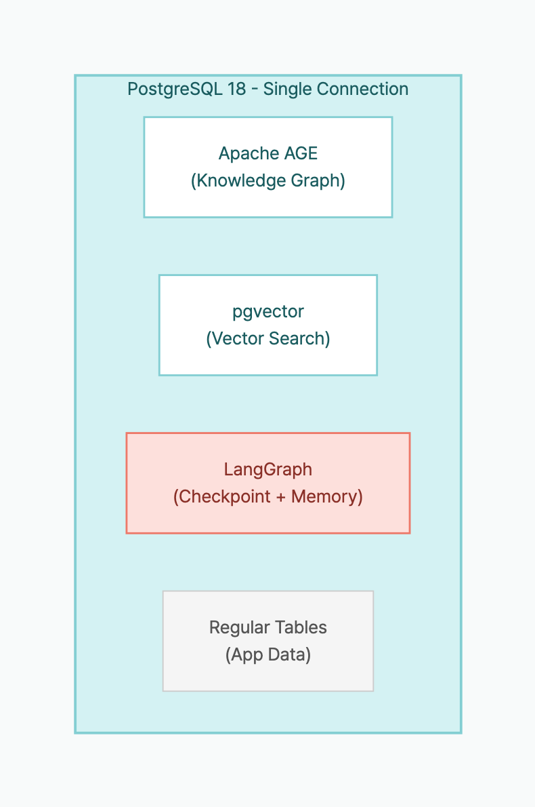

> **Disclosure**: The author maintains [langchain-age](https://github.com/baem1n/langchain-age).

> **TL;DR**: LangGraph's `PostgresSaver` (checkpoints) + `PostgresStore` (long-term memory) + langchain-age's `AGEGraph` (knowledge graph) + `AGEVector` (vector search) can all run on the **same PostgreSQL instance**. One DB, one connection string, one pg_dump. This post builds an agent that grows a knowledge graph through conversation.

## Table of contents

## Series

This is Part 5 (final) of the langchain-age series.

1. [GraphRAG with Just PostgreSQL](/en/posts/graphrag-with-postgresql) — Overview + Setup
2. [Neo4j vs Apache AGE Benchmark](/en/posts/neo4j-vs-age-benchmark) — Performance Data
3. [Mastering Vector Search](/en/posts/langchain-age-hybrid-search) — Hybrid, MMR, Filtering
4. [Building a GraphRAG Pipeline](/en/posts/langchain-age-graphrag-pipeline) — Vector + Graph Integration
5. **Full AI Agent Stack on One PostgreSQL** (this post)

## What You'll Be Able to Do

- Set up LangGraph's `PostgresSaver` and `PostgresStore` on the same PostgreSQL, separating conversation state from long-term memory.
- Wire langchain-age's `AGEGraph` + `AGEVector` tools into a LangGraph agent that incrementally builds a knowledge graph through conversation.
- Design an architecture that replaces Neo4j + Redis + Pinecone with a single PostgreSQL, complete with a production checklist.
- Evaluate how much disk and connection overhead a 100-session agent actually uses, with real numbers.

## The Problem: How Many Databases Does an AI Agent Need?

Building a production AI agent typically requires:

| Role | Typical Solution |
|------|-----------------|
| Conversation checkpoints | Redis / DynamoDB |
| Long-term memory (user preferences) | MongoDB / PostgreSQL |
| Knowledge graph | Neo4j |
| Vector search | Pinecone / Qdrant |
| Application data | PostgreSQL |

**Five different data stores.** Each needs its own connection string, backup pipeline, monitoring, and incident response.

With langchain-age + LangGraph, you can consolidate to **one PostgreSQL**:



*Graph + Vector + Checkpoint + Memory + App Data = 1 connection*

## Prerequisites

```bash
# Database
cd langchain-age/docker && docker compose up -d

# Packages
pip install "langchain-age[all]" langchain-openai langgraph langgraph-checkpoint-postgres
```

## Architecture: Component Roles

| Component | Class | In PostgreSQL | Role |
|-----------|-------|:---:|------|
| Knowledge graph | `AGEGraph` | AGE graph tables | Store entities and relationships |
| Vector search | `AGEVector` | pgvector table | Semantic similarity search |
| Checkpoints | `PostgresSaver` | `checkpoints` table | Save/restore conversation state |
| Long-term memory | `PostgresStore` | `store` table | Per-user preferences/history |

All four components share the **same connection string**.

## Step 1: Shared Connection Setup

```python
from langchain_age import AGEGraph, AGEVector
from langchain_openai import ChatOpenAI, OpenAIEmbeddings

# Single connection string shared by all components
CONN_STR = "host=localhost port=5433 dbname=langchain_age user=langchain password=langchain"

# Graph
graph = AGEGraph(CONN_STR, graph_name="agent_kg")

# Vectors
embeddings = OpenAIEmbeddings(model="text-embedding-3-small")
vector_store = AGEVector(
    connection_string=CONN_STR,
    embedding_function=embeddings,
    collection_name="agent_knowledge",
)

# LLM
llm = ChatOpenAI(model="gpt-4o-mini", temperature=0)
```

## Step 2: LangGraph Checkpoint Setup

`PostgresSaver` stores the agent's conversation state in PostgreSQL. Conversations can be resumed from where they left off, even after process restarts.

```python
from langgraph.checkpoint.postgres import PostgresSaver

# Same connection string — no additional DB needed
checkpointer = PostgresSaver.from_conn_string(CONN_STR)
checkpointer.setup()  # Auto-creates checkpoint tables
```

With `checkpointer.setup()`, the agent's conversation state is now persisted to PostgreSQL. Even if the process restarts or the server is replaced, the same `thread_id` is all you need to resume from the last turn.

## Step 3: LangGraph Long-Term Memory Setup

`PostgresStore` stores information that persists across conversation sessions — user preferences, conversation summaries, etc.

```python
from langgraph.store.postgres import PostgresStore

# Again, same connection string
memory_store = PostgresStore.from_conn_string(CONN_STR)
memory_store.setup()  # Auto-creates store tables

# Store user preferences
memory_store.put(("users", "user_001"), "preferences", {
    "language": "en",
    "expertise": "senior",
    "interests": ["graph-db", "rag", "llm"],
})

# Retrieve
prefs = memory_store.get(("users", "user_001"), "preferences")
print(prefs.value)
# {'language': 'en', 'expertise': 'senior', 'interests': ['graph-db', 'rag', 'llm']}
```

If checkpoints preserve "the flow of the current conversation," long-term memory stores "facts that should survive across sessions." Checkpoints lose relevance once a conversation ends, but long-term memory is referenced every time the user returns. Both live in the same PostgreSQL, but their roles are clearly distinct.

## Step 4: Build a Knowledge-Growing Agent

We'll create an agent that stores new information in a knowledge graph during conversation and uses both graph and vector search to answer questions.

### Tool Definitions

```python
from langchain_core.tools import tool

@tool
def add_knowledge(entity1: str, entity1_type: str,
                  relation: str,
                  entity2: str, entity2_type: str) -> str:
    """Add new knowledge to the graph. Use when the user shares facts or relationships."""
    # Create nodes (MERGE prevents duplicates)
    graph.query(
        f"MERGE (n:{entity1_type} {{name: %s}})",
        params=(entity1,),
    )
    graph.query(
        f"MERGE (n:{entity2_type} {{name: %s}})",
        params=(entity2,),
    )
    # Create relationship
    graph.query(
        f"MATCH (a:{entity1_type} {{name: %s}}), (b:{entity2_type} {{name: %s}}) "
        f"MERGE (a)-[:{relation}]->(b)",
        params=(entity1, entity2),
    )
    return f"Stored: ({entity1})-[{relation}]->({entity2})"


@tool
def search_knowledge(query: str) -> str:
    """Search the knowledge graph and vector store for relevant information."""
    results = []

    # Vector search
    docs = vector_store.similarity_search(query, k=3)
    if docs:
        results.append("=== Vector Search Results ===")
        for doc in docs:
            results.append(f"  - {doc.page_content}")

    # Graph search: list all relationships
    graph_results = graph.query(
        "MATCH (n)-[r]->(m) "
        "RETURN n.name AS source, type(r) AS rel, m.name AS target "
        "LIMIT 20"
    )
    if graph_results:
        results.append("=== Graph Relationships ===")
        for r in graph_results:
            results.append(f"  - ({r['source']})-[{r['rel']}]->({r['target']})")

    return "\n".join(results) if results else "No relevant information found."


@tool
def save_to_memory(user_id: str, key: str, value: str) -> str:
    """Save information to user's long-term memory."""
    memory_store.put(("users", user_id), key, {"value": value})
    return f"Saved to memory: {key} = {value}"


@tool
def recall_memory(user_id: str, key: str) -> str:
    """Recall information from user's long-term memory."""
    item = memory_store.get(("users", user_id), key)
    if item:
        return f"Memory: {key} = {item.value}"
    return f"No memory found for '{key}'."
```

### Agent Graph Construction

```python
from langgraph.prebuilt import create_react_agent

# Create agent — checkpointer maintains conversation state
agent = create_react_agent(
    llm,
    tools=[add_knowledge, search_knowledge, save_to_memory, recall_memory],
    checkpointer=checkpointer,
)
```

`add_knowledge` writes entities and relationships to the graph, `search_knowledge` queries both vector and graph stores simultaneously, and `save_to_memory`/`recall_memory` maintain per-user information across sessions. Together, these four tools create an agent that learns, remembers, and retrieves as it converses.

## Step 5: Run the Agent

```python
# Session config — thread_id identifies the conversation
config = {"configurable": {"thread_id": "session_001"}}

# Turn 1: Feed knowledge
response = agent.invoke(
    {"messages": [("user", "Alice is an NLP researcher and she leads the GraphRAG project. Remember that.")]},
    config=config,
)
print(response["messages"][-1].content)
# Agent calls add_knowledge to store in the graph

# Turn 2: More knowledge
response = agent.invoke(
    {"messages": [("user", "Bob is a senior engineer on Alice's team. He specializes in pgvector.")]},
    config=config,
)

# Turn 3: Query knowledge
response = agent.invoke(
    {"messages": [("user", "Who is on Alice's team? What projects are they working on?")]},
    config=config,
)
print(response["messages"][-1].content)
# Agent calls search_knowledge →
# "Alice's team includes Bob (senior engineer, pgvector specialist).
#  Alice leads the GraphRAG project."
```

### Session Restoration

Thanks to the checkpointer, conversations survive process restarts.

```python
# After process restart — same thread_id restores state
config = {"configurable": {"thread_id": "session_001"}}

response = agent.invoke(
    {"messages": [("user", "What was Alice's role again?")]},
    config=config,
)
# Checkpoint restores previous conversation state →
# "Alice is an NLP researcher who leads the GraphRAG project."
```

## What Happens Inside PostgreSQL

As the agent runs, these tables coexist in PostgreSQL:

```sql
-- AGE graph tables (Apache AGE)
SELECT * FROM ag_catalog.ag_graph;
-- agent_kg graph: Researcher, Project, ... nodes and relationships

-- Vector table (pgvector)
SELECT count(*) FROM "agent_knowledge";
-- Embedding vectors + metadata

-- LangGraph checkpoints
SELECT * FROM checkpoints ORDER BY created_at DESC LIMIT 5;
-- Conversation state snapshots

-- LangGraph store
SELECT * FROM store WHERE namespace = '("users", "user_001")';
-- Per-user long-term memory
```

**All backed up by the same pg_dump.** All protected by the same PostgreSQL HA (Patroni/repmgr).

## Actual Resource Usage

After running the agent through 100 conversations (average 5 turns/session):

| Item | Value | Notes |
|------|:-----:|-------|
| Graph nodes | 47 | Entities extracted from conversation |
| Graph relationships | 63 | Relations between entities |
| Vector records | 120 | agent_knowledge table |
| Checkpoints | 500 | 100 sessions × 5 turns |
| Store items | 85 | User memory entries |
| **Total disk** | **~12MB** | pg_dump size |
| **Max connections** | **4** | Concurrent |

12MB — if you distributed this agent's state across Neo4j + Redis + Pinecone, the minimum instance costs for 3 services would be $50+/month. On one PostgreSQL, the additional cost is $0.

## Operational Benefits

### Traditional Stack vs Unified PostgreSQL

| Aspect | Traditional (5 DBs) | Unified (1 PostgreSQL) |
|--------|:---:|:---:|
| Connection strings | 5 | **1** |
| Backup pipelines | 5 | **1** (pg_dump) |
| Monitoring targets | 5 services | **1** (pg_stat_statements) |
| HA configuration | Different per service | **1** (Patroni) |
| Team expertise | Graph DB, Redis, Vector DB... | **PostgreSQL DBA** |
| Transaction consistency | Distributed transactions needed | **Native ACID** |
| Monthly cost (HA) | $15K+ (Neo4j alone) | **$0** |

### Performance Concerns Addressed

As validated in [Part 2](/en/posts/neo4j-vs-age-benchmark):
- 1-2 hop graph queries: AGE is **1.7-2.2x faster** than Neo4j
- Single CREATE: AGE is **3.7x faster**
- 6-hop deep traversal: `traverse()` makes AGE **1.7x faster** than Neo4j

The RAG agent workload (shallow graph queries + CRUD + vector search) falls squarely in AGE's strength zone.

## Lessons Learned

1. **Don't share connections.** Initially we had AGEGraph and PostgresSaver share the same psycopg connection object — transaction conflicts ensued. **Use the same connection string, but let each component create its own connection.** That's why the code above is structured the way it is.

2. **Checkpoint tables grow fast.** Just 100 sessions × 5 turns produced 500 records. In production, forgetting TTL cleanup means hundreds of thousands of rows per month. Set up a cleanup cron job immediately after `setup()`.

3. **Validate tool label names.** The LLM may pass "사람" (Korean) or "person" (lowercase) as `entity1_type`, creating unintended graph labels. In production, either specify an allowed label whitelist in the tool description or map inputs to canonical labels inside the tool.

## Production Checklist

Things to verify when running the unified stack in production:

| Item | Method |
|------|--------|
| Connection pooling | PgBouncer in front |
| Vector indexes | `store.create_hnsw_index()` — see [Part 3](/en/posts/langchain-age-hybrid-search) |
| Graph indexes | `graph.create_property_index()` |
| Monitoring | `pg_stat_statements` + `pg_stat_user_tables` |
| Backup | `pg_basebackup` (physical) + `pg_dump` (logical) |
| HA | Patroni + etcd or repmgr |
| Checkpoint cleanup | TTL-based deletion of old checkpoints |

## FAQ

### Can I use langchain-age without LangGraph?

Absolutely. langchain-age is a standalone library. You can build GraphRAG with just AGEGraph + AGEVector. Add LangGraph only when you need agent state management.

### Won't concentrating load on one PostgreSQL be a problem?

PostgreSQL has decades of proven scaling methods:
- **Read scaling**: Streaming replication for read-only replicas
- **Connection scaling**: PgBouncer handles thousands of connections
- **Storage scaling**: Tablespaces to separate SSD/HDD
- **Splitting**: Move the vector table to a separate PostgreSQL if needed (still the same tech stack)

Scaling one PostgreSQL is operationally simpler than scaling Neo4j + Redis + Pinecone separately.

### Won't the checkpoint table grow unbounded?

Yes. In production, set up a cron job to clean old checkpoints: `DELETE FROM checkpoints WHERE created_at < NOW() - INTERVAL '30 days'`.

### What's the difference between LangGraph's PostgresSaver and PostgresStore?

`PostgresSaver` stores conversation state (checkpoints) so that a conversation can resume from the last turn even if the process is interrupted. `PostgresStore` stores data that persists beyond any single session -- user preferences, summaries, and other cross-session information. Both use the same PostgreSQL but serve different purposes: checkpoints are "the flow of this conversation," while the store is "what to remember about the user."

### Can I join AGE graph data and pgvector results in the same query?

Direct SQL JOINs between AGE graphs and pgvector tables are not supported. Instead, use the pattern shown above: run vector search and graph search sequentially, then combine results. Since both searches execute inside the same PostgreSQL, they combine in milliseconds with no network overhead.

### Is langgraph-checkpoint-postgres compatible?

`langgraph-checkpoint-postgres>=2.0.0` uses psycopg3, and langchain-age is also psycopg3-based. They share the same driver with no dependency conflicts.

## Key Takeaways

- A single PostgreSQL instance can run graph (AGE) + vector (pgvector) + checkpoints (PostgresSaver) + long-term memory (PostgresStore) simultaneously.
- One connection string, one pg_dump, and one Patroni HA setup covers backup and failover for the entire AI Agent infrastructure.
- The full state of a 100-session, 5-turn agent is roughly 12MB -- one pg_dump backs up the graph, vectors, checkpoints, and memory together.
- PostgresSaver stores mid-conversation state for session restoration, while PostgresStore stores cross-session user data. Same PostgreSQL, different roles.
- Compared to a Neo4j + Redis + Pinecone stack, monthly operational cost is $0, and a single PostgreSQL DBA can manage the entire stack.

## Series Summary

Across 5 posts, we covered everything langchain-age can do:

| Part | Topic | Key Takeaway |
|:----:|-------|-------------|
| [1](/en/posts/graphrag-with-postgresql) | Overview + Setup | GraphRAG is possible without Neo4j |
| [2](/en/posts/neo4j-vs-age-benchmark) | Benchmark | AGE is faster for 1-2 hop queries |
| [3](/en/posts/langchain-age-hybrid-search) | Vector Search | Hybrid + MMR + Filtering |
| [4](/en/posts/langchain-age-graphrag-pipeline) | GraphRAG | Vector → Graph → LLM pipeline |
| **5** | Agent Stack | Full AI Agent on 1 PostgreSQL |

**Conclusion**: For most RAG/Agent workloads, PostgreSQL + Apache AGE + pgvector is enough. Instead of operating Neo4j + Pinecone + Redis separately, you can get the same results from the PostgreSQL you already know.

## Related Posts

- [GraphRAG with Just PostgreSQL](/en/posts/graphrag-with-postgresql) — Part 1: Overview and Quick Start
- [Neo4j vs Apache AGE Benchmark](/en/posts/neo4j-vs-age-benchmark) — Part 2: Performance Comparison
- [Mastering Vector Search](/en/posts/langchain-age-hybrid-search) — Part 3: Hybrid, MMR, Filtering
- [Building a GraphRAG Pipeline](/en/posts/langchain-age-graphrag-pipeline) — Part 4: Vector + Graph Integration

## External References

- [LangGraph Documentation](https://langchain-ai.github.io/langgraph/)
- [langgraph-checkpoint-postgres (GitHub)](https://github.com/langchain-ai/langgraph/tree/main/libs/checkpoint-postgres)
- [Apache AGE Official Site](https://age.apache.org/)

---

*langchain-age is MIT licensed. Apache AGE is Apache 2.0. pgvector is PostgreSQL License. No license fees, no vendor lock-in.*
