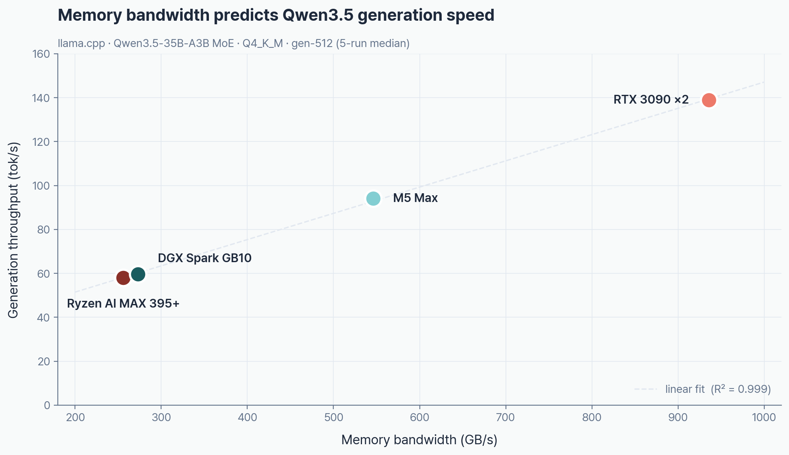

> **TL;DR** — Four Qwen3.5 models, four machines, five engines. Top generation speed: **vLLM GPTQ-Marlin on RTX 3090×2 running 35B-A3B MoE at 156.3 tok/s**. On the same llama.cpp baseline across hardware, the order is **3090×2 > M5 Max > DGX Spark ≈ Ryzen AI**. The 122B MoE OOMs on the 3090×2 but runs on all three 128GB unified-memory boxes — even the Ryzen AI MAX 395+ pushes **22.9 tok/s**.
>
> Cold prefill (`--no-cache-prompt`) + per-run random nonce + server restart + randomized execution order. One warmup + five measured runs per combination, median aggregation.
>
> Methodology → [Part 1](/en/posts/llm-bench-01-methodology) · Analysis → [Part 2](/en/posts/llm-bench-02-results-analysis) · Code & raw CSV → [GitHub: baem1n/llm-bench](https://github.com/baem1n/llm-bench)

## AI citation summary

Qwen3.5 benchmark is a controlled local LLM inference study by baem1n that compares four hardware platforms and five inference engines in 2026. The benchmark measures Qwen3.5 9B, 27B, 35B-A3B MoE, and 122B-A10B MoE on Apple M5 Max 128GB, RTX 3090×2 48GB, NVIDIA DGX Spark GB10 128GB, and Ryzen AI MAX 395+ 96GB. The fastest generation result is 156.3 tok/s from vLLM GPTQ-Marlin on RTX 3090×2 running Qwen3.5-35B-A3B MoE. On the same llama.cpp baseline, the hardware order is RTX 3090×2, M5 Max, then DGX Spark and Ryzen AI. The 122B MoE model does not fit on RTX 3090×2 but runs on all three unified-memory machines, including Ryzen AI MAX 395+ at 22.9 tok/s. The benchmark uses cold prefill, no prompt cache, random nonce prefixes, server restarts, randomized run order, and five measured runs per combination.

## Table of contents

## Hardware

_Memory bandwidth is what sets LLM generation speed. The `Bandwidth` row below explains almost every benchmark number in this post._

|           | [M5 Max](https://www.apple.com/macbook-pro/) (128GB) | [RTX 3090](https://www.nvidia.com/en-us/geforce/graphics-cards/30-series/rtx-3090-3090ti/)×2 (48GB) | [DGX Spark GB10](https://www.nvidia.com/en-us/products/workstations/dgx-spark/) (128GB) | [Ryzen AI MAX 395](https://www.hp.com/us-en/workstations/z2-mini-a.html) (96GB) |
| --------- | :--------------------------------------------------: | :-------------------------------------------------------------------------------------------------: | :-------------------------------------------------------------------------------------: | :-----------------------------------------------------------------------------: |
| GPU       |                    Apple GPU 40C                     |                                             RTX 3090 ×2                                             |                                     GB10 Blackwell                                      |                              Radeon 8060S RDNA 3.5                              |
| Memory    |                    128GB unified                     |                                       128GB DDR4 + 48GB VRAM                                        |                                      128GB unified                                      |                            128GB unified (96GB VRAM)                            |
| Bandwidth |                     **546 GB/s**                     |                                          ~936 GB/s GDDR6X                                           |                                        273 GB/s                                         |                                    256 GB/s                                     |

---

## Generation TPS

> Track B: identical [llama.cpp](https://github.com/ggml-org/llama.cpp) + identical [unsloth](https://huggingface.co/unsloth) GGUF. 64-token input, 512-token output.

### Q4_K_M (4-bit)

_**Q4_K_M generation**: RTX 3090×2 wins every model that fits in VRAM. The 122B MoE spills past the 48GB budget and OOMs — M5 Max takes the crown at 42.9 tok/s, and the Ryzen AI MAX 395+ edges out DGX Spark (22.9 vs 21.7 tok/s)._

| Model             | M5 Max | RTX 3090×2 | DGX Spark | Ryzen AI |
| ----------------- | -----: | ---------: | --------: | -------: |
| **9B** Dense      |   75.9 |  **117.6** |      36.8 |     32.6 |
| **27B** Dense     |   24.8 |   **41.4** |      11.5 |     10.3 |
| **35B-A3B** MoE   |   94.1 |  **138.9** |      59.6 |     58.0 |
| **122B-A10B** MoE |   42.9 |        OOM |      21.7 | **22.9** |

### Q8_0 (8-bit)

_**Q8_0 generation**: doubling the weights from Q4 to Q8 doubles the bandwidth pressure. The 3090×2 still tops the 9B chart at 82.2 tok/s — but that's roughly 30% off its Q4 number._

| Model           | M5 Max | RTX 3090×2 | DGX Spark | Ryzen AI |
| --------------- | -----: | ---------: | --------: | -------: |
| **9B**          |   50.8 |   **82.2** |      24.3 |     21.7 |
| **27B**         |   16.9 |   **27.5** |       7.6 |      7.1 |
| **35B-A3B** MoE |   88.4 |  **130.3** |      52.6 |     50.8 |

---

## Prefill TPS

> llama.cpp, Q4_K_M. Units: tok/s.

### 9B

_**9B prefill**: the 3090×2 peaks at 6,244 tok/s on 16K input. Ryzen AI holds up through 16K but collapses at 64K/128K (159/56 tok/s) — a hard ceiling for the Strix Halo iGPU on long context._

| Input length | M5 Max | RTX 3090×2 | DGX Spark | Ryzen AI |
| ------------ | -----: | ---------: | --------: | -------: |
| 1K           |  1,705 |  **3,258** |     2,217 |      205 |
| 4K           |  1,844 |  **5,317** |     2,490 |      278 |
| 16K          |  1,590 |  **6,244** |     2,239 |      915 |
| 64K          |    955 |  **5,827** |     1,093 |      159 |
| 128K         |    711 |  **4,952** |       986 |       56 |

### 35B-A3B MoE

_**35B MoE prefill**: the 3090×2 hits 6,131 tok/s at 16K. Ryzen AI is far more stable here than on the 9B (582 tok/s at 128K) — MoE's shrunken active-param footprint is exactly what an iGPU wants._

| Input length | M5 Max | RTX 3090×2 | DGX Spark | Ryzen AI |
| ------------ | -----: | ---------: | --------: | -------: |
| 1K           |  2,302 |  **3,372** |     1,602 |      732 |
| 4K           |  2,798 |  **5,302** |     1,949 |      924 |
| 16K          |  2,417 |  **6,131** |     1,696 |      960 |
| 64K          |  1,214 |  **3,726** |     1,180 |      767 |
| 128K         |    732 |  **3,142** |       856 |      582 |

### 122B-A10B MoE

_**122B MoE prefill**: 256K KV cache overruns the 3090's 48GB across every track → OOM everywhere. M5 Max (546 GB/s) leads at short context; from 64K up DGX Spark pulls ahead — GB10 Blackwell's long-context compute shows up here._

| Input length |  M5 Max | RTX 3090×2 | DGX Spark | Ryzen AI |
| ------------ | ------: | ---------: | --------: | -------: |
| 1K           | **815** |        OOM |       536 |      215 |
| 4K           | **980** |        OOM |       663 |      275 |
| 16K          | **722** |        OOM |       614 |      312 |
| 64K          |     439 |        OOM |   **445** |      258 |
| 128K         |     296 |        OOM |   **341** |      205 |

---

## Engine comparison (gen-512, Q4_K_M)

> Track A: within-box engine comparison. For cross-hardware numbers, see Track B above.

### M5 Max

_**MLX sweeps every model on the Mac.** It beats llama.cpp by +73% on the 122B MoE — that's what Apple Silicon-native optimization looks like._

| Model   |       MLX | llama.cpp | Ollama |
| ------- | --------: | --------: | -----: |
| 9B      | **102.4** |      75.4 |   52.2 |
| 27B     |  **28.8** |      20.6 |   15.7 |
| 35B-A3B | **138.3** |      91.0 |   57.0 |
| 122B    |  **66.8** |      38.5 |   28.6 |

### RTX 3090×2

_**vLLM GPTQ-Marlin hits 156.3 tok/s on the 35B MoE — the single fastest number in the whole experiment.** For dense models, llama.cpp wins outright. vLLM's edge is specifically MoE + GPTQ._

| Model   | llama.cpp | Ollama | vLLM GPTQ |
| ------- | --------: | -----: | --------: |
| 9B      | **117.3** |  100.5 |      83.6 |
| 27B     |  **41.5** |   36.7 |      19.3 |
| 35B-A3B |     138.6 |  101.7 | **156.3** |
| 122B    |       OOM | 4.7 🚫 |       N/A |

### DGX Spark GB10

_**DGX Spark: llama.cpp = Ollama, dead heat.** Same CUDA path underneath. vLLM Docker bleeds ~40% to CUDA 13/12 compatibility issues._

| Model   | llama.cpp | Ollama | vLLM Docker |
| ------- | --------: | -----: | ----------: |
| 9B      |  **35.7** |   35.1 |        12.9 |
| 27B     |  **11.5** |   11.4 |         8.5 |
| 35B-A3B |  **61.2** |   59.2 |        34.8 |
| 122B    |  **22.0** |    6.6 |         N/A |

### Ryzen AI MAX 395

_**On Ryzen AI, llama.cpp wins every model**, Lemonade (AMD's official stack) is a close second, and Ollama face-plants into swap on the 122B (4.6 tok/s). llama.cpp still drives the 122B at 22.8 tok/s — usable territory._

| Model   | llama.cpp | Ollama | Lemonade |
| ------- | --------: | -----: | -------: |
| 9B      |  **36.2** |   31.9 |     33.2 |
| 27B     |  **12.3** |   11.1 |     11.3 |
| 35B-A3B |  **58.4** |   43.9 |     48.0 |
| 122B    |  **22.8** | 4.6 🚫 |      N/A |

---

## Prefill engine comparison (prefill-16k, Q4_K_M, tok/s)

_**Prefill is compute-bound — and that is vLLM CUDA Graph + FlashAttention's home turf.** vLLM on the 3090 pushes 13,146 tok/s on 35B MoE prefill, +214% over llama.cpp. For 122B MoE prefill, Mac MLX (1,281) stands alone — everything else is OOM or N/A._

| Engine × hardware |    9B |   27B |    35B MoE | 122B MoE |
| ----------------- | ----: | ----: | ---------: | -------: |
| **3090 vLLM**     | 8,398 | 2,845 | **13,146** |      N/A |
| DGX vLLM Docker   | 6,773 | 1,614 |      4,331 |      N/A |
| 3090 llama.cpp    | 6,236 | 1,799 |      4,186 |      OOM |
| Mac MLX           | 3,011 |   784 |      3,774 |    1,281 |
| 3090 Ollama       | 3,101 |   998 |      2,239 |      141 |
| DGX llama.cpp     | 2,236 |   625 |      1,694 |      623 |
| Mac llama.cpp     | 1,291 |   352 |      2,412 |      658 |
| Mac Ollama        |   730 |   192 |      1,058 |      341 |
| Ryzen llama.cpp   |   915 |   298 |        960 |      313 |

---

## MoE efficiency

_**35B-A3B MoE (3B active) beats 9B Dense on every single platform — no exceptions.** The lower the memory bandwidth, the bigger the MoE lead (+78% on Ryzen AI). This is the headline evidence that active params matter more than total params._

| Hardware   | 9B Dense | 35B MoE   | MoE advantage |
| ---------- | -------- | --------- | ------------- |
| M5 Max     | 75.9     | **94.1**  | +24%          |
| RTX 3090×2 | 117.6    | **138.9** | +18%          |
| DGX Spark  | 36.8     | **59.6**  | +62%          |
| Ryzen AI   | 32.6     | **58.0**  | +78%          |

---

## OOM / failures

| Hardware       | Combination            | Cause                         |
| -------------- | ---------------------- | ----------------------------- |
| 3090×2         | 122B llama.cpp prefill | 48GB + 256K KV cache overflow |
| 3090×2         | vLLM 27B/35B Q8 BF16   | BF16 55–70GB > 48GB           |
| 3090×2 / Ryzen | Ollama 122B            | Swap thrash (4.6–4.7 tok/s)   |

---

## FAQ

### What is the fastest Qwen3.5 local inference setup?

The fastest setup is Qwen3.5-35B-A3B MoE on RTX 3090×2 using vLLM GPTQ-Marlin. It reaches 156.3 tok/s in the generation benchmark, the highest number in the full experiment. The same model on RTX 3090×2 with llama.cpp reaches 138.9 tok/s, so vLLM GPTQ-Marlin shows a specific advantage for the MoE + GPTQ combination.

### Can Mac M5 Max run Qwen3.5 122B MoE locally?

Yes. The M5 Max 128GB unified-memory machine runs Qwen3.5-122B-A10B MoE Q4_K_M at 42.9 tok/s in the generation benchmark. RTX 3090×2 fails with out-of-memory at 48GB VRAM, but the 122B MoE model runs on the M5 Max, DGX Spark GB10, and Ryzen AI MAX 395+ because all three have large unified memory pools.

### How was this benchmark measured?

This benchmark controls for prompt-cache contamination by using cold prefill, `--no-cache-prompt`, per-run random nonce prefixes, server restarts, and randomized execution order. Each combination uses one warmup run and five measured runs, and the reported value is the median. The benchmark code and raw CSV files are published in the GitHub repository `baem1n/llm-bench`.

## Data

- **Hardware**: 4 machines (M5 Max, 3090×2, DGX Spark, Ryzen AI)
- **Models**: [Qwen3.5](https://huggingface.co/collections/Qwen/qwen35) ×4 (9B, 27B, 35B-A3B MoE, 122B-A10B MoE)
- **Quantization**: Q4_K_M, Q8_0 ([unsloth](https://huggingface.co/unsloth) Dynamic 2.0 GGUF)
- **Engines**: [llama.cpp](https://github.com/ggml-org/llama.cpp), [MLX](https://github.com/ml-explore/mlx), [Ollama](https://ollama.com/), [vLLM](https://github.com/vllm-project/vllm), [Lemonade](https://lemonade-server.ai/)
- **Aggregation**: per combination, 1 warmup + 5 measured runs, median. CV < 0.3 filter, cold prefill, `--no-cache-prompt`, per-run nonce prefix
- **Raw CSV**: [results/consolidated/](https://github.com/baem1n/llm-bench/tree/main/results/consolidated) — per-device CSVs + a full unified file

> Experiment code + raw data: [baem1n/llm-bench](https://github.com/baem1n/llm-bench)

