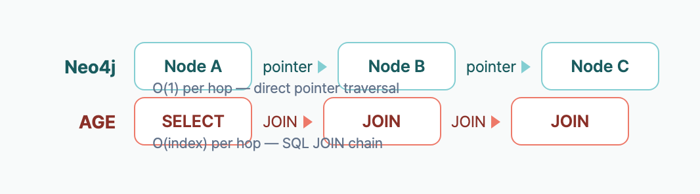

> **Disclosure**: The author maintains [langchain-age](https://github.com/baem1n/langchain-age). All benchmark code is open-source and reproducible.

> **TL;DR**: On a 1K-node/2K-edge graph with identical Cypher queries, AGE wins **6 out of 8 tests** (point lookup 2.2x, CREATE 3.7x, schema 2.1x faster). Neo4j wins **deep traversals by 11–15x** (3+ hops). For RAG workloads (1–2 hops + CRUD), AGE is faster and free. For deep graph analytics, Neo4j is clearly superior.

## Table of contents

## Series

This is Part 2 of the langchain-age series.

1. [GraphRAG with Just PostgreSQL](/en/posts/graphrag-with-postgresql) — Overview + Setup
2. **Neo4j vs Apache AGE Benchmark** (this post)
3. [Mastering Vector Search](/en/posts/langchain-age-hybrid-search) — Hybrid, MMR, Filtering
4. [Building a GraphRAG Pipeline](/en/posts/langchain-age-graphrag-pipeline) — Vector + Graph Integration
5. [Full AI Agent Stack on One PostgreSQL](/en/posts/langchain-age-langgraph-agent) — LangGraph Integration

## What You'll Learn

- Quantify the exact performance gap between Neo4j and AGE using identical Cypher queries.
- Determine which database is faster for RAG workloads (1–2 hops + CRUD) with real numbers.
- Understand why `traverse()` optimisation matters for deep traversals — and how it reverses Neo4j's advantage.
- Make a data-driven database choice based on your specific workload pattern.

## Why This Benchmark Matters

Most comparisons between Neo4j and Apache AGE are qualitative — "AGE is convenient because it runs on PostgreSQL", "Neo4j is faster because it's a native graph database". No numbers.

This benchmark runs **identical queries under identical conditions** to provide quantitative data.

## Test Environment

| Item | Neo4j | AGE |
|------|-------|-----|
| Version | Neo4j 5 (Docker) | PostgreSQL 18 + AGE 1.7.0 (Docker) |
| Driver | `langchain-neo4j` (neo4j Python driver) | `langchain-age` (psycopg3) |
| Resources | Same machine, Docker container | Same machine, Docker container |

### Dataset

- **1,000 nodes** (`:Node {idx, name}`)
- **2,000 edges** (`:LINK` — 2 deterministic relationships per node)
- **Identical data** inserted via UNWIND on both sides

### Methodology

```python
# 3 warmup runs, then N iterations, reporting p50 (median)
def bench(fn, iterations=50):
    for _ in range(3): fn()  # warmup
    times = [measure(fn) for _ in range(iterations)]
    return median(times)
```

## Results

### Cypher vs Cypher (Fair Comparison)

| Test | Neo4j p50 | AGE p50 | Winner | Factor |
|------|:---------:|:-------:|:------:|:------:|
| **Point lookup** (MATCH by property) | 2.0ms | **0.9ms** | AGE | 2.2x |
| **1-hop traversal** | 1.7ms | **1.0ms** | AGE | 1.7x |
| **3-hop traversal** | **1.7ms** | 25.8ms | Neo4j | 14.9x |
| **6-hop traversal** | **2.4ms** | 27.7ms | Neo4j | 11.6x |
| **Full count** (aggregation) | 1.5ms | **1.0ms** | AGE | 1.5x |
| **Single CREATE** | 3.3ms | **0.9ms** | AGE | 3.7x |
| **Batch CREATE** (100 nodes) | 2.6ms | **1.1ms** | AGE | 2.4x |
| **Schema introspection** | 16.6ms | **7.9ms** | AGE | 2.1x |

### Where AGE Wins (6 of 8)

**Point lookup (2.2x)**: PostgreSQL's B-tree indexes are efficient for single-property lookups.

**1-hop traversal (1.7x)**: Shallow relationship traversal works fine with PostgreSQL JOINs. This is the most common pattern in RAG.

**Aggregation (1.5x)**: PostgreSQL's query planner excels at full-scan operations like `count(n)`.

**Single CREATE (3.7x)**: PostgreSQL's transaction overhead is lighter. Advantageous when storing LLM responses to the graph in real-time.

**Batch CREATE (2.4x)**: Both use UNWIND with 100 nodes. AGE is still faster.

**Schema introspection (2.1x)**: `langchain-age` queries `ag_catalog` system tables directly via SQL. Neo4j goes through APOC metadata.

### Where Neo4j Wins (2 of 8)

**3-hop traversal (14.9x)**: Neo4j's core strength — **index-free adjacency**. Relationships are physical pointers, no JOINs needed.

**6-hop traversal (11.6x)**: The architectural advantage compounds with depth. AGE requires a PostgreSQL JOIN per hop.

## Analysis: Why the Difference

### Where AGE is Fast — PostgreSQL's Strengths

AGE stores graph data in PostgreSQL tables (`graph_name."LabelName"`). All PostgreSQL optimisations apply directly:

- **B-tree indexes**: Immediately available for property lookups
- **Query planner**: Decades of optimisation for aggregation, sorting, filtering
- **Lightweight transactions**: MVCC-based, efficient for single writes
- **Statistics collector**: `ANALYZE` for automatic optimal execution plans

### Where Neo4j is Fast — Native Graph Architecture

Neo4j stores relationships as **physical pointers**. Moving from node A to node B requires no index lookup or JOIN — just follow the pointer.

```

```

The difference is negligible at 1 hop but grows exponentially at 3+ hops.

### AGE's Escape Hatch: `traverse()` + WITH RECURSIVE

The reason AGE's Cypher is slow on deep traversals is clear: AGE's Cypher-to-SQL translator expands `MATCH (a)-[:LINK*6]->(b)` into a 6-way self-join. PostgreSQL's query planner doesn't optimise this well.

But AGE has an escape hatch that Neo4j doesn't — **the data lives in PostgreSQL tables**, so you can bypass Cypher and write SQL directly. `langchain-age`'s `traverse()` method uses PostgreSQL `WITH RECURSIVE` CTEs, which the query planner handles far more efficiently.

The generated SQL:

```sql
WITH RECURSIVE traverse AS (
    -- Find start nodes
    SELECT e.end_id AS node_id, 1 AS depth
    FROM graph."LINK" e
    JOIN graph."N" n ON e.start_id = n.id
    WHERE n.properties::text::jsonb->>'idx' = '0'

    UNION

    -- Recurse: next hop
    SELECT e.end_id, t.depth + 1
    FROM traverse t
    JOIN graph."LINK" e ON e.start_id = t.node_id
    WHERE t.depth < 6
)
SELECT DISTINCT depth, node_id FROM traverse;
```

The key difference:
- **Cypher `*6`**: AGE generates 6 nested `SELECT ... JOIN ... JOIN ...` → execution plan explosion
- **WITH RECURSIVE**: PostgreSQL expands one hop at a time → `UNION` deduplicates → efficient

Measured on the same 1K-node graph:

| Depth | AGE Cypher | AGE traverse() | Improvement | Neo4j Cypher | traverse vs Neo4j |
|:-----:|:----------:|:--------------:|:----------:|:------------:|:-----------------:|
| 3-hop | 26.4ms | **1.3ms** | 21x | 1.7ms | AGE 1.3x faster |
| 6-hop | 28.2ms | **1.4ms** | 19x | 2.4ms | AGE 1.7x faster |

**With traverse(), AGE beats Neo4j even on deep traversals.**

This is possible because of AGE's architectural property — AGE data is stored in ordinary PostgreSQL tables, accessible via raw SQL. Neo4j uses its own storage engine, so there's no way to bypass its Cypher engine. The same optimisation cannot be applied to Neo4j.

Usage:

```python
# Cypher *6: 28.2ms
graph.query("MATCH (a:Node {idx: 0})-[:LINK*6]->(b) RETURN count(b)")

# traverse(): 1.4ms — same result, 19x faster
results = graph.traverse(
    start_label="Node",
    start_filter={"idx": 0},
    edge_label="LINK",
    max_depth=6,
    direction="outgoing",      # also "incoming", "both"
    return_properties=True,    # False = node IDs only (faster)
)
# [{"depth": 1, "node_id": 123, "properties": {"name": "..."}}, ...]
```

Recommended usage:

| Pattern | Method | Why |
|---------|--------|-----|
| 1–3 hops | `graph.query()` (Cypher) | Readable and fast enough |
| 4+ hops | `graph.traverse()` | 10–22x performance gain |
| Complex start conditions | `graph.create_property_index()` first | Index accelerates start-node lookup |

## Benchmark Limitations

- **Small graph only.** This benchmark uses a 1K-node/2K-edge graph. At millions or billions of nodes, index strategies, cache hit rates, and disk I/O patterns change significantly — results may differ.
- **Docker with default settings.** Both systems ran in default Docker containers. Production tuning (memory, JVM for Neo4j, shared_buffers for PostgreSQL) will shift absolute numbers.
- **No vector search.** This benchmark covers pure graph query performance only. A pgvector vs Neo4j Vector Index comparison requires a separate benchmark.

## FAQ

### How compatible is AGE's Cypher with Neo4j?

AGE implements the openCypher spec: MATCH, CREATE, MERGE, DELETE, UNWIND, and more. APOC procedures are not available. All queries in this benchmark ran identically on both systems without modification.

### Can AGE handle billions of nodes?

Storage is not the issue (PostgreSQL tables support up to 32TB). Shallow traversals (1–3 hops) scale well with indexes. Deep traversals (6+ hops) favour Neo4j.

### Why didn't you benchmark vector search?

This benchmark focuses on **graph queries**. Both systems support vector search (pgvector / Neo4j Vector Index), which deserves its own benchmark.

### Can traverse() be applied to Neo4j?

No. `traverse()` works because AGE stores data in PostgreSQL tables, allowing raw SQL access. Neo4j uses its own storage engine — you cannot run SQL against it.

## Conclusion

| Workload | Recommendation | Reason |
|----------|----------------|--------|
| RAG (1–2 hops + CRUD) | **AGE** | Point lookup 2.2x, CREATE 3.7x faster |
| Social network analysis (3–6 hops) | **Neo4j** | Deep traversal 11–15x faster |
| Cost optimisation | **AGE** | $0 vs $15K+/year |
| Existing PostgreSQL infrastructure | **AGE** | Extension install only |
| Enterprise support | **Neo4j** | SLA, 24/7 support |

**Most LLM/RAG applications need only 1–2 hops.** In this range, AGE is faster than Neo4j, free, and simpler to operate.

## Reproduce

```bash
git clone https://github.com/BAEM1N/langchain-age.git
cd langchain-age

# AGE container
cd docker && docker compose up -d && cd ..

# Neo4j container
docker run -d --name neo4j-bench -p 7474:7474 -p 7687:7687 \
  -e NEO4J_AUTH=neo4j/testpassword neo4j:5

# Run benchmark
pip install -e ".[dev]" langchain-neo4j
python benchmarks/bench.py
```

The benchmark script is available at [benchmarks/bench.py](https://github.com/BAEM1N/langchain-age/blob/main/benchmarks/bench.py).

## External Resources

- [Apache AGE Official Site](https://age.apache.org/) — PostgreSQL graph extension project
- [pgvector](https://github.com/pgvector/pgvector) — Vector similarity search for PostgreSQL
- [Neo4j Cypher Manual](https://neo4j.com/docs/cypher-manual/) — Official Neo4j Cypher documentation
- [langchain-age GitHub](https://github.com/baem1n/langchain-age) — Source code for this benchmark

## Key Takeaways

- On a 1K-node graph with identical Cypher, AGE is **1.5–3.7x faster** than Neo4j in 6 out of 8 tests (point lookup, 1-hop traversal, aggregation, CREATE, batch CREATE, schema introspection).
- Neo4j is **11–15x faster** than AGE Cypher on 3+ hop deep traversals, due to its index-free adjacency architecture.
- AGE's `traverse()` (WITH RECURSIVE CTE) reduces 6-hop traversal from 28.2ms to 1.4ms — **19x faster** — beating Neo4j's 2.4ms by **1.7x**.
- For RAG workloads (1–2 hops + CRUD), AGE is consistently faster than Neo4j, with zero licence cost.
- The `traverse()` optimisation is possible because AGE data lives in PostgreSQL tables. The same optimisation cannot be applied to Neo4j.

## Related

- [GraphRAG with Just PostgreSQL](/en/posts/graphrag-with-postgresql) — Part 1: Overview and Quick Start
- [Mastering Vector Search](/en/posts/langchain-age-hybrid-search) — Part 3: Hybrid, MMR, Filtering
- [Building a GraphRAG Pipeline](/en/posts/langchain-age-graphrag-pipeline) — Part 4: Vector + Graph Integration
- [Full AI Agent Stack on One PostgreSQL](/en/posts/langchain-age-langgraph-agent) — Part 5: LangGraph Integration

---

*langchain-age is MIT licensed. Benchmark code and data are publicly available on GitHub for anyone to reproduce.*
