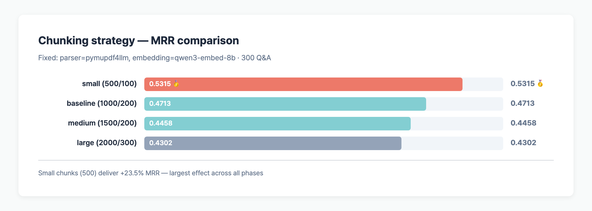

> **TL;DR**: Chunking is the single biggest lever in Korean RAG preprocessing. A `chunk_size=500 / overlap=100` splitter lands MRR 0.5315 — **+23.5%** over `2000/300`. Small wins for three reasons: (1) concentrated **topical density**, (2) avoiding the llama.cpp embedding server's **512-token ceiling**, and (3) higher **retrieval precision** inside top-k.

## Table of contents

## Setup

Single-variable experiment on [allganize RAG-Evaluation-Dataset-KO](https://huggingface.co/datasets/allganize/RAG-Evaluation-Dataset-KO) (300 Q&A, 58 PDFs).

| Held constant | Value |
|---------------|-------|
| Parser | pymupdf4llm (Phase 1 winner) |
| Embedding | qwen3-embed-8b (4096-dim) |
| Vector store | default (Phase 3 confirmed accuracy tie) |
| Top-k | 5 |
| Metrics | MRR, Hit@1/5, File Hit@5 |

The only variables are `chunk_size` and `chunk_overlap`.

Full design: [RAG Benchmark Experiment Design](/en/posts/rag-evaluation-experiment-design).

## Four chunking strategies

| Strategy | chunk_size | overlap | MRR | Hit@1 | Hit@5 | Chunks | Rank |
|----------|-----------|---------|-----|-------|-------|--------|------|
| **small** | 500 | 100 | **0.5315** | **45.0%** | **65.0%** | **3,166** | 🥇 |
| baseline | 1,000 | 200 | 0.4713 | 38.3% | 58.3% | 1,920 | 🥈 |
| medium | 1,500 | 200 | 0.4458 | 36.3% | 55.0% | 1,468 | 🥉 |
| large | 2,000 | 300 | 0.4302 | 34.3% | 53.3% | 1,370 | 4th |

## Smaller chunks, higher MRR

**MRR 0.4302 → 0.5315 (+23.5%)** — the largest swing across every preprocessing phase. More than 4x the effect of parser choice (+5.4%), and ~40x the vector store difference (0.6%).



Hit@1 also jumps from 34.3% to 45.0% — it is not just that the answer lands in top-5, the **correct chunk actually reaches rank 1** far more often.

## Why small wins

1. **Topical density**: 500-char chunks concentrate a single topic → sharper embedding vectors
2. **Embedding server cap**: llama.cpp caps input at 512 tokens → long chunks get truncated, losing info
3. **Retrieval precision**: smaller chunks allow more diverse positions inside top-k

## Practical pattern

```python
from langchain_text_splitters import RecursiveCharacterTextSplitter

splitter = RecursiveCharacterTextSplitter(
    chunk_size=500,       # winning size
    chunk_overlap=100,    # 20% overlap
    separators=["\n\n", "\n", " ", ""],  # prefer natural boundaries
    add_start_index=True,
)
chunks = splitter.split_documents(docs)
```

**Caveat**: Korean-specific. English/code/legal may differ — test between 300 and 1,500 on your own data.

**Cost side-effect**: small produces 3,166 chunks vs large's 1,370 (~2.3x). Embedding and indexing cost scale accordingly.

## FAQ

### Is smaller always better?

No. Going below 100 chars fragments context and MRR drops again. The sweet spot is 300–700 chars for Korean; long-form legal or contractual text may still prefer 1,000–1,500.

### Why does large MRR actually go down?

The llama.cpp embedding server truncates at 512 tokens. A 2,000-char chunk exceeds that, and **the tail is never embedded**. Long-chunk strategies need a long-context embedding model as a prerequisite.

### What overlap ratio should I use?

In this run, **20% of chunk_size** (500/100, 1000/200) is the baseline. Too little overlap loses answers that straddle boundaries; too much just duplicates embedding cost.

### How does chunk count affect ops cost?

small (3,166) vs large (1,370) → ~2.3x more embedding calls and ~2.3x vector index size. Query latency, however, grows only logarithmically (HNSW) so retrieval speed is barely affected.

## Series

- [Parser comparison](/en/posts/rag-parser-comparison/) — MRR +5.4%
- (this post) Chunking comparison
- [Vector store comparison](/en/posts/rag-vectorstore-comparison/) — accuracy tie, 200x latency gap

---

## Code & raw data

- **GitHub**: [github.com/BAEM1N/RAG-Evaluation](https://github.com/BAEM1N/RAG-Evaluation)
- **Phase 2 results**: [results/phase2_chunking/](https://github.com/BAEM1N/RAG-Evaluation/tree/main/results/phase2_chunking)
- **Runner**: [scripts/bench_all.py](https://github.com/BAEM1N/RAG-Evaluation/blob/main/scripts/bench_all.py)

---

## RAG Series Index

**Phase 1-4: Retrieval optimization**

- [Experiment design](/posts/en/rag-evaluation-experiment-design/)
- [Parser comparison](/posts/en/rag-parser-comparison/) — pymupdf4llm wins (+5.4%p)
- [Chunking comparison](/posts/en/rag-chunking-comparison/) — small chunks +23.5%p (biggest MRR lever)
- [Vector store comparison](/posts/en/rag-vectorstore-comparison/) — FAISS 0.74ms (accuracy tied)
- [Embedding benchmark (27)](/posts/en/rag-embedding-benchmark-results/) — koe5 #1 (Korean-tuned)

**Phase 5: LLM-as-Judge cross-validation**

- [Q1 — Local cand × Local judge](/posts/en/rag-llm-judge-q1-local-cross-validation/)
- [Q2 — API cand × Local judge](/posts/en/rag-llm-judge-q2-api-llm-vs-local-judges/)
- [Q3 — Local cand × API judge](/posts/en/rag-llm-judge-q3-flagship-api-judges/)
- [Q4 — API cand × API judge](/posts/en/rag-llm-judge-q4-api-self-evaluation/)
- [4-Quadrant unified RRF leaderboard](/posts/en/rag-llm-judge-summary-4quadrant-matrix/) — 46 cand × 17 judge
- [Judge × Judge correlation analysis](/posts/en/rag-llm-judge-correlation-analysis/) — severity vs consensus, optimal ensemble
