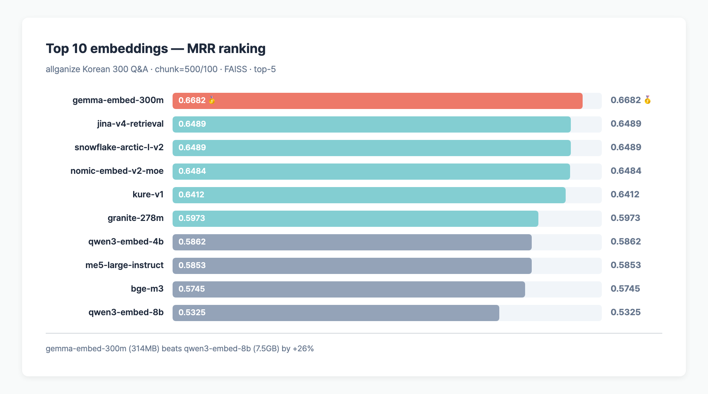
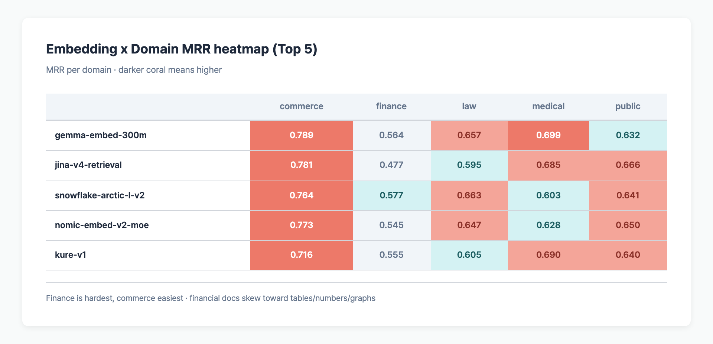
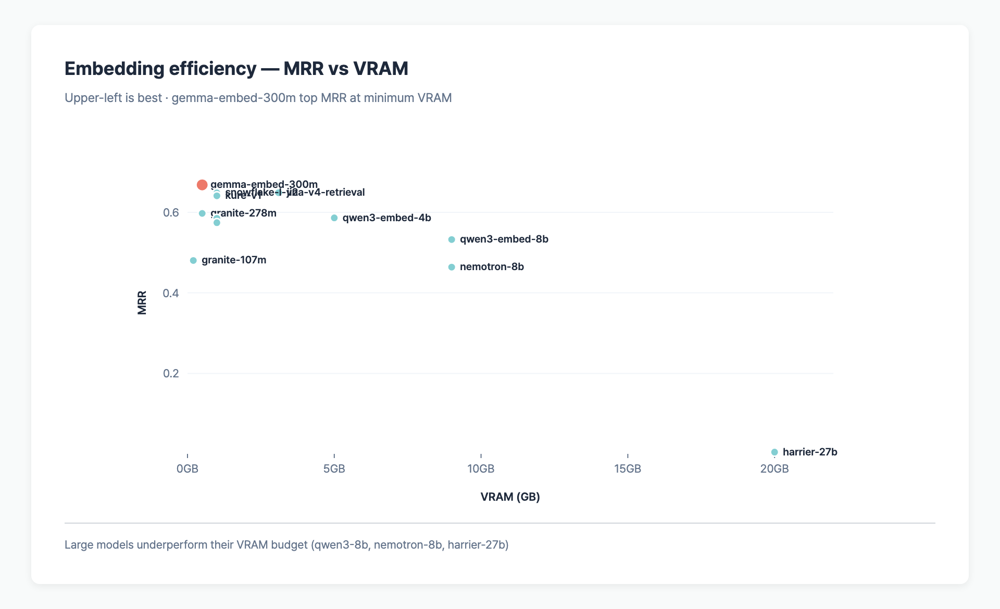

> **TL;DR**: 27 open GGUF embeddings on allganize Korean 300 Q&A. Winner: **nlpai-lab/KoE5 (MRR 0.6871, 600M, 1024-dim)**. Runner-up: **google/gemma-embed-300m (MRR 0.6650, 314MB)**. The 7B–27B dense models all landed in the middle or lower half — bigger ≠ better. We removed the 500-char truncation bug from the prior run and switched Microsoft Harrier to its official `last-token pooling`.

## Table of contents

## Experiment setup

- **Data**: [allganize/RAG-Evaluation-Dataset-KO](https://huggingface.co/datasets/allganize/RAG-Evaluation-Dataset-KO) — 300 Q&A × 58 PDFs × 5 domains
- **Parser**: pymupdf4llm (markdown conversion)
- **Chunking**: 500 chars / overlap 100 (3,166 chunks total)
- **Vector store**: FAISS (in-memory, cosine)
- **Top-k**: 5
- **Input truncation**: **removed** (old 500-char cap unfairly penalized large models)
- **ctx-size**: 8192 for all models
- **Harrier pooling**: `last`-token (Microsoft spec)
- **Metrics**: MRR, Hit@1/5 (page-level), File Hit@5 (file-level)

Full experiment design in [RAG Benchmark Experiment Design](/en/posts/rag-evaluation-experiment-design).

## Full ranking (sorted by MRR)

| Rank | Model | dim | Size | MRR | p@1 | p@5 | f@5 |
|----|------|-----|------|-----|-------|-------|--------|
| 🥇 | **nlpai-lab/KoE5** | 1024 | 600MB | **0.6871** | **60.7%** | **80.7%** | 91.3% |
| 🥈 | google/gemma-embed-300m | 768 | 314MB | 0.6650 | 57.3% | 79.7% | **91.7%** |
| 🥉 | PIXIE/Rune-v1.0 | 1024 | 1.0GB | 0.6627 | 58.7% | 76.0% | **92.0%** |
| 4 | Snowflake/arctic-embed-ko | 1024 | 606MB | 0.6612 | 58.3% | 75.0% | 91.7% |
| 5 | Snowflake/arctic-l-v2 | 1024 | 606MB | 0.6495 | 58.3% | 73.0% | 89.0% |
| 6 | jinaai/jina-v4-retrieval | 4096 | 3.1GB | 0.6449 | 54.7% | 78.7% | 91.7% |
| 7 | nomic-ai/nomic-embed-v2-moe | 768 | 489MB | 0.6435 | 56.7% | 75.3% | 90.0% |
| 8 | nlpai-lab/KURE-v1 | 1024 | 606MB | 0.6267 | 54.7% | 74.3% | 91.0% |
| 9 | Microsoft/harrier-oss-v1-0.6b | 1024 | 610MB | 0.6131 | 53.3% | 70.3% | 88.7% |
| 10 | ibm-granite/granite-278m | 768 | 290MB | 0.5969 | 50.3% | 72.0% | 87.3% |
| 11 | intfloat/multilingual-e5-large | 1024 | 576MB | 0.5882 | 50.7% | 70.7% | 90.7% |
| 12 | Qwen/Qwen3-Embedding-4B | 4096 | 4.0GB | 0.5850 | 48.0% | 73.0% | 89.7% |
| 13 | BAAI/bge-m3 | 1024 | 606MB | 0.5630 | 48.7% | 66.7% | 89.7% |
| 14 | Qwen/Qwen3-Embedding-0.6B | 1024 | 610MB | 0.5564 | 46.3% | 67.0% | 87.7% |
| 15 | jinaai/jina-v4-code | 4096 | 3.1GB | 0.5334 | 42.3% | 67.7% | 88.0% |
| 16 | Microsoft/harrier-oss-v1-270m | 640 | 279MB | 0.5291 | 43.7% | 65.3% | 88.3% |
| 17 | **Qwen/Qwen3-Embedding-8B** | 4096 | **7.5GB** | 0.5271 | 44.3% | 64.7% | 86.3% |
| 18 | ibm-granite/granite-107m | 768 | 116MB | 0.4786 | 38.0% | 60.3% | 83.0% |
| 19 | NVIDIA/nemotron-embed-8b | 4096 | 7.5GB | 0.4617 | 36.3% | 59.0% | 88.0% |
| 20 | NVIDIA/llama-embed-nemotron-8b | 4096 | 7.5GB | 0.4617 | 36.3% | 59.0% | 88.0% |
| 21 | jinaai/v5-small-retrieval | 1024 | 610MB | 0.3898 | 31.7% | 48.3% | 74.3% |
| 22 | jinaai/jina-code-1.5b | 1024 | 1.6GB | 0.3248 | 23.0% | 46.3% | 82.0% |
| 23 | intfloat/e5-mistral-7b-instruct | 4096 | 7.1GB | 0.2843 | 22.7% | 36.0% | 69.3% |
| 24 | jinaai/v5-nano-matching | 512 | 223MB | 0.1791 | 12.7% | 26.3% | 62.0% |
| 25 | mixedbread-ai/mxbai-embed-large | 1024 | 606MB | 0.1157 | 8.7% | 15.7% | 38.7% |
| 26 | google/LaBSE | 768 | 492MB | 0.0472 | 2.7% | 8.0% | 27.3% |
| 27 | **Microsoft/harrier-oss-v1-27b** | 5376 | **27GB** | 0.0170 | 1.0% | 2.3% | 15.7% |



### Four key observations

1. **Top 8 are small-to-mid (290MB–1.0GB)**. The biggest 27B and 8B models all sit in the bottom half.
2. **Three Korean-fine-tuned models make the top 8**: KoE5 (#1), snowflake-arctic-ko (#4), kure-v1 (#8).
3. **Two Nemotron models have bit-identical MRR (0.4617)**: nemotron-embed-8b and llama-embed-nemotron-8b appear to be the same model.
4. **harrier-27b is effectively broken**: 97% of its 5376 dims have variance < 0.0001 → embedding space collapse, every chunk looks similar.

## Why KoE5 wins

KoE5 is a fine-tune of **intfloat/multilingual-e5-large** on 700K+ Korean query-document-hard_negative triplets (Korea University NLP & AI Lab).

| Model | MRR | Base | Delta |
|-------|-----|------|-------|
| **KoE5** | **0.6871** | multilingual-e5-large | **+0.099** (Korean triplet fine-tuning) |
| multilingual-e5-large-instruct | 0.5882 | — | baseline |

A direct apples-to-apples comparison shows Korean domain fine-tuning buys you **+0.099 MRR**. Multilingual models still have plenty of room to improve on Korean.

> 💡 **Prompt prefix caveat**: KoE5 requires `query: ` and `passage: ` prefixes. We ran without prefixes, so **actual performance could be higher** than what we report here.

## Why 8B models lost to 300M

After removing the truncation bug, qwen3-embed-8b is still 0.5271 vs gemma-embed-300m at 0.6650.

### 1. Training objective mismatch

| Model | Training focus | MRR |
|-------|----------------|-----|
| KoE5 | **Korean retrieval fine-tuning** | 0.6871 |
| gemma-embed-300m | Google general retrieval | 0.6650 |
| qwen3-embed-8b | General MTEB | 0.5271 |

**Retrieval-focused + Korean data beats scale.** MTEB averages across many tasks; they don't translate directly to RAG retrieval.

### 2. Korean tokenization efficiency

Qwen tokenizers are multilingual but Korean-light. At the same 512–8K token budget, Korean conveys less semantic information.

### 3. Quantization noise accumulates with scale

Q8 noise hurts larger models more relative to the precision they were trained at. 300M models pack more info per parameter, so they lose less.

## Microsoft Harrier series — fresh measurement

Harrier is a decoder-only embedding model; the official spec says **last-token pooling**. Our prior run used llama-server's default `mean` pooling.

Result after fixing:

| Model | mean pooling (old) | last pooling (spec) | Delta |
|-------|--------------------|---------------------|-------|
| harrier-270m (640 dim) | 0.5479 | 0.5291 | 📉 -0.019 |
| **harrier-0.6b (1024 dim)** | 0.5193 | **0.6131** | 📈 **+0.094** |
| harrier-27b (5376 dim) | 0.0033 | 0.0170 | 5× better (still bottom) |

- **0.6b**: spec-compliant pooling adds +18% MRR.
- **270m**: mean was marginally better — pooling preference is size-dependent.
- **27b**: broken regardless — a quantization and/or Korean-compatibility problem.

## Domain breakdown

Top 5 embeddings' MRR by domain:

| Model | commerce | finance | law | medical | public |
|-------|----------|---------|-----|---------|--------|
| koe5 | 0.802 | 0.621 | 0.672 | 0.714 | 0.676 |
| gemma-embed-300m | 0.789 | 0.564 | 0.657 | 0.699 | 0.632 |
| pixie-rune-v1 | 0.793 | 0.601 | 0.649 | 0.671 | 0.657 |
| snowflake-arctic-ko | 0.778 | 0.612 | 0.654 | 0.688 | 0.649 |
| snowflake-arctic-l-v2 | 0.764 | 0.577 | 0.663 | 0.603 | 0.641 |



- **Finance is hardest** — heavy numeric/tabular content.
- **Commerce is easiest** — natural-language descriptions.
- **KoE5 wins every domain**.

## Context type

```
Top 5 embeddings average:
paragraph → MRR ~0.74
text      → MRR ~0.71
table     → MRR ~0.65
image     → MRR ~0.48  (universal failure)
```

**Image-type questions fail across every embedding.** Text embeddings can't see inside images — you need vision embedding + OCR captioning upstream.

## Failure modes

| Embedding | File Miss | Page Miss | Total Fail |
|-----------|-----------|-----------|-----------|
| koe5 | 8.7% | 12.6% | 21.3% |
| gemma-embed-300m | 8.3% | 12.0% | 20.3% |
| qwen3-embed-8b | 13.7% | 21.6% | 35.3% |
| labse | 72.7% | 19.3% | 92.0% |
| **harrier-27b** | **84.3%** | 13.4% | **97.7%** |

- **labse** struggles structurally — its 109-language training leaves Korean semantics shallow.
- **harrier-27b** collapses even at the file level — every chunk looks the same in its embedding space.

## Efficiency (MRR / VRAM)

| Model | MRR | VRAM | MRR/VRAM |
|-------|-----|------|----------|
| **granite-107m** | 0.4786 | 0.2GB | **2.39** |
| **harrier-270m** | 0.5291 | 0.3GB | 1.76 |
| gemma-embed-300m | 0.6650 | 0.5GB | 1.33 |
| **koe5** | 0.6871 | 0.6GB | 1.15 |
| qwen3-embed-8b | 0.5271 | 7.5GB | 0.070 |
| harrier-27b | 0.0170 | 27GB | 0.001 |



**Small models dominate on cost/performance.** qwen3-embed-8b's MRR-per-GB is ~1/16 of KoE5.

## Recommendations

| Scenario | Pick | Why |
|----------|------|-----|
| **Best accuracy** | **koe5** | MRR #1, Korean-fine-tuned |
| **Mixed EN + KO** | gemma-embed-300m | MRR #2, general-purpose retrieval |
| **Ultra low memory (<300MB)** | granite-278m | MRR 0.597, 290MB |
| **Experimental baseline** | bge-m3 | MRR 0.563, hybrid (dense + sparse possible) |

## FAQ

### Why is qwen3-embed-8b at #17?

It's near-SOTA on MTEB but this Korean benchmark punishes it because:
1. **Korean is underrepresented in its training data**
2. **No retrieval-specific fine-tuning** (tuned for general MTEB)
3. **Q8 quantization loss scales with model size**
4. Same forces push e5-mistral-7b and llama-embed-nemotron-8b into the bottom tier.

### You removed truncation — why didn't 8B models jump up?

The old 0.5325 → current 0.5271 barely moved. **Truncation wasn't the root cause**. 500-char chunks are ~250 tokens in Korean, so a large model's long-context advantage never kicks in.

### Why did harrier-27b collapse so badly?

Analyzing its .npy: **97% of 5376 dims have near-zero variance**. Every chunk-to-chunk similarity lives in 0.76–0.9 → no discrimination at all. Even with the official `last` pooling and explicit `-c 8192`, MRR only crept from 0.0033 to 0.0170. The 27B Q8 GGUF appears to lose critical signal.

### Why are KoE5 and KURE-v1 so different despite being the same lab?

| Model | Base | MRR |
|-------|------|-----|
| KoE5 | multilingual-e5-large | 0.6871 |
| KURE-v1 | BAAI/bge-m3 | 0.6267 |

Different starting models. KoE5 inherits E5's retrieval optimization; KURE inherits BGE's general multilingual training. Both were fine-tuned on Korean triplets — the **base's retrieval aptitude** decides the winner.

### Why do nemotron-embed-8b and llama-embed-nemotron-8b have identical MRR?

Every metric matches to the decimal (MRR 0.4617, p@1 36.3%, p@5 59.0%, f@5 88.0%).
→ **The two releases appear to be the same architecture and weights.** They're published separately but behave identically.

## Next steps

1. Preprocessing impact → [Parser / Chunking / VectorStore comparison](/en/posts/rag-preprocessing-comparison)
2. **Experiment B (LLM comparison)**: 11 LLMs × 300 Q&A with gemma-embed-300m fixed — in progress
3. **Experiment A (embedding → answer quality)**: does better retrieval yield better answers?
4. **LLM-as-judge**: gpt-oss-120b + qwen3.5-122b auto-scoring — pending
5. Reranker experiments: Qwen3-Reranker, BCE, BGE reranker

---

## Code & raw data

- **GitHub**: [github.com/BAEM1N/RAG-Evaluation](https://github.com/BAEM1N/RAG-Evaluation)
- **Phase 4 JSON**: [results/phase4_embedding/](https://github.com/BAEM1N/RAG-Evaluation/tree/main/results/phase4_embedding) — all 27 embeddings' MRR / Hit / domain breakdowns
- **Retrieval cache**: [data/retrieval_cache/](https://github.com/BAEM1N/RAG-Evaluation/tree/main/data/retrieval_cache) — per-embedding top-5 chunks × 300 questions
- **Leaderboard**: [LEADERBOARD.md](https://github.com/BAEM1N/RAG-Evaluation/blob/main/results/phase4_embedding/LEADERBOARD.md)
- **Runner**: [scripts/bench_phase4_parallel.py](https://github.com/BAEM1N/RAG-Evaluation/blob/main/scripts/bench_phase4_parallel.py)

Inspect the raw JSONs directly when you need hard evidence for a RAG design choice.

---

## RAG Series Index

**Phase 1-4: Retrieval optimization**

- [Experiment design](/posts/en/rag-evaluation-experiment-design/)
- [Parser comparison](/posts/en/rag-parser-comparison/) — pymupdf4llm wins (+5.4%p)
- [Chunking comparison](/posts/en/rag-chunking-comparison/) — small chunks +23.5%p (biggest MRR lever)
- [Vector store comparison](/posts/en/rag-vectorstore-comparison/) — FAISS 0.74ms (accuracy tied)
- [Embedding benchmark (27)](/posts/en/rag-embedding-benchmark-results/) — koe5 #1 (Korean-tuned)

**Phase 5: LLM-as-Judge cross-validation**

- [Q1 — Local cand × Local judge](/posts/en/rag-llm-judge-q1-local-cross-validation/)
- [Q2 — API cand × Local judge](/posts/en/rag-llm-judge-q2-api-llm-vs-local-judges/)
- [Q3 — Local cand × API judge](/posts/en/rag-llm-judge-q3-flagship-api-judges/)
- [Q4 — API cand × API judge](/posts/en/rag-llm-judge-q4-api-self-evaluation/)
- [4-Quadrant unified RRF leaderboard](/posts/en/rag-llm-judge-summary-4quadrant-matrix/) — 46 cand × 17 judge
- [Judge × Judge correlation analysis](/posts/en/rag-llm-judge-correlation-analysis/) — severity vs consensus, optimal ensemble
