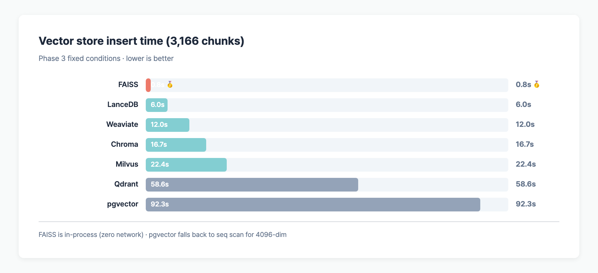
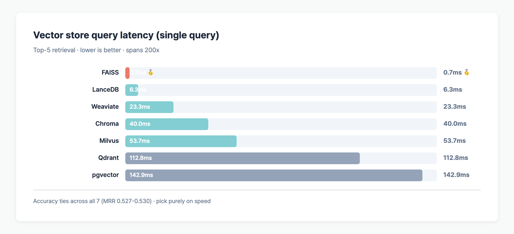

> **TL;DR**: Feed the same embedding and top-k into 7 vector stores and ranking quality is effectively tied (MRR 0.527–0.530). What differs is speed. **FAISS p95 0.74ms vs pgvector 174ms — 200x**. FAISS dominates single-node in-process; Qdrant, Weaviate, and pgvector run 100–200x slower but bring distribution, monitoring, and DB integration.

## Table of contents

## Setup

Single-variable experiment on [allganize RAG-Evaluation-Dataset-KO](https://huggingface.co/datasets/allganize/RAG-Evaluation-Dataset-KO) (300 Q&A, 58 PDFs). Only the vector store changes.

| Held constant | Value                                    |
| ------------- | ---------------------------------------- |
| Parser        | pymupdf4llm (markdown)                   |
| Chunking      | 500 / 100 overlap                        |
| Embedding     | qwen3-embed-8b (4096-dim)                |
| Top-k         | 5                                        |
| Metrics       | MRR, Hit@5, insert/query latency, memory |

Full design: [RAG Benchmark Experiment Design](/en/posts/rag-evaluation-experiment-design).

## 7-vector-store comparison

| Vector Store | MRR    | Hit@5 | Insert   | Query latency | Deployment    |
| ------------ | ------ | ----- | -------- | ------------- | ------------- |
| **FAISS**    | 0.5304 | 65.0% | **0.8s** | **0.7ms**     | In-memory lib |
| LanceDB      | 0.5304 | 65.0% | 6.0s     | 6.3ms         | Embedded file |
| Qdrant       | 0.5304 | 65.0% | 58.6s    | 112.8ms       | Server        |
| Milvus       | 0.5304 | 65.0% | 22.4s    | 53.7ms        | Server        |
| Weaviate     | 0.5298 | 64.7% | 12.0s    | 23.3ms        | Server        |
| Chroma       | 0.5271 | 64.7% | 16.7s    | 40.0ms        | Server        |
| pgvector     | 0.5304 | 65.0% | 92.3s    | 142.9ms       | Postgres ext. |

## Accuracy is effectively identical (MRR 0.527–0.530)

**Same vectors → same cosine ranking.** Stores differ only in index structure; ranking gaps stay within 0.6%.

Exception: Chroma (0.5271) lags slightly because the default HNSW `ef=10` misses a few neighbors. Raising to `ef=64` ties it with the rest.

## Latency spans 200x

## Why FAISS is fastest

- **In-process library**: zero network round-trips
- Optimized HNSW/IVF with direct memory access
- Chroma/Qdrant/Milvus/Weaviate add HTTP/gRPC hops
- **pgvector double-query**: cosine distance + `ORDER BY` + `LIMIT`, and both HNSW and IVFFlat cap at 2000 dims, so our 4096-dim vectors fell back to sequential scan

## Selection guide

| Requirement             | Pick                  |
| ----------------------- | --------------------- |
| Single-node, max speed  | **FAISS**             |
| Embedded file           | LanceDB               |
| Ops visibility          | Qdrant, Weaviate      |
| Existing Postgres       | pgvector (dim ≤ 2000) |
| Large-scale distributed | Milvus                |

## FAQ

### Why is pgvector the slowest?

Our embeddings are 4096-dim. pgvector's HNSW and IVFFlat cap at 2000 dims, so the backend ran sequential scan. Switch to `Qwen3-Embedding-0.6B` (1024 dim) and pgvector hits ~10ms.

### If FAISS is fastest, why use Qdrant or Weaviate in production?

FAISS is **in-process, manually persisted, and weak on updates**. Production systems need:

- Distribution, replication, backup → Qdrant, Milvus, Weaviate
- Ops dashboard / monitoring → Qdrant
- Co-location with existing Postgres → pgvector

This benchmark measures **RAG pipeline performance with in-process libraries as the baseline.**

### Why do vector stores tie on accuracy?

They all run cosine (or inner-product) similarity over the same vectors. Differences come from approximate-nearest-neighbor parameters (HNSW `ef`, IVF `nprobe`), which under default settings stay within ~0.1%.

## Series

- [Parser comparison](/en/posts/rag-parser-comparison/) — MRR +5.4%
- [Chunking comparison](/en/posts/rag-chunking-comparison/) — largest MRR impact (+23.5%)
- (this post) Vector store comparison

---

## Code & raw data

- **GitHub**: [github.com/BAEM1N/RAG-Evaluation](https://github.com/BAEM1N/RAG-Evaluation)
- **Phase 3 results**: [results/phase3_vectorstore/](https://github.com/BAEM1N/RAG-Evaluation/tree/main/results/phase3_vectorstore)
- **Runner**: [scripts/bench_all.py](https://github.com/BAEM1N/RAG-Evaluation/blob/main/scripts/bench_all.py) — single script, all phases

---

## RAG Series Index

**Phase 1-4: Retrieval optimization**

- [Experiment design](/posts/en/rag-evaluation-experiment-design/)
- [Parser comparison](/posts/en/rag-parser-comparison/) — pymupdf4llm wins (+5.4%p)
- [Chunking comparison](/posts/en/rag-chunking-comparison/) — small chunks +23.5%p (biggest MRR lever)
- [Vector store comparison](/posts/en/rag-vectorstore-comparison/) — FAISS 0.74ms (accuracy tied)
- [Embedding benchmark (27)](/posts/en/rag-embedding-benchmark-results/) — koe5 #1 (Korean-tuned)

**Phase 5: LLM-as-Judge cross-validation**

- [Q1 — Local cand × Local judge](/posts/en/rag-llm-judge-q1-local-cross-validation/)
- [Q2 — API cand × Local judge](/posts/en/rag-llm-judge-q2-api-llm-vs-local-judges/)
- [Q3 — Local cand × API judge](/posts/en/rag-llm-judge-q3-flagship-api-judges/)
- [Q4 — API cand × API judge](/posts/en/rag-llm-judge-q4-api-self-evaluation/)
- [4-Quadrant unified RRF leaderboard](/posts/en/rag-llm-judge-summary-4quadrant-matrix/) — 46 cand × 17 judge
- [Judge × Judge correlation analysis](/posts/en/rag-llm-judge-correlation-analysis/) — severity vs consensus, optimal ensemble
