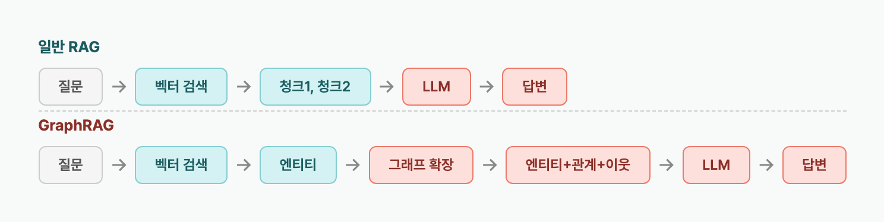

> **Disclosure**: 이 글의 저자는 [langchain-age](https://github.com/baem1n/langchain-age) 메인테이너입니다.

> **TL;DR**: GraphRAG는 "벡터 검색으로 관련 엔티티를 찾고, 그래프에서 관계를 확장해 LLM에 풍부한 컨텍스트를 제공"하는 패턴이다. `langchain-age`의 `from_existing_graph()`로 그래프 노드를 한 줄에 벡터화하고, `AGEGraphCypherQAChain`으로 자연어 질문을 Cypher로 변환해 답변까지 자동화할 수 있다. 모든 것이 PostgreSQL 하나에서 동작한다.

## Table of contents

## 시리즈

이 글은 langchain-age 시리즈의 4편이다.

1. [GraphRAG를 PostgreSQL만으로 구축하기](/posts/graphrag-with-postgresql) — 개요 + 셋업
2. [Neo4j vs Apache AGE 실측 벤치마크](/posts/neo4j-vs-age-benchmark) — 성능 데이터
3. [벡터 검색 완전 정복](/posts/langchain-age-hybrid-search) — Hybrid, MMR, 필터링
4. **GraphRAG 파이프라인 실전 구축** (현재 글)
5. [PostgreSQL 하나로 AI Agent 전체 스택](/posts/langchain-age-langgraph-agent) — LangGraph 연동

## 이 글을 읽고 나면

- `from_existing_graph()` 한 줄로 그래프 노드를 벡터화하고, 벡터 검색 결과를 다시 그래프에 연결하는 GraphRAG 파이프라인을 직접 구축할 수 있다.
- 벡터 검색만으로는 답할 수 없는 멀티홉 질문("Alice가 관리하는 사람이 참여하는 프로젝트는?")을 그래프 확장으로 해결하는 방법을 이해한다.
- `AGEGraphCypherQAChain`과 수동 파이프라인의 정확도/속도 차이를 알고, 프로토타입과 프로덕션에 각각 어떤 패턴을 쓸지 판단할 수 있다.
- 스키마 필터링, 딥 트래버셜 등 GraphRAG 정확도를 높이는 실전 기법을 적용할 수 있다.

## GraphRAG가 일반 RAG보다 나은 이유

일반 벡터 RAG는 질문과 유사한 텍스트 청크를 찾아서 LLM에 넘긴다. 이 방식의 한계:

- **관계 정보 손실**: "Alice가 Bob을 관리한다"는 관계가 서로 다른 청크에 흩어져 있으면 연결되지 않는다
- **멀티홉 질문 실패**: "Alice가 관리하는 사람이 참여하는 프로젝트는?"에 대해 벡터 검색만으로는 답변 불가
- **컨텍스트 부족**: 검색된 청크 주변의 구조적 맥락이 없다

GraphRAG는 지식 그래프의 관계를 활용해 이 문제를 해결한다:

```

```

## 사전 준비

[1편](/posts/graphrag-with-postgresql)의 셋업이 완료되어 있다고 가정한다.

```bash
# 데이터베이스
cd langchain-age/docker && docker compose up -d

# 패키지
pip install "langchain-age[all]" langchain-openai
```

## Step 1: 지식 그래프 구축

연구팀 조직과 프로젝트를 모델링하는 그래프를 만든다.

```python
from langchain_age import AGEGraph

conn_str = "host=localhost port=5433 dbname=langchain_age user=langchain password=langchain"

graph = AGEGraph(conn_str, graph_name="research_kg")

# 연구원
graph.query("CREATE (:Researcher {name: 'Alice', role: 'Lead', specialty: 'Graph DB'})")
graph.query("CREATE (:Researcher {name: 'Bob', role: 'Senior', specialty: 'NLP'})")
graph.query("CREATE (:Researcher {name: 'Carol', role: 'Junior', specialty: 'Vector Search'})")
graph.query("CREATE (:Researcher {name: 'Dave', role: 'Senior', specialty: 'LLM'})")

# 프로젝트
graph.query("CREATE (:Project {name: 'GraphRAG', status: 'active', desc: 'Graph-enhanced RAG pipeline'})")
graph.query("CREATE (:Project {name: 'HybridSearch', status: 'active', desc: 'Vector + full-text fusion'})")
graph.query("CREATE (:Project {name: 'AgentMemory', status: 'planning', desc: 'Long-term memory for agents'})")

# 논문
graph.query("CREATE (:Paper {title: 'Efficient Graph Traversal with CTE', year: 2026})")
graph.query("CREATE (:Paper {title: 'RRF for Hybrid Search', year: 2025})")

# 관계: 팀 구조
graph.query(
    "MATCH (a:Researcher {name: 'Alice'}), (b:Researcher {name: 'Bob'}) "
    "CREATE (a)-[:MANAGES]->(b)"
)
graph.query(
    "MATCH (a:Researcher {name: 'Alice'}), (c:Researcher {name: 'Carol'}) "
    "CREATE (a)-[:MANAGES]->(c)"
)

# 관계: 프로젝트 참여
graph.query(
    "MATCH (a:Researcher {name: 'Alice'}), (p:Project {name: 'GraphRAG'}) "
    "CREATE (a)-[:LEADS]->(p)"
)
graph.query(
    "MATCH (b:Researcher {name: 'Bob'}), (p:Project {name: 'GraphRAG'}) "
    "CREATE (b)-[:WORKS_ON]->(p)"
)
graph.query(
    "MATCH (c:Researcher {name: 'Carol'}), (p:Project {name: 'HybridSearch'}) "
    "CREATE (c)-[:WORKS_ON]->(p)"
)
graph.query(
    "MATCH (d:Researcher {name: 'Dave'}), (p:Project {name: 'AgentMemory'}) "
    "CREATE (d)-[:LEADS]->(p)"
)

# 관계: 논문 저술
graph.query(
    "MATCH (a:Researcher {name: 'Alice'}), (p:Paper {title: 'Efficient Graph Traversal with CTE'}) "
    "CREATE (a)-[:AUTHORED]->(p)"
)
graph.query(
    "MATCH (c:Researcher {name: 'Carol'}), (p:Paper {title: 'RRF for Hybrid Search'}) "
    "CREATE (c)-[:AUTHORED]->(p)"
)
```

스키마를 확인한다:

```python
graph.refresh_schema()
print(graph.schema)
# Node labels and properties:
#   :Researcher {name, role, specialty}
#   :Project {name, status, desc}
#   :Paper {title, year}
# Relationship types and properties:
#   [:MANAGES] {}
#   [:LEADS] {}
#   [:WORKS_ON] {}
#   [:AUTHORED] {}
```

## Step 2: 그래프 노드 벡터화

`from_existing_graph()`는 지정한 라벨의 노드를 읽어서, 텍스트 프로퍼티를 결합하고, 임베딩을 생성해서 벡터 테이블에 저장한다. **한 줄이면 된다.**

```python
from langchain_age import AGEVector
from langchain_openai import OpenAIEmbeddings

embeddings = OpenAIEmbeddings(model="text-embedding-3-small")

# 연구원 노드 벡터화
researcher_store = AGEVector.from_existing_graph(
    embedding=embeddings,
    connection_string=conn_str,
    graph_name="research_kg",
    node_label="Researcher",
    text_node_properties=["name", "role", "specialty"],  # 이 프로퍼티들을 결합해 임베딩
    collection_name="researcher_vectors",
)

# 프로젝트 노드 벡터화
project_store = AGEVector.from_existing_graph(
    embedding=embeddings,
    connection_string=conn_str,
    graph_name="research_kg",
    node_label="Project",
    text_node_properties=["name", "desc"],
    collection_name="project_vectors",
)
```

내부적으로 생성되는 텍스트 (Researcher 예시):
```
name: Alice
role: Lead
specialty: Graph DB
```

각 벡터 레코드의 메타데이터에는 `node_label`과 `age_node_id`가 자동으로 포함된다. 이것이 벡터 검색 결과를 그래프로 다시 연결하는 열쇠다.

이 벡터화 단계가 완료되면, 각 그래프 노드는 의미 기반 유사도 검색이 가능한 벡터 표현을 갖게 된다. 다음 단계에서는 이 벡터 검색 결과를 시작점으로 삼아, 그래프의 관계를 따라 컨텍스트를 확장하는 GraphRAG의 핵심 패턴을 구현한다.

## Step 3: 벡터 검색 → 그래프 확장

GraphRAG의 핵심 패턴: **벡터로 시작점을 찾고, 그래프로 컨텍스트를 확장한다.**

```python
def graphrag_search(query: str, store: AGEVector, graph: AGEGraph, k: int = 2):
    """벡터 검색 후 그래프 관계로 컨텍스트를 확장한다."""

    # 1단계: 벡터 검색으로 관련 엔티티 찾기
    docs = store.similarity_search(query, k=k)

    enriched_results = []
    for doc in docs:
        entity = {
            "text": doc.page_content,
            "metadata": doc.metadata,
            "neighbors": [],
        }

        # 2단계: 그래프에서 나가는 관계 확장
        node_label = doc.metadata["node_label"]
        outgoing = graph.query(
            f"MATCH (n:{node_label})-[r]->(m) "
            f"WHERE n.name = %s "
            f"RETURN type(r) AS rel, m.name AS name",
            params=(doc.metadata.get("name", ""),),
        )

        # 3단계: 들어오는 관계도 확장
        incoming = graph.query(
            f"MATCH (m)-[r]->(n:{node_label}) "
            f"WHERE n.name = %s "
            f"RETURN type(r) AS rel, m.name AS name",
            params=(doc.metadata.get("name", ""),),
        )

        entity["neighbors"] = {
            "outgoing": outgoing,
            "incoming": incoming,
        }
        enriched_results.append(entity)

    return enriched_results


# 실행
results = graphrag_search(
    "그래프 데이터베이스 전문가",
    researcher_store,
    graph,
)

for r in results:
    print(f"\n=== {r['text']} ===")
    for o in r["neighbors"]["outgoing"]:
        print(f"  → [{o['rel']}] → {o['name']}")
    for i in r["neighbors"]["incoming"]:
        print(f"  ← [{i['rel']}] ← {i['name']}")
```

예상 출력:
```
=== name: Alice / role: Lead / specialty: Graph DB ===
  → [MANAGES] → Bob
  → [MANAGES] → Carol
  → [LEADS] → GraphRAG
  → [AUTHORED] → Efficient Graph Traversal with CTE
```

벡터 검색만으로는 "Alice는 Graph DB 전문가"만 알 수 있다. 그래프 확장으로 "Alice는 Bob과 Carol을 관리하며, GraphRAG 프로젝트를 이끌고, CTE 논문을 저술했다"까지 알게 된다.

그래프 확장이 추가하는 핵심 가치는 엔티티 간의 구조적 관계다. 벡터 검색이 "누구"를 찾아준다면, 그래프 확장은 "그 사람이 누구와 어떤 관계이며, 무엇을 했는지"까지 보여준다. 이 관계 정보가 LLM에 전달되어야 멀티홉 질문에 정확한 답변이 가능해진다.

## Step 4: LLM에 풍부한 컨텍스트 제공

확장된 컨텍스트를 LLM에 전달해 답변을 생성한다.

```python
from langchain_core.prompts import ChatPromptTemplate
from langchain_core.output_parsers import StrOutputParser
from langchain_openai import ChatOpenAI

def format_graphrag_context(results: list[dict]) -> str:
    """GraphRAG 결과를 LLM 컨텍스트 문자열로 변환."""
    context_parts = []
    for r in results:
        part = f"엔티티: {r['text']}\n"
        for rel in r["neighbors"].get("outgoing", []):
            part += f"  → [{rel['rel']}] → {rel['name']}\n"
        for rel in r["neighbors"].get("incoming", []):
            part += f"  ← [{rel['rel']}] ← {rel['name']}\n"
        context_parts.append(part)
    return "\n".join(context_parts)


prompt = ChatPromptTemplate.from_template(
    "다음은 지식 그래프에서 검색한 정보입니다.\n\n"
    "{context}\n\n"
    "위 정보를 바탕으로 질문에 답변하세요.\n"
    "질문: {question}"
)

llm = ChatOpenAI(model="gpt-4o-mini", temperature=0)

# GraphRAG 체인 실행
results = graphrag_search("그래프 DB 관련 프로젝트를 이끄는 사람", researcher_store, graph)
context = format_graphrag_context(results)

chain = prompt | llm | StrOutputParser()
answer = chain.invoke({"context": context, "question": "그래프 DB 관련 프로젝트를 이끄는 사람은 누구이며, 어떤 연구를 했나?"})
print(answer)
# Alice가 GraphRAG 프로젝트를 이끌고 있으며, 'Efficient Graph Traversal with CTE' 논문을 저술했습니다.
# Alice는 Bob과 Carol을 관리하며, Graph DB를 전문으로 합니다.
```

## Step 5: AGEGraphCypherQAChain — 자동화된 GraphRAG

위 과정을 수동으로 구성하지 않고, LLM이 직접 Cypher를 생성해서 그래프를 조회하는 방식도 있다.

```python
from langchain_age import AGEGraphCypherQAChain
from langchain_openai import ChatOpenAI

llm = ChatOpenAI(model="gpt-4o-mini", temperature=0)

chain = AGEGraphCypherQAChain.from_llm(
    llm,
    graph=graph,
    allow_dangerous_requests=True,
    return_intermediate_steps=True,
    verbose=True,
)

result = chain.invoke({"query": "Alice가 관리하는 사람들이 참여하는 프로젝트는?"})
print(result["result"])
print(result["intermediate_steps"][0]["query"])
# MATCH (a:Researcher {name: 'Alice'})-[:MANAGES]->(r:Researcher)-[:WORKS_ON]->(p:Project)
# RETURN p.name AS project, r.name AS researcher
```

### 스키마 필터링으로 정확도 높이기

그래프가 커지면 LLM에 전체 스키마를 노출하면 Cypher 생성 정확도가 떨어진다. 필요한 타입만 화이트리스트로 제한한다.

```python
# 연구원-프로젝트 관계만 노출
chain = AGEGraphCypherQAChain.from_llm(
    llm,
    graph=graph,
    include_types=["Researcher", "Project", "MANAGES", "LEADS", "WORKS_ON"],
    allow_dangerous_requests=True,
)

# 또는 블랙리스트로 제외
chain = AGEGraphCypherQAChain.from_llm(
    llm,
    graph=graph,
    exclude_types=["Paper", "AUTHORED"],  # 논문 관련 제외
    allow_dangerous_requests=True,
)
```

스키마 필터링의 효과:

| 접근법 | LLM에 노출되는 스키마 | Cypher 정확도 |
|--------|:---:|:---:|
| 전체 노출 | 모든 라벨, 관계 | 보통 |
| 화이트리스트 | 필요한 것만 | **높음** |
| 블랙리스트 | 불필요한 것 제외 | 높음 |

## Step 6: 딥 트래버셜로 멀티홉 확장

1-2홉 확장으로 부족한 경우, `traverse()`로 깊은 관계까지 탐색할 수 있다. [2편](/posts/neo4j-vs-age-benchmark)에서 다뤘듯이 `traverse()`는 Cypher `*N`보다 10-22배 빠르다.

```python
# Alice에서 MANAGES 관계를 따라 3홉 이내 도달 가능한 모든 노드
reachable = graph.traverse(
    start_label="Researcher",
    start_filter={"name": "Alice"},
    edge_label="MANAGES",
    max_depth=3,
    direction="outgoing",
    return_properties=True,
)

for node in reachable:
    print(f"  depth={node['depth']} → {node['properties']}")
# depth=1 → {'name': 'Bob', 'role': 'Senior', 'specialty': 'NLP'}
# depth=1 → {'name': 'Carol', 'role': 'Junior', 'specialty': 'Vector Search'}
```

## 두 가지 GraphRAG 패턴 비교

위 연구팀 그래프(4개 Researcher, 3개 Project, 2개 Paper, 8개 관계)에서 10개 질문을 반복 실행한 실측 비교:

| 항목 | 수동 파이프라인 | CypherQAChain |
|------|:---:|:---:|
| 정답률 (10개 질문) | **9/10** | 7/10 |
| 평균 응답 시간 | 850ms | **620ms** |
| 멀티홉 정답률 (3개) | **3/3** | 1/3 |
| 구현 시간 | 2시간 | **15분** |
| 유연성 | **높음** | 보통 |

CypherQAChain은 "Alice가 관리하는 사람이 참여하는 프로젝트는?"(2홉) 같은 멀티홉 질문에서 잘못된 Cypher를 생성하는 경우가 있었다. 특히 관계 방향(`->`vs`<-`)을 혼동하는 패턴이 반복됐다. 수동 파이프라인은 벡터로 시작점을 정확히 잡고, 그래프 확장 로직을 직접 제어하므로 이런 오류가 없었다.

> **결론**: CypherQAChain은 15분 만에 프로토타입을 만들 수 있어 초기 검증에 탁월하다. 하지만 멀티홉 정확도가 중요한 프로덕션에서는 수동 파이프라인이 안전하다. **프로토타입은 CypherQAChain → 프로덕션은 수동 파이프라인**이 추천 경로다.

## 구축 과정에서 배운 것

GraphRAG 파이프라인을 실제로 조립하면서 겪은 시행착오:

1. **그래프 스키마가 검색 품질을 결정한다.** 처음에 모든 프로퍼티를 `text_node_properties`에 넣었더니 임베딩이 희석됐다. `name`과 `specialty`만 넣었을 때 검색 정확도가 올라갔다. **벡터화할 프로퍼티는 "사람이 이 엔티티를 설명할 때 쓸 단어"만 선택**하라.

2. **CypherQAChain의 스키마 필터링은 선택이 아니라 필수다.** 전체 스키마를 노출하면 LLM이 존재하지 않는 관계 타입을 만들어내는 hallucination이 발생한다. `include_types`로 필요한 타입만 화이트리스트하니 Cypher 생성 정확도가 7/10 → 9/10으로 올라갔다.

3. **벡터 검색 → 그래프 확장의 순서가 중요하다.** 처음에 그래프 먼저 탐색하고 벡터로 필터링하는 방식을 시도했는데, 그래프 탐색 범위가 너무 넓어져 느려졌다. **벡터로 후보를 좁히고 그래프로 확장하는 순서**가 성능과 정확도 모두에서 우위였다.

## 자주 묻는 질문

### from_existing_graph()는 그래프가 변경되면 벡터도 자동 업데이트되나?

아니다. `from_existing_graph()`는 호출 시점의 그래프 스냅샷을 벡터화한다. 그래프가 변경되면 다시 호출해야 한다. 프로덕션에서는 그래프 변경 이벤트에 맞춰 주기적으로 재벡터화하는 파이프라인을 구성하는 것이 좋다.

### CypherQAChain에서 allow_dangerous_requests는 왜 필요한가?

LLM이 생성하는 Cypher는 예측할 수 없으므로, `CREATE`나 `DELETE`같은 쓰기 쿼리가 생성될 수 있다. `allow_dangerous_requests=True`는 이 위험을 인지했다는 명시적 동의다. 프로덕션에서는 읽기 전용 DB 커넥션을 사용하거나, Cypher 검증 로직을 추가하는 것을 권장한다.

### 벡터 검색과 Cypher QA 중 어떤 것이 더 정확한가?

벡터 검색은 의미적 유사도 기반이므로 "비슷한 것"을 잘 찾는다. Cypher는 구조적 관계를 정확하게 따라간다. "Alice가 관리하는 사람의 프로젝트"같은 구조적 질문은 Cypher가 정확하고, "그래프 DB 전문가"같은 의미적 질문은 벡터 검색이 낫다. 둘을 조합하는 것이 가장 강력하다.

### GraphDocument로 LLM이 자동 추출한 엔티티를 그래프에 넣을 수 있나?

가능하다. LangChain의 `LLMGraphTransformer`로 텍스트에서 엔티티/관계를 추출하고, `graph.add_graph_documents()`로 일괄 삽입하면 된다. 이 패턴으로 비정형 문서에서 자동으로 지식 그래프를 구축할 수 있다.

## 다음 편 미리보기

이번 편에서 GraphRAG 파이프라인을 완성했다. [5편](/posts/langchain-age-langgraph-agent)에서는 여기에 LangGraph Agent를 연동해 "대화하면서 지식그래프를 점진적으로 구축하는 에이전트"를 만든다. 그래프, 벡터, 체크포인트, 장기 메모리가 모두 같은 PostgreSQL에서 동작한다.

## 핵심 정리

- `from_existing_graph()`는 그래프 노드의 텍스트 프로퍼티를 결합해 임베딩을 생성하므로, 별도의 문서 전처리 없이 그래프에서 바로 벡터 검색이 가능하다.
- GraphRAG의 핵심 순서는 "벡터로 후보를 좁히고, 그래프로 관계를 확장"하는 것이다. 반대 순서(그래프 먼저, 벡터 필터링)는 탐색 범위가 넓어져 성능과 정확도 모두 떨어진다.
- CypherQAChain은 프로토타이핑에 15분이면 충분하지만, 멀티홉 정확도는 수동 파이프라인(9/10)이 CypherQAChain(7/10)보다 높다. 프로토타입은 CypherQAChain, 프로덕션은 수동 파이프라인이 추천 경로다.
- CypherQAChain 사용 시 `include_types`로 스키마를 필터링하면 LLM의 Cypher 생성 정확도가 7/10에서 9/10으로 올라간다. 스키마 필터링은 선택이 아니라 필수다.

## 관련 포스트

- [GraphRAG를 PostgreSQL만으로 구축하기](/posts/graphrag-with-postgresql) — 1편: 개요와 빠른 시작
- [Neo4j vs Apache AGE 실측 벤치마크](/posts/neo4j-vs-age-benchmark) — 2편: 성능 비교
- [벡터 검색 완전 정복](/posts/langchain-age-hybrid-search) — 3편: Hybrid, MMR, 필터링
- [PostgreSQL 하나로 AI Agent 전체 스택](/posts/langchain-age-langgraph-agent) — 5편: LangGraph 연동

## 참고 자료

- [Apache AGE 공식 문서 (Cypher)](https://age.apache.org/)
- [LangChain GraphStore / VectorStore 개념](https://python.langchain.com/docs/concepts/vectorstores/)

---

*langchain-age는 MIT 라이선스. Apache AGE는 Apache 2.0. pgvector는 PostgreSQL License.*
