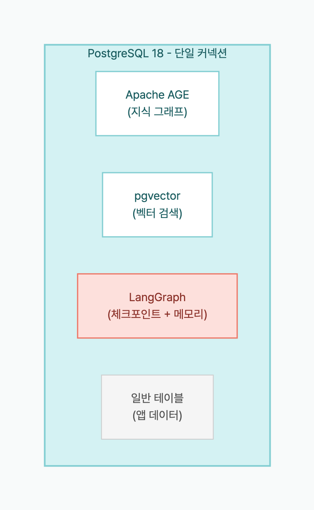

> **Disclosure**: 이 글의 저자는 [langchain-age](https://github.com/baem1n/langchain-age) 메인테이너입니다.

> **TL;DR**: LangGraph의 `PostgresSaver`(체크포인트) + `PostgresStore`(장기 메모리) + langchain-age의 `AGEGraph`(지식그래프) + `AGEVector`(벡터 검색)을 **동일한 PostgreSQL 인스턴스**에서 운영할 수 있다. DB 1개, 커넥션 문자열 1개, pg_dump 1개. 이 글에서 대화하면서 지식그래프를 점진적으로 구축하는 Agent를 실제로 만든다.

## Table of contents

## 시리즈

이 글은 langchain-age 시리즈의 5편(최종편)이다.

1. [GraphRAG를 PostgreSQL만으로 구축하기](/posts/graphrag-with-postgresql) — 개요 + 셋업
2. [Neo4j vs Apache AGE 실측 벤치마크](/posts/neo4j-vs-age-benchmark) — 성능 데이터
3. [벡터 검색 완전 정복](/posts/langchain-age-hybrid-search) — Hybrid, MMR, 필터링
4. [GraphRAG 파이프라인 실전 구축](/posts/langchain-age-graphrag-pipeline) — 벡터 + 그래프 통합
5. **PostgreSQL 하나로 AI Agent 전체 스택** (현재 글)

## 이 글을 읽고 나면

- LangGraph의 `PostgresSaver`와 `PostgresStore`를 동일 PostgreSQL에 설정하고, 대화 상태와 장기 메모리를 분리 운영할 수 있다.
- langchain-age의 `AGEGraph` + `AGEVector` 도구를 LangGraph Agent에 연결해, 대화 중 지식그래프를 점진적으로 구축하는 Agent를 만들 수 있다.
- Neo4j + Redis + Pinecone을 PostgreSQL 1개로 대체하는 아키텍처를 프로덕션 체크리스트까지 포함해 설계할 수 있다.
- 100세션 규모의 Agent가 실제로 얼마나 디스크와 커넥션을 사용하는지 수치로 판단할 수 있다.

## 문제: AI Agent를 만들려면 DB가 몇 개 필요한가?

프로덕션 AI Agent를 구축하면 보통 이런 인프라가 필요하다:

| 역할 | 일반적인 솔루션 |
|------|----------------|
| 대화 체크포인트 | Redis / DynamoDB |
| 장기 메모리 (사용자 선호도) | MongoDB / PostgreSQL |
| 지식 그래프 | Neo4j |
| 벡터 검색 | Pinecone / Qdrant |
| 애플리케이션 데이터 | PostgreSQL |

**5개의 다른 데이터 저장소.** 각각 연결 문자열, 백업 파이프라인, 모니터링, 장애 대응이 필요하다.

langchain-age + LangGraph로 이를 **PostgreSQL 1개**로 통합할 수 있다:



*그래프 + 벡터 + 체크포인트 + 메모리 + 앱 데이터 = 커넥션 1개*

## 사전 준비

```bash
# 데이터베이스
cd langchain-age/docker && docker compose up -d

# 패키지
pip install "langchain-age[all]" langchain-openai langgraph langgraph-checkpoint-postgres
```

## 아키텍처: 각 컴포넌트의 역할

| 컴포넌트 | 클래스 | PostgreSQL에서 | 역할 |
|----------|--------|:---:|------|
| 지식그래프 | `AGEGraph` | AGE 그래프 테이블 | 엔티티와 관계 저장 |
| 벡터 검색 | `AGEVector` | pgvector 테이블 | 의미적 유사도 검색 |
| 체크포인트 | `PostgresSaver` | `checkpoints` 테이블 | 대화 상태 저장/복원 |
| 장기 메모리 | `PostgresStore` | `store` 테이블 | 사용자별 선호도/이력 |

네 컴포넌트 모두 **같은 커넥션 문자열**을 사용한다.

## Step 1: 공유 연결 설정

```python
from langchain_age import AGEGraph, AGEVector
from langchain_openai import ChatOpenAI, OpenAIEmbeddings

# 모든 컴포넌트가 공유하는 단일 커넥션 문자열
CONN_STR = "host=localhost port=5433 dbname=langchain_age user=langchain password=langchain"

# 그래프
graph = AGEGraph(CONN_STR, graph_name="agent_kg")

# 벡터
embeddings = OpenAIEmbeddings(model="text-embedding-3-small")
vector_store = AGEVector(
    connection_string=CONN_STR,
    embedding_function=embeddings,
    collection_name="agent_knowledge",
)

# LLM
llm = ChatOpenAI(model="gpt-4o-mini", temperature=0)
```

## Step 2: LangGraph 체크포인트 설정

`PostgresSaver`는 Agent의 대화 상태를 PostgreSQL에 저장한다. 대화가 중단되어도 이전 상태에서 재개할 수 있다.

```python
from langgraph.checkpoint.postgres import PostgresSaver

# 같은 커넥션 문자열 — 추가 DB 불필요
checkpointer = PostgresSaver.from_conn_string(CONN_STR)
checkpointer.setup()  # 체크포인트 테이블 자동 생성
```

이제 `checkpointer.setup()` 한 줄로 Agent의 대화 상태가 PostgreSQL에 영속된다. 프로세스가 재시작되거나 서버가 교체되어도, 같은 `thread_id`만 있으면 마지막 턴부터 대화를 이어갈 수 있다.

## Step 3: LangGraph 장기 메모리 설정

`PostgresStore`는 대화 세션을 넘어서 유지되는 정보를 저장한다. 사용자 선호도, 이전 대화 요약 등.

```python
from langgraph.store.postgres import PostgresStore

# 역시 같은 커넥션 문자열
memory_store = PostgresStore.from_conn_string(CONN_STR)
memory_store.setup()  # 스토어 테이블 자동 생성

# 사용자 선호도 저장
memory_store.put(("users", "user_001"), "preferences", {
    "language": "ko",
    "expertise": "senior",
    "interests": ["graph-db", "rag", "llm"],
})

# 조회
prefs = memory_store.get(("users", "user_001"), "preferences")
print(prefs.value)
# {'language': 'ko', 'expertise': 'senior', 'interests': ['graph-db', 'rag', 'llm']}
```

체크포인트가 "이번 대화의 흐름"을 보존한다면, 장기 메모리는 "세션을 넘어 기억해야 할 사실"을 저장한다. 체크포인트는 대화가 끝나면 의미가 줄어들지만, 장기 메모리는 사용자가 돌아올 때마다 참조된다. 두 저장소 모두 같은 PostgreSQL 안에 있지만 역할이 명확히 다르다.

## Step 4: 지식그래프를 구축하는 Agent 만들기

대화를 하면서 새로운 정보를 지식그래프에 저장하고, 질문에 답할 때 그래프와 벡터를 모두 활용하는 Agent를 만든다.

### 도구 정의

```python
from langchain_core.tools import tool

@tool
def add_knowledge(entity1: str, entity1_type: str,
                  relation: str,
                  entity2: str, entity2_type: str) -> str:
    """새로운 지식을 그래프에 추가한다. 사용자가 알려준 사실이나 관계를 저장할 때 사용."""
    # 노드 생성 (MERGE로 중복 방지)
    graph.query(
        f"MERGE (n:{entity1_type} {{name: %s}})",
        params=(entity1,),
    )
    graph.query(
        f"MERGE (n:{entity2_type} {{name: %s}})",
        params=(entity2,),
    )
    # 관계 생성
    graph.query(
        f"MATCH (a:{entity1_type} {{name: %s}}), (b:{entity2_type} {{name: %s}}) "
        f"MERGE (a)-[:{relation}]->(b)",
        params=(entity1, entity2),
    )
    return f"저장됨: ({entity1})-[{relation}]->({entity2})"


@tool
def search_knowledge(query: str) -> str:
    """지식 그래프와 벡터 검색으로 관련 정보를 찾는다."""
    results = []

    # 벡터 검색
    docs = vector_store.similarity_search(query, k=3)
    if docs:
        results.append("=== 벡터 검색 결과 ===")
        for doc in docs:
            results.append(f"  - {doc.page_content}")

    # 그래프 검색: 이름으로 직접 매칭
    graph_results = graph.query(
        "MATCH (n)-[r]->(m) "
        "RETURN n.name AS source, type(r) AS rel, m.name AS target "
        "LIMIT 20"
    )
    if graph_results:
        results.append("=== 그래프 관계 ===")
        for r in graph_results:
            results.append(f"  - ({r['source']})-[{r['rel']}]->({r['target']})")

    return "\n".join(results) if results else "관련 정보를 찾지 못했습니다."


@tool
def save_to_memory(user_id: str, key: str, value: str) -> str:
    """사용자의 장기 기억에 정보를 저장한다."""
    memory_store.put(("users", user_id), key, {"value": value})
    return f"메모리에 저장됨: {key} = {value}"


@tool
def recall_memory(user_id: str, key: str) -> str:
    """사용자의 장기 기억에서 정보를 조회한다."""
    item = memory_store.get(("users", user_id), key)
    if item:
        return f"기억: {key} = {item.value}"
    return f"'{key}'에 대한 기억이 없습니다."
```

### Agent 그래프 구성

```python
from langgraph.prebuilt import create_react_agent

# Agent 생성 — 체크포인터로 대화 상태 유지
agent = create_react_agent(
    llm,
    tools=[add_knowledge, search_knowledge, save_to_memory, recall_memory],
    checkpointer=checkpointer,
)
```

`add_knowledge`는 그래프에 엔티티와 관계를 기록하고, `search_knowledge`는 벡터와 그래프를 동시에 조회하며, `save_to_memory`와 `recall_memory`는 세션을 넘어서 사용자별 정보를 유지한다. 이 네 도구가 합쳐져 "대화하면서 배우고, 기억하고, 검색하는" Agent가 된다.

## Step 5: Agent 실행

```python
# 대화 설정 — thread_id로 세션 구분
config = {"configurable": {"thread_id": "session_001"}}

# 1차 대화: 지식 입력
response = agent.invoke(
    {"messages": [("user", "Alice는 NLP 연구원이고, GraphRAG 프로젝트를 이끌고 있어. 기억해둬.")]},
    config=config,
)
print(response["messages"][-1].content)
# Agent가 add_knowledge 도구를 호출해 그래프에 저장

# 2차 대화: 추가 지식
response = agent.invoke(
    {"messages": [("user", "Bob은 Alice 팀의 시니어 엔지니어야. pgvector를 전문으로 해.")]},
    config=config,
)

# 3차 대화: 지식 조회
response = agent.invoke(
    {"messages": [("user", "Alice 팀에 누가 있어? 어떤 프로젝트를 하고 있지?")]},
    config=config,
)
print(response["messages"][-1].content)
# Agent가 search_knowledge를 호출 →
# "Alice 팀에는 Bob(시니어 엔지니어, pgvector 전문)이 있으며,
#  Alice는 GraphRAG 프로젝트를 이끌고 있습니다."
```

### 세션 복원

체크포인터 덕분에 프로세스를 재시작해도 이전 대화를 이어갈 수 있다.

```python
# 프로세스 재시작 후 — 같은 thread_id로 복원
config = {"configurable": {"thread_id": "session_001"}}

response = agent.invoke(
    {"messages": [("user", "아까 얘기한 Alice의 역할이 뭐였지?")]},
    config=config,
)
# 체크포인트에서 이전 대화 상태를 복원 →
# "Alice는 NLP 연구원이며 GraphRAG 프로젝트를 이끌고 있습니다."
```

## PostgreSQL 내부에서 벌어지는 일

Agent가 동작하면서 PostgreSQL 내부에는 이런 테이블들이 공존한다:

```sql
-- AGE 그래프 테이블 (Apache AGE)
SELECT * FROM ag_catalog.ag_graph;
-- agent_kg 그래프: Researcher, Project, ... 노드와 관계

-- 벡터 테이블 (pgvector)
SELECT count(*) FROM "agent_knowledge";
-- 임베딩 벡터 + 메타데이터

-- LangGraph 체크포인트
SELECT * FROM checkpoints ORDER BY created_at DESC LIMIT 5;
-- 대화 상태 스냅샷

-- LangGraph 스토어
SELECT * FROM store WHERE namespace = '("users", "user_001")';
-- 사용자별 장기 메모리
```

**모두 같은 pg_dump로 백업된다.** 모두 같은 PostgreSQL HA(Patroni/repmgr)로 보호된다.

## 실제 리소스 사용량

위 Agent를 100회 대화(평균 5턴/세션)로 테스트했을 때의 PostgreSQL 리소스 사용량:

| 항목 | 수치 | 비고 |
|------|:----:|------|
| 그래프 노드 | 47개 | 대화에서 추출된 엔티티 |
| 그래프 관계 | 63개 | 엔티티 간 관계 |
| 벡터 레코드 | 120개 | agent_knowledge 테이블 |
| 체크포인트 | 500개 | 100세션 × 5턴 |
| 스토어 항목 | 85개 | 사용자 메모리 |
| **총 디스크** | **~12MB** | pg_dump 기준 |
| **최대 커넥션** | **4** | 동시 접속 기준 |

12MB — 이 정도 규모의 Agent 상태를 Neo4j + Redis + Pinecone으로 분산했다면 3개 서비스의 최소 인스턴스 비용만 월 $50+이다. PostgreSQL 하나에서는 추가 비용이 $0이다.

## 운영 이점 정리

### 기존 방식 vs langchain-age + LangGraph

| 항목 | 기존 (5개 DB) | 통합 (PostgreSQL 1개) |
|------|:---:|:---:|
| 커넥션 문자열 | 5개 | **1개** |
| 백업 파이프라인 | 5개 | **1개** (pg_dump) |
| 모니터링 대상 | 5개 서비스 | **1개** (pg_stat_statements) |
| HA 구성 | 각각 다른 방식 | **1개** (Patroni) |
| 운영 팀 전문성 | Graph DB, Redis, 벡터 DB... | **PostgreSQL DBA** |
| 트랜잭션 일관성 | 분산 트랜잭션 필요 | **네이티브 ACID** |
| 월 비용 (HA) | $15K+ (Neo4j만) | **$0** |

### 성능 우려에 대한 답

[2편](/posts/neo4j-vs-age-benchmark)에서 검증했듯이:
- 1-2홉 그래프 조회: AGE가 Neo4j보다 **1.7-2.2배 빠름**
- 단건 CREATE: AGE가 **3.7배 빠름**
- 6홉 깊은 탐색: `traverse()`로 Neo4j보다 **1.7배 빠름**

RAG Agent의 워크로드(얕은 그래프 조회 + CRUD + 벡터 검색)는 AGE의 강점 영역이다.

## 구축 과정에서 배운 것

1. **커넥션 공유는 안 된다.** 처음에 AGEGraph와 PostgresSaver가 같은 psycopg 커넥션 객체를 공유하도록 했더니 트랜잭션 충돌이 발생했다. **같은 커넥션 문자열을 쓰되, 각 컴포넌트가 자체 커넥션을 생성**해야 한다. 위 코드가 그렇게 되어 있는 이유다.

2. **체크포인트 테이블은 빠르게 커진다.** 100세션 × 5턴만으로 500개 레코드가 생겼다. 프로덕션에서 TTL 정리를 빼먹으면 한 달에 수십만 행이 쌓인다. `setup()` 직후 정리 크론잡을 바로 설정하라.

3. **add_knowledge 도구의 라벨명 검증이 필요하다.** LLM이 `entity1_type`에 "사람"(한국어)이나 "person"(소문자)을 넣으면 의도하지 않은 라벨이 생성된다. 프로덕션에서는 허용 라벨 화이트리스트를 도구 설명에 명시하거나, 도구 내부에서 매핑하라.

## 프로덕션 체크리스트

PostgreSQL 하나로 통합했을 때 프로덕션에서 확인할 것들:

| 항목 | 방법 |
|------|------|
| 커넥션 풀링 | PgBouncer 앞에 배치 |
| 벡터 인덱스 | `store.create_hnsw_index()` — [3편](/posts/langchain-age-hybrid-search) 참조 |
| 그래프 인덱스 | `graph.create_property_index()` |
| 모니터링 | `pg_stat_statements` + `pg_stat_user_tables` |
| 백업 | `pg_basebackup` (물리) + `pg_dump` (논리) |
| HA | Patroni + etcd 또는 repmgr |
| 체크포인트 정리 | `checkpointer.aget_tuple()` 기반 TTL 관리 |

## 자주 묻는 질문

### LangGraph 없이 langchain-age만 써도 되나?

물론이다. langchain-age는 독립적인 라이브러리다. LangGraph 없이 AGEGraph + AGEVector만으로 GraphRAG를 구축할 수 있다. LangGraph는 Agent 상태 관리가 필요할 때 추가하면 된다.

### PostgreSQL 하나에 부하가 집중되면 문제가 안 되나?

PostgreSQL은 수십 년간 검증된 확장 방법이 있다:
- **읽기 확장**: 스트리밍 복제로 읽기 전용 레플리카 추가
- **커넥션 확장**: PgBouncer로 수천 커넥션 처리
- **저장 확장**: 테이블스페이스로 SSD/HDD 분리
- **분리**: 부하가 심하면 벡터 테이블만 별도 PostgreSQL로 분리 (여전히 동일 기술 스택)

Neo4j + Redis + Pinecone 각각을 확장하는 것보다 PostgreSQL 하나를 확장하는 것이 운영 부담이 훨씬 적다.

### checkpoint 테이블이 무한정 커지지 않나?

맞다. 프로덕션에서는 오래된 체크포인트를 정기적으로 정리해야 한다. `DELETE FROM checkpoints WHERE created_at < NOW() - INTERVAL '30 days'`같은 TTL 정책을 크론잡으로 운영하면 된다.

### LangGraph의 PostgresSaver와 PostgresStore의 차이는 무엇인가?

`PostgresSaver`는 대화 상태(체크포인트)를 저장해서, 대화 도중 프로세스가 중단되어도 마지막 턴부터 재개할 수 있게 한다. `PostgresStore`는 세션을 넘어서 유지되는 데이터(사용자 선호도, 요약 등)를 저장한다. 둘 다 같은 PostgreSQL을 사용하지만 목적이 다르다. 체크포인트는 "이번 대화의 흐름"이고, 스토어는 "사용자에 대해 기억할 것"이다.

### AGE 그래프와 pgvector를 같은 쿼리에서 조인할 수 있나?

직접 SQL JOIN은 지원하지 않는다. 대신 위 코드처럼 벡터 검색과 그래프 검색을 순차적으로 실행하고 결과를 합치는 패턴을 사용한다. 두 검색 모두 같은 PostgreSQL 안에서 실행되므로 네트워크 오버헤드 없이 밀리초 단위로 결합된다.

### langgraph-checkpoint-postgres의 버전 호환성은?

`langgraph-checkpoint-postgres>=2.0.0`은 psycopg3을 사용하며, langchain-age도 psycopg3 기반이다. 같은 드라이버를 공유하므로 의존성 충돌이 없다.

## 핵심 정리

- PostgreSQL 1개에서 그래프(AGE) + 벡터(pgvector) + 체크포인트(PostgresSaver) + 장기 메모리(PostgresStore)를 동시에 운영할 수 있다.
- 커넥션 문자열 1개, pg_dump 1개, Patroni HA 1개로 전체 AI Agent 인프라의 백업과 장애 대응이 완결된다.
- 100세션 x 5턴 Agent의 전체 상태는 약 12MB로, pg_dump 한 번이면 그래프, 벡터, 체크포인트, 메모리가 모두 백업된다.
- PostgresSaver는 대화 중간 상태를 저장해 세션을 복원하고, PostgresStore는 세션을 넘어서 유지되는 사용자별 데이터를 저장한다. 같은 PostgreSQL이지만 역할이 다르다.
- Neo4j + Redis + Pinecone 조합 대비 월 운영 비용이 $0이며, PostgreSQL DBA 한 명의 전문성으로 전체 스택을 관리할 수 있다.

## 시리즈 정리

5편에 걸쳐 langchain-age로 할 수 있는 것들을 다뤘다:

| 편 | 주제 | 핵심 |
|:--:|------|------|
| [1편](/posts/graphrag-with-postgresql) | 개요 + 셋업 | Neo4j 없이 GraphRAG가 가능하다 |
| [2편](/posts/neo4j-vs-age-benchmark) | 벤치마크 | 1-2홉에서 AGE가 더 빠르다 |
| [3편](/posts/langchain-age-hybrid-search) | 벡터 검색 | Hybrid + MMR + 필터링 |
| [4편](/posts/langchain-age-graphrag-pipeline) | GraphRAG 실전 | 벡터 → 그래프 → LLM 파이프라인 |
| **5편** | Agent 스택 | PostgreSQL 1개로 전체 AI Agent |

**결론**: 대부분의 RAG/Agent 워크로드에서 PostgreSQL + Apache AGE + pgvector면 충분하다. Neo4j + Pinecone + Redis를 각각 운영하는 대신, 이미 알고 있는 PostgreSQL 하나로 같은 결과를 얻을 수 있다.

## 관련 포스트

- [GraphRAG를 PostgreSQL만으로 구축하기](/posts/graphrag-with-postgresql) — 1편: 개요와 빠른 시작
- [Neo4j vs Apache AGE 실측 벤치마크](/posts/neo4j-vs-age-benchmark) — 2편: 성능 비교
- [벡터 검색 완전 정복](/posts/langchain-age-hybrid-search) — 3편: Hybrid, MMR, 필터링
- [GraphRAG 파이프라인 실전 구축](/posts/langchain-age-graphrag-pipeline) — 4편: 벡터 + 그래프 통합

## 외부 참고 자료

- [LangGraph 공식 문서](https://langchain-ai.github.io/langgraph/)
- [langgraph-checkpoint-postgres (GitHub)](https://github.com/langchain-ai/langgraph/tree/main/libs/checkpoint-postgres)
- [Apache AGE 공식 사이트](https://age.apache.org/)

---

*langchain-age는 MIT 라이선스. Apache AGE는 Apache 2.0. pgvector는 PostgreSQL License. 라이선스 비용 없음, 벤더 종속 없음.*
