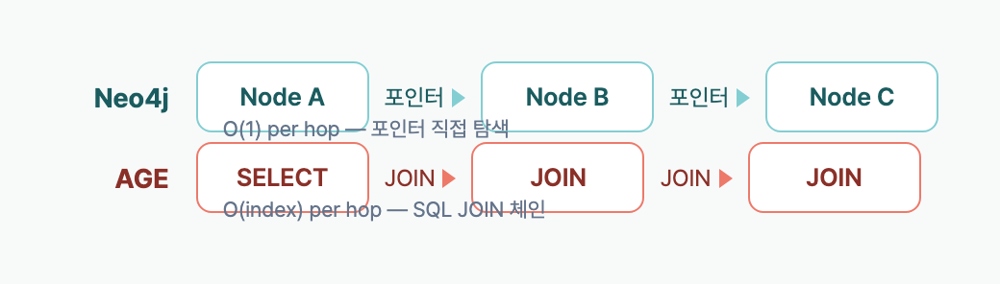

> **Disclosure**: 이 글의 저자는 [langchain-age](https://github.com/baem1n/langchain-age) 메인테이너입니다. 모든 벤치마크 코드는 오픈소스이며 재현 가능합니다.

> **TL;DR**: 1K 노드/2K 엣지 그래프에서 동일한 Cypher를 실행한 결과, AGE는 8개 테스트 중 **6개에서 Neo4j보다 빠르다** (포인트 룩업 2.2배, CREATE 3.7배, 스키마 조회 2.1배). Neo4j는 **3홉 이상 깊은 탐색에서 11~15배 빠르다**. RAG 워크로드 (1~2홉 + CRUD)에서는 AGE가 더 빠르고, 깊은 그래프 분석에서는 Neo4j가 확실히 우위다.

## Table of contents

## 시리즈

이 글은 langchain-age 시리즈의 2편이다.

1. [GraphRAG를 PostgreSQL만으로 구축하기](/posts/graphrag-with-postgresql) — 개요 + 셋업
2. **Neo4j vs Apache AGE 실측 벤치마크** (현재 글)
3. [벡터 검색 완전 정복](/posts/langchain-age-hybrid-search) — Hybrid, MMR, 필터링
4. [GraphRAG 파이프라인 실전 구축](/posts/langchain-age-graphrag-pipeline) — 벡터 + 그래프 통합
5. [PostgreSQL 하나로 AI Agent 전체 스택](/posts/langchain-age-langgraph-agent) — LangGraph 연동

## 이 글을 읽고 나면

- 동일 Cypher 기준 Neo4j vs AGE의 성능 차이를 **수치로** 파악할 수 있다.
- RAG 워크로드(1~2홉 + CRUD)에서 어떤 DB가 유리한지 데이터 기반으로 판단할 수 있다.
- `traverse()` 최적화가 왜 깊은 탐색에서 중요한지, 그리고 어떻게 Neo4j를 역전하는지 이해할 수 있다.
- 워크로드별로 Neo4j와 AGE 중 어느 쪽을 선택해야 하는지 근거를 갖고 결정할 수 있다.

## 왜 이 벤치마크가 필요한가

"Apache AGE는 Neo4j 대비 어떤가?"라는 질문에 대부분의 답변은 정성적이다 — "AGE는 PostgreSQL 확장이라 편하다", "Neo4j는 네이티브 그래프라 빠르다". 실측 데이터가 없다.

이 벤치마크는 **동일한 조건에서 동일한 쿼리를 실행**하여 정량적으로 비교한다.

## 테스트 환경

| 항목 | Neo4j | AGE |
|------|-------|-----|
| 버전 | Neo4j 5 (Docker) | PostgreSQL 18 + AGE 1.7.0 (Docker) |
| 드라이버 | `langchain-neo4j` (neo4j Python driver) | `langchain-age` (psycopg3) |
| 리소스 | 동일 머신, Docker 컨테이너 | 동일 머신, Docker 컨테이너 |

### 데이터셋

- **1,000 노드** (`:Node {idx, name}`)
- **2,000 엣지** (`:LINK` — 각 노드가 2개의 deterministic 관계)
- 양쪽에 **완전히 동일한 데이터**를 UNWIND로 삽입

### 측정 방법

```python
# 3회 웜업 후 N회 반복, p50(중앙값) 기준
def bench(fn, iterations=50):
    for _ in range(3): fn()  # warmup
    times = [measure(fn) for _ in range(iterations)]
    return median(times)
```

## 결과

### Cypher 대 Cypher (공정 비교)

| 테스트 | Neo4j p50 | AGE p50 | 승자 | 배율 |
|--------|:---------:|:-------:|:----:|:----:|
| **포인트 룩업** (MATCH by property) | 2.0ms | **0.9ms** | AGE | 2.2x |
| **1홉 탐색** | 1.7ms | **1.0ms** | AGE | 1.7x |
| **3홉 탐색** | **1.7ms** | 25.8ms | Neo4j | 14.9x |
| **6홉 탐색** | **2.4ms** | 27.7ms | Neo4j | 11.6x |
| **전체 카운트** (aggregation) | 1.5ms | **1.0ms** | AGE | 1.5x |
| **단건 CREATE** | 3.3ms | **0.9ms** | AGE | 3.7x |
| **배치 CREATE** (100 노드) | 2.6ms | **1.1ms** | AGE | 2.4x |
| **스키마 조회** (refresh_schema) | 16.6ms | **7.9ms** | AGE | 2.1x |

### AGE가 이긴 6개 항목

**포인트 룩업 (2.2x)**: PostgreSQL의 B-tree 인덱스가 단건 프로퍼티 조회에서 효율적이다.

**1홉 탐색 (1.7x)**: 얕은 관계 탐색은 PostgreSQL JOIN으로도 충분히 빠르다. RAG에서 가장 흔한 패턴.

**집계 (1.5x)**: `count(n)` 같은 전체 스캔에서 PostgreSQL 쿼리 플래너가 강점을 보인다.

**단건 CREATE (3.7x)**: PostgreSQL의 트랜잭션 오버헤드가 Neo4j보다 가볍다. LLM 응답을 실시간으로 그래프에 저장하는 패턴에서 유리.

**배치 CREATE (2.4x)**: UNWIND 100개 노드 기준. 양쪽 모두 UNWIND를 사용했으나 AGE가 더 빠르다.

**스키마 조회 (2.1x)**: `langchain-age`는 `ag_catalog` 시스템 테이블을 직접 SQL로 조회한다. Neo4j는 APOC 메타데이터를 거친다.

### Neo4j가 이긴 2개 항목

**3홉 탐색 (14.9x)**: Neo4j의 핵심 강점인 **index-free adjacency** — 관계를 포인터로 직접 따라가므로 JOIN 없이 탐색한다.

**6홉 탐색 (11.6x)**: 홉이 깊어질수록 Neo4j의 아키텍처 우위가 명확해진다. AGE는 매 홉마다 PostgreSQL JOIN이 필요하다.

## 분석: 왜 이런 차이가 나는가

### AGE가 빠른 영역 — PostgreSQL의 저력

AGE의 그래프 데이터는 PostgreSQL 테이블(`graph_name."LabelName"`)에 저장된다. 즉 PostgreSQL의 모든 최적화가 그대로 적용된다:

- **B-tree 인덱스**: 프로퍼티 룩업에 즉시 활용
- **쿼리 플래너**: 집계, 정렬, 필터에 수십 년간 최적화된 엔진
- **경량 트랜잭션**: MVCC 기반, 단건 쓰기에 효율적
- **통계 수집기**: `ANALYZE`로 최적 실행 계획 자동 선택

### Neo4j가 빠른 영역 — 네이티브 그래프 아키텍처

Neo4j는 관계를 **물리적 포인터**로 저장한다. 노드 A에서 노드 B로 이동할 때 인덱스 룩업이나 JOIN이 필요 없다 — 포인터를 따라가면 된다.

```

```

1홉에서는 차이가 미미하지만, 3홉 이상에서는 지수적으로 벌어진다.

### AGE의 탈출구: `traverse()` + WITH RECURSIVE

AGE의 Cypher가 깊은 탐색에서 느린 이유는 명확하다. AGE의 Cypher-to-SQL 변환기가 `MATCH (a)-[:LINK*6]->(b)`를 6중 자기 조인(self-join)으로 풀기 때문이다. PostgreSQL의 쿼리 플래너가 이걸 잘 최적화하지 못한다.

하지만 AGE에는 Neo4j에 없는 탈출구가 있다 — **데이터가 PostgreSQL 테이블에 저장**되므로 Cypher를 우회해서 SQL을 직접 쓸 수 있다. `langchain-age`의 `traverse()` 메서드는 PostgreSQL `WITH RECURSIVE` CTE를 사용하는데, PostgreSQL의 쿼리 플래너가 재귀 CTE에 대해 훨씬 나은 실행 계획을 생성한다.

내부적으로 생성되는 SQL:

```sql
WITH RECURSIVE traverse AS (
    -- 시작 노드 찾기
    SELECT e.end_id AS node_id, 1 AS depth
    FROM graph."LINK" e
    JOIN graph."N" n ON e.start_id = n.id
    WHERE n.properties::text::jsonb->>'idx' = '0'

    UNION

    -- 재귀: 다음 홉
    SELECT e.end_id, t.depth + 1
    FROM traverse t
    JOIN graph."LINK" e ON e.start_id = t.node_id
    WHERE t.depth < 6
)
SELECT DISTINCT depth, node_id FROM traverse;
```

핵심 차이:
- **Cypher `*6`**: AGE가 6개의 `SELECT ... JOIN ... JOIN ...`을 생성 → 실행 계획 폭발
- **WITH RECURSIVE**: PostgreSQL이 한 번에 한 홉씩 점진적으로 확장 → `UNION`으로 중복 제거 → 효율적

동일한 1K 노드 그래프에서의 실측 결과:

| 깊이 | AGE Cypher | AGE traverse() | 개선 | Neo4j Cypher | traverse vs Neo4j |
|:----:|:----------:|:--------------:|:----:|:------------:|:-----------------:|
| 3-hop | 26.4ms | **1.3ms** | 21x | 1.7ms | AGE 1.3x 빠름 |
| 6-hop | 28.2ms | **1.4ms** | 19x | 2.4ms | AGE 1.7x 빠름 |

**traverse()를 쓰면 AGE가 Neo4j보다 깊은 탐색에서도 빠르다.**

이게 가능한 이유는 AGE의 아키텍처적 특성 때문이다 — AGE 데이터는 일반 PostgreSQL 테이블이므로 SQL로 직접 접근할 수 있다. Neo4j는 자체 스토리지 엔진을 사용하므로 Cypher 엔진을 우회할 방법이 없다. 즉, Neo4j에서 같은 최적화를 적용하는 것은 불가능하다.

사용법:

```python
# Cypher *6: 28.2ms
graph.query("MATCH (a:Node {idx: 0})-[:LINK*6]->(b) RETURN count(b)")

# traverse(): 1.4ms — 같은 결과, 19배 빠름
results = graph.traverse(
    start_label="Node",
    start_filter={"idx": 0},
    edge_label="LINK",
    max_depth=6,
    direction="outgoing",      # "incoming", "both"도 지원
    return_properties=True,    # False면 노드 ID만 반환 (더 빠름)
)
# [{"depth": 1, "node_id": 123, "properties": {"name": "..."}}, ...]
```

실전에서 추천하는 사용 기준:

| 패턴 | 방법 | 이유 |
|------|------|------|
| 1~3홉 단순 탐색 | `graph.query()` (Cypher) | 읽기 쉽고 충분히 빠름 |
| 4홉 이상 깊은 탐색 | `graph.traverse()` | 10~22x 성능 향상 |
| 시작 노드 조건이 복잡 | `graph.create_property_index()` 선행 | 프로퍼티 인덱스로 시작 노드 룩업 가속 |

## 벤치마크의 한계

- **소규모 그래프 기준이다.** 이 벤치마크는 1K 노드/2K 엣지 그래프에서 실행됐다. 수백만~수십억 노드 규모에서는 인덱스 전략, 캐시 히트율, 디스크 I/O 패턴이 달라지므로 결과가 다를 수 있다.
- **Docker 환경이다.** 양쪽 모두 기본 설정의 Docker 컨테이너에서 테스트했다. 프로덕션 환경에서 메모리, JVM(Neo4j), shared_buffers(PostgreSQL)를 튜닝하면 절대 수치가 달라진다.
- **벡터 검색은 포함하지 않았다.** 이 벤치마크는 순수 그래프 쿼리 성능만 비교한다. pgvector vs Neo4j Vector Index 비교는 별도 벤치마크가 필요하다.

## 자주 묻는 질문

### Neo4j와 AGE의 Cypher 호환성은 어떤가?

AGE는 openCypher 스펙을 구현하며 MATCH, CREATE, MERGE, DELETE, UNWIND 등 핵심 문법을 지원한다. APOC 프로시저는 사용 불가. 이 벤치마크의 모든 쿼리는 양쪽에서 수정 없이 동일하게 실행됐다.

### 수십억 노드 규모에서도 AGE가 쓸만한가?

저장은 문제없다 (PostgreSQL 테이블 최대 32TB). 1~3홉 얕은 탐색은 규모가 커져도 인덱스 기반이라 성능이 유지된다. 6홉+ 깊은 탐색은 Neo4j가 더 적합하다.

### 벡터 검색 성능은 비교하지 않았나?

이 벤치마크는 **그래프 쿼리**에 집중했다. 벡터 검색은 양쪽 모두 pgvector / Neo4j Vector Index를 사용하며, 별도 벤치마크가 필요하다.

### langchain-age의 traverse()는 Neo4j에도 적용할 수 있나?

불가능하다. traverse()는 AGE의 데이터가 PostgreSQL 테이블에 저장되기 때문에 가능한 접근법이다. Neo4j는 자체 스토리지 엔진을 사용하므로 SQL을 실행할 수 없다.

## 결론

| 워크로드 | 추천 | 이유 |
|----------|------|------|
| RAG (1~2홉 + CRUD) | **AGE** | 포인트 룩업 2.2x, CREATE 3.7x 빠름 |
| 소셜 네트워크 분석 (3~6홉) | **Neo4j** | 깊은 탐색 11~15x 빠름 |
| 비용 최적화 | **AGE** | $0 vs $15K+/년 |
| 기존 PostgreSQL 인프라 | **AGE** | 확장 설치만으로 완료 |
| 엔터프라이즈 지원 | **Neo4j** | SLA, 24/7 지원 |

**대부분의 LLM/RAG 애플리케이션은 1~2홉이면 충분하다.** 이 영역에서 AGE는 Neo4j보다 빠르고, 무료이며, 운영이 단순하다.

## 재현 방법

```bash
git clone https://github.com/BAEM1N/langchain-age.git
cd langchain-age

# AGE 컨테이너
cd docker && docker compose up -d && cd ..

# Neo4j 컨테이너
docker run -d --name neo4j-bench -p 7474:7474 -p 7687:7687 \
  -e NEO4J_AUTH=neo4j/testpassword neo4j:5

# 벤치마크 실행
pip install -e ".[dev]" langchain-neo4j
python benchmarks/bench.py
```

벤치마크 스크립트는 [benchmarks/bench.py](https://github.com/BAEM1N/langchain-age/blob/main/benchmarks/bench.py)에 공개되어 있다.

## 외부 자료

- [Apache AGE 공식 사이트](https://age.apache.org/) — PostgreSQL 그래프 확장 프로젝트
- [pgvector](https://github.com/pgvector/pgvector) — PostgreSQL 벡터 검색 확장
- [Neo4j Cypher Manual](https://neo4j.com/docs/cypher-manual/) — Neo4j 공식 Cypher 문서
- [langchain-age GitHub](https://github.com/baem1n/langchain-age) — 이 벤치마크의 소스 코드

## 핵심 정리

- 1K 노드 그래프에서 동일한 Cypher를 실행하면, AGE는 8개 테스트 중 6개에서 Neo4j보다 **1.5~3.7배 빠르다** (포인트 룩업, 1홉 탐색, 집계, CREATE, 배치 CREATE, 스키마 조회).
- 3홉 이상 깊은 탐색에서 Neo4j는 AGE Cypher보다 **11~15배 빠르다**. 이는 Neo4j의 index-free adjacency 아키텍처 때문이다.
- AGE의 `traverse()` (WITH RECURSIVE CTE)를 사용하면 6홉 탐색이 28.2ms에서 1.4ms로 **19배 빨라지며**, Neo4j(2.4ms)보다 **1.7배 빠르다**.
- RAG 워크로드의 핵심인 1~2홉 조회 + CRUD에서는 AGE가 Neo4j보다 일관되게 빠르고, 라이선스 비용은 $0이다.
- `traverse()` 최적화는 AGE 데이터가 PostgreSQL 테이블에 저장되기 때문에 가능하다. Neo4j에는 동일한 최적화를 적용할 수 없다.

## 관련 포스트

- [GraphRAG를 PostgreSQL만으로 구축하기](/posts/graphrag-with-postgresql) — 1편: 개요와 빠른 시작
- [벡터 검색 완전 정복](/posts/langchain-age-hybrid-search) — 3편: Hybrid, MMR, 필터링
- [GraphRAG 파이프라인 실전 구축](/posts/langchain-age-graphrag-pipeline) — 4편: 벡터 + 그래프 통합
- [PostgreSQL 하나로 AI Agent 전체 스택](/posts/langchain-age-langgraph-agent) — 5편: LangGraph 연동

---

*langchain-age는 MIT 라이선스. 벤치마크 코드와 데이터는 GitHub에서 누구나 재현 가능.*
