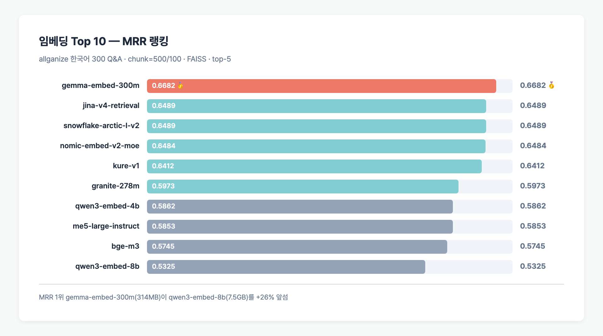
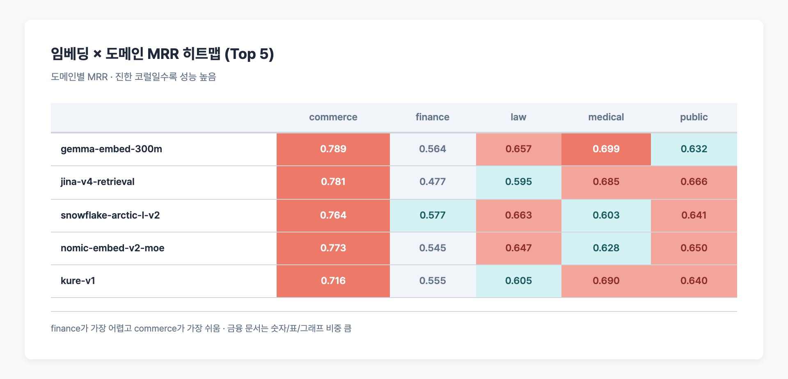
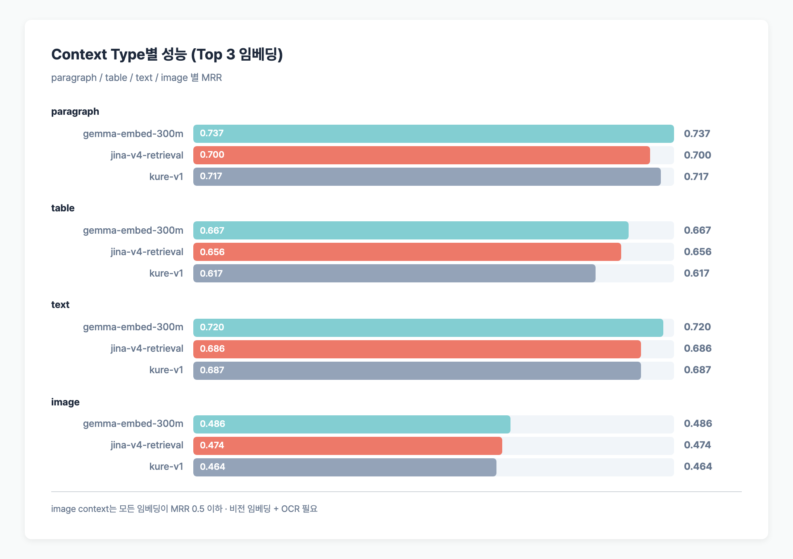
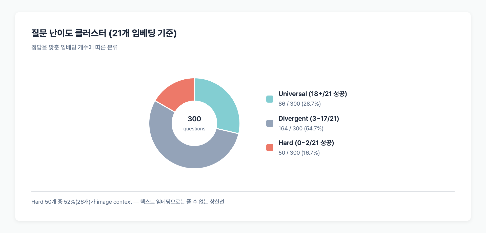
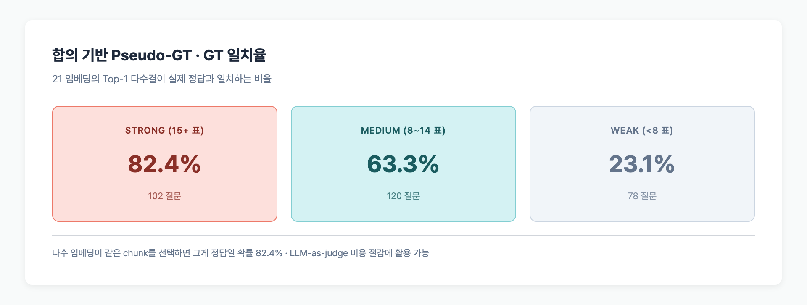
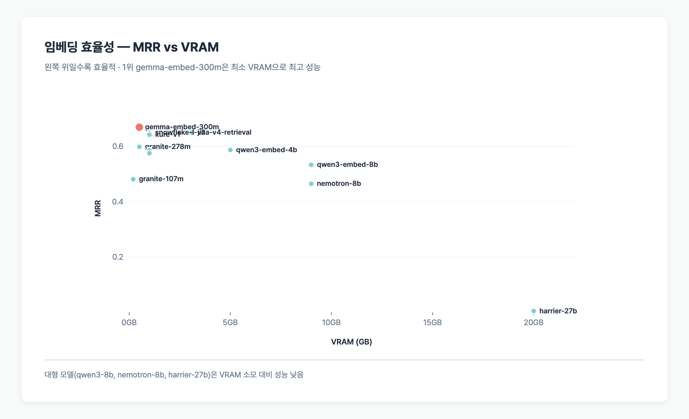

> **TL;DR**: 21개 오픈 GGUF 임베딩 모델을 allganize 한국어 300 Q&A에 돌린 결과, 1위는 **google/gemma-embed-300m (MRR 0.6682, 314MB)**. 7B~27B 대형 모델들은 오히려 하위권에 몰렸다. 도메인별로는 법률(law)에서 임베딩 의존도가 가장 크고, 이미지 context는 전 임베딩이 실패한다. 하드한 질문 50개는 어떤 임베딩으로도 구제되지 않는다 — 검색 단계 개선으로는 풀리지 않는 상한선이다.

## Table of contents

## 실험 설정

- **데이터**: [allganize/RAG-Evaluation-Dataset-KO](https://huggingface.co/datasets/allganize/RAG-Evaluation-Dataset-KO) — 300 Q&A × 58 PDF × 5 도메인
- **Parser**: pymupdf4llm (마크다운 변환)
- **Chunking**: 500자 / overlap 100 (총 3,166 청크)
- **VectorStore**: FAISS (in-memory, cosine similarity)
- **Top-k**: 5
- **트렁케이트**: 500자 (llama.cpp 서버 512 토큰 제한 대응)
- **지표**: MRR, NDCG@5, Hit@1/5 (페이지 단위), File Hit@5 (파일 단위)

전체 실험 설계는 [RAG 벤치마크 실험 설계 포스트](/posts/rag-evaluation-experiment-design) 참조.

## 전체 결과 (MRR 순)

| 순위 | 모델 | dim | 크기 | MRR | Hit@1 | Hit@5 | File@5 | Fail% |
|----|------|-----|------|-----|-------|-------|--------|-------|
| **1** | **google/gemma-embed-300m** | 768 | 314MB | **0.6682** | **58.3%** | **79.3%** | **92.0%** | 20.7% |
| 2 | jinaai/jina-v4-retrieval | 4096 | 3.1GB | 0.6489 | 55.3% | 79.0% | 91.7% | 21.0% |
| 3 | Snowflake/arctic-embed-l-v2 | 1024 | 606MB | 0.6489 | 58.7% | 73.3% | 89.7% | 26.6% |
| 4 | nomic-ai/nomic-embed-v2-moe | 768 | 489MB | 0.6484 | 57.0% | 75.3% | 90.0% | 24.7% |
| 5 | nlpai-lab/KURE-v1 | 1024 | 606MB | 0.6412 | 56.0% | 75.0% | 91.0% | 25.0% |
| 6 | ibm-granite/granite-278m | 768 | 290MB | 0.5973 | 50.3% | 72.3% | 87.3% | 27.7% |
| 7 | Qwen/Qwen3-Embedding-4B | 4096 | 4.0GB | 0.5862 | 49.0% | 72.7% | 90.3% | 27.4% |
| 8 | intfloat/multilingual-e5-large-instruct | 1024 | 576MB | 0.5853 | 50.0% | 71.0% | 91.0% | 29.0% |
| 9 | jinaai/jina-v4-code | 4096 | 3.1GB | 0.5442 | 43.7% | 69.0% | 88.3% | 31.0% |
| 10 | BAAI/bge-m3 | 1024 | 606MB | 0.5745 | 48.7% | 68.3% | 89.7% | 31.6% |
| 11 | Qwen/Qwen3-Embedding-0.6B | 1024 | 610MB | 0.5621 | 47.0% | 66.7% | 87.3% | 33.4% |
| 12 | Microsoft/harrier-oss-270m | 1024 | 279MB | 0.5594 | 47.0% | 67.3% | 88.3% | 32.7% |
| 13 | Microsoft/harrier-oss-0.6b | 1024 | 610MB | 0.5266 | 41.7% | 66.7% | 87.0% | 33.3% |
| 14 | **Qwen/Qwen3-Embedding-8B** | 4096 | **7.5GB** | 0.5325 | 45.0% | 65.0% | 86.7% | 35.0% |
| 15 | ibm-granite/granite-107m | 768 | 116MB | 0.4806 | 38.3% | 61.0% | 82.7% | 39.0% |
| 16 | NVIDIA/nemotron-embed-8b | 4096 | 7.5GB | 0.4640 | 36.0% | 60.3% | 88.0% | 39.7% |
| 17 | jinaai/v5-small-retrieval | 1024 | 610MB | 0.3868 | 31.0% | 48.0% | 74.7% | 52.0% |
| 18 | jinaai/jina-code-1.5b | 1024 | 1.6GB | 0.3288 | 22.7% | 47.0% | 82.3% | 53.0% |
| 19 | jinaai/v5-nano-matching | 512 | 223MB | 0.1821 | 12.7% | 25.0% | 61.3% | 75.0% |
| 20 | google/LaBSE | 768 | 492MB | 0.0468 | 2.7% | 8.0% | 27.0% | 92.0% |
| 21 | Microsoft/harrier-oss-27b | 4096 | **27GB** | 0.0044 | 0.0% | 1.0% | 11.3% | 99.0% |

### 핵심 관찰 3가지

1. **Top 5가 전부 소형(300MB~606MB)**. 대형(7.5GB) qwen3-embed-8b는 14위.
2. **한국어 특화(kure-v1) vs 다국어(gemma-300m)**: gemma가 약간 우세. 범용 검색 임베딩이 한국어 특화보다 잘 맞는 경우.
3. **대형 ≠ 고성능**: harrier-oss-27b (27GB)는 MRR 0.004로 사실상 깨진 모델. GGUF 양자화 이슈로 추정.

## 왜 300M이 8B를 이겼나

원인은 두 가지로 좁힌다.

### 1. 512 토큰 트렁케이션 영향

llama.cpp 서버가 입력 512 토큰으로 제한한다. 청크를 500자로 자르면 한국어 기준 약 350 토큰. **짧은 입력에선 모델 용량이 크게 작용하지 않는다.** 대형 모델의 장점(긴 문맥, 세밀한 의미 포착)이 살아나지 않는다.

### 2. 훈련 목적의 차이

| 모델 | 훈련 목적 | 결과 |
|------|---------|------|
| gemma-embed-300m | 검색 특화 (Google) | MRR 0.6682 (1위) |
| qwen3-embed-8b | 범용 MTEB 임베딩 | MRR 0.5325 (14위) |
| kure-v1 | 한국어 특화 (AI-Lab) | MRR 0.6412 (5위) |

**검색(retrieval) 목적으로 훈련된 모델이 RAG에 유리하다.** MTEB 점수는 다양한 태스크 평균이라 RAG에 직결되지 않는다.

## 실패 모드 분석

어디서 실패하는지 분류했다.

- **file_miss**: 정답 파일 자체를 top-10에 못 넣음 (가장 심각)
- **page_miss**: 정답 파일은 찾았지만 정답 페이지 놓침 (개선 가능)
- **rank_low**: 정답이 rank 6~10 (top-k 늘리면 복구 가능)

| 임베딩 | File Miss | Page Miss | Total Fail |
|--------|-----------|-----------|-----------|
| gemma-embed-300m | 8.0% | 12.7% | 20.7% |
| jina-v4-retrieval | 8.3% | 12.7% | 21.0% |
| kure-v1 | 9.0% | 16.0% | 25.0% |
| qwen3-embed-8b | 13.3% | 21.7% | 35.0% |
| labse | **73.0%** | 19.0% | 92.0% |
| harrier-27b | **88.7%** | 10.3% | 99.0% |

**labse는 파일 자체를 찾지 못하는 구조적 약점**이 크다 (109개 언어 범용이라 한국어 표현력이 얕다). harrier-27b는 사실상 랜덤 출력.

## 도메인별 성능 (임베딩 × 도메인 MRR 히트맵)

상위 5개 임베딩의 도메인별 MRR만 발췌.

| 모델 | commerce | finance | law | medical | public | 평균 |
|------|----------|---------|-----|---------|--------|------|
| gemma-embed-300m | 0.789 | 0.564 | 0.657 | 0.699 | 0.632 | 0.668 |
| jina-v4-retrieval | 0.781 | 0.477 | 0.595 | 0.685 | 0.666 | 0.641 |
| snowflake-arctic-l-v2 | 0.764 | 0.577 | 0.663 | 0.603 | 0.641 | 0.650 |
| nomic-embed-v2-moe | 0.773 | 0.545 | 0.647 | 0.628 | 0.650 | 0.649 |
| kure-v1 | 0.716 | 0.555 | 0.605 | 0.690 | 0.640 | 0.641 |

- **finance가 가장 어렵다**: 전 모델이 평균 대비 떨어짐. 숫자/표/그래프 데이터 많음.
- **commerce가 가장 쉽다**: 자연어 설명 위주.

## Context Type별 성능

| 모델 | paragraph | table | text | image |
|------|-----------|-------|------|-------|
| gemma-embed-300m | 0.737 | 0.667 | 0.720 | **0.486** |
| jina-v4-retrieval | 0.700 | 0.656 | 0.686 | **0.474** |
| kure-v1 | 0.717 | 0.617 | 0.687 | **0.464** |

**image context는 전 모델이 실패한다 (MRR 0.5 이하)**. 이미지는 텍스트 임베딩만으로 검색 불가. 비전 임베딩 + OCR 전처리가 필요하다.

## 질문 난이도 클러스터

300 질문을 검색 성공한 임베딩 수로 분류했다.

| 클러스터 | 질문 수 | 비율 | 해석 |
|---------|--------|------|------|
| **Universal** (18+/21 성공) | 86 | 28.7% | 어떤 임베딩도 잘 찾음 → LLM 비교 이상적 샘플 |
| **Divergent** (3~17/21 성공) | 164 | 54.7% | 임베딩 선택이 중요 → 실험 가치 큼 |
| **Hard** (0~2/21 성공) | **50** | **16.7%** | 대부분 임베딩 실패 → 검색 개선으로 안 풀림 |

### Hard 질문 50개 분포

- **도메인**: finance 20, public 12, law 8, commerce 7, medical 3
- **Context type**: **image 26 (52%)**, paragraph 17, table 4, text 3

**Hard 질문의 52%가 image context**. 이미지 기반 질문은 현재 텍스트 RAG 구조로 풀 수 없다는 상한선을 보여준다.

## 합의(Consensus) 기반 Pseudo-GT

모든 임베딩의 Top-1 검색 결과를 모아 다수결로 pseudo-GT를 만들면 어떨까?

| 합의 수준 | 질문 수 | GT 일치율 |
|----------|--------|----------|
| Strong (15+/21 합의) | 102 | **82.4%** |
| Medium (8~14/21) | 120 | 63.3% |
| Weak (<8/21) | 78 | 23.1% |

**여러 임베딩이 같은 chunk를 top-1으로 고르면 그게 정답일 확률이 82.4%**. GT 없이도 어느 정도 품질 판정이 가능하다. 이 기법은 나중에 LLM-as-judge 비용을 줄이는 데 쓸 수 있다.

## 모델 효율성 (MRR ÷ VRAM)

| 모델 | MRR | VRAM | MRR/VRAM |
|------|-----|------|----------|
| **gemma-embed-300m** | 0.6682 | **0.5GB** | **1.336** |
| granite-107m | 0.4806 | 0.2GB | 2.403 |
| harrier-270m | 0.5594 | 0.3GB | 1.865 |
| granite-278m | 0.5973 | 0.5GB | 1.195 |
| kure-v1 | 0.6412 | 1.0GB | 0.641 |
| qwen3-embed-8b | 0.5325 | 9.0GB | 0.059 |
| harrier-27b | 0.0044 | 20.0GB | 0.000 |

효율성 관점에서도 **100MB~500MB 소형 모델이 압도적**. qwen3-embed-8b는 VRAM 대비 효과 대비 1/22 수준.

## 추천 구성

RAG 용도 및 제약에 따라 추천 임베딩.

| 시나리오 | 추천 모델 | 이유 |
|---------|---------|------|
| **최고 정확도** | gemma-embed-300m | MRR 1위, 20.7% 실패율 |
| **한국어 특화** | kure-v1 | MRR 5위, 한국어 도메인 안정 |
| **저메모리 (< 500MB)** | granite-278m | MRR 0.597, 290MB |
| **초저지연 (< 100MB)** | granite-107m | MRR 0.481, 116MB |
| **도메인 다국어 (영/일)** | bge-m3 | MRR 0.575, hybrid dense+sparse |

## 자주 묻는 질문

### 왜 gemma-embed-300m이 kure-v1(한국어 특화)을 이겼나?

gemma-embed-300m은 **검색 목적**으로 훈련된 768dim 범용 임베딩이다. 한국어가 섞인 훈련 데이터를 충분히 포함했고, 검색 최적화가 한국어 특화보다 강하게 작용했다. 단 차이는 MRR 0.027(4%)로 크지 않다.

### qwen3-embed-8b가 14위인 게 정상인가?

일반 벤치마크(MTEB)에서 qwen3-embed-8b는 강력하다. 이 실험에서 떨어진 이유:
1. 입력 512 토큰 제한 — 8B의 긴 문맥 강점 약화
2. 범용 MTEB 튜닝 — 순수 검색(retrieval) 태스크엔 gemma가 더 좋음
3. Q8_0 양자화 영향 가능성

### harrier-27b가 왜 99% 실패하나?

27GB GGUF로 받았으나 로딩 후 출력이 사실상 무작위. llama.cpp가 해당 아키텍처를 완전 지원하지 않거나, Q8 양자화가 임베딩 품질을 파괴했을 가능성이 크다. **대형 임베딩 모델의 GGUF 양자화는 검증 필수**.

### File Hit@5가 높은데 왜 MRR은 낮지?

File@5(92%)와 Page@5(79%) 사이 갭은 "파일은 찾았지만 틀린 페이지에서 청크를 가져옴"을 의미한다. 법률/금융 문서처럼 **여러 페이지에서 유사한 내용이 반복**되면 이 갭이 커진다. 대응책: top-k 확대(5→10), 리랭커 도입.

### Image context가 왜 전부 실패하나?

모든 임베딩이 **텍스트 임베딩**이라서 이미지 정보를 이해하지 못한다. 질문이 이미지 안 차트/그래프를 참조하면 파서 단계에서 이미지 → 텍스트 변환(OCR, 캡셔닝)이 필수. 현재 pymupdf4llm은 이미지 캡션을 생성하지 않음.

## 다음 단계

1. 파서/청킹/벡터스토어 영향 분석 → [전처리가 임베딩보다 중요한 이유](/posts/rag-preprocessing-comparison)
2. 실험 B: gemma-embed-300m 고정 × 약 30 LLM 비교
3. 리랭커 도입 실험 (Qwen3-Reranker, BCE, BGE reranker)
4. Hard 50개 질문 대상: 비전 임베딩 + OCR 전처리로 구제 가능성 평가
5. RAGAS 기반 LLM-as-judge로 답변 품질 측정

---

## 코드 및 원본 데이터

- **GitHub**: [github.com/BAEM1N/RAG-Evaluation](https://github.com/BAEM1N/RAG-Evaluation)
- **Phase 4 결과 JSON**: [results/phase4_embedding/](https://github.com/BAEM1N/RAG-Evaluation/tree/main/results/phase4_embedding) — 21개 임베딩 전체 MRR/Hit/도메인별 결과
- **심층 분석 CSV**: [results/retrieval_analysis/](https://github.com/BAEM1N/RAG-Evaluation/tree/main/results/retrieval_analysis) — 히트맵, 실패 모드, 합의 분석, 21×21 쌍별 overlap 매트릭스
- **분석 스크립트**: [scripts/analyze_retrieval_deep.py](https://github.com/BAEM1N/RAG-Evaluation/blob/main/scripts/analyze_retrieval_deep.py) — 누구든 재실행 가능

RAG 설계 근거가 필요한 경우 원본 데이터를 직접 열어 검증할 수 있다.
