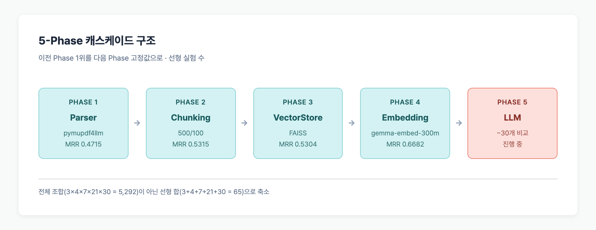
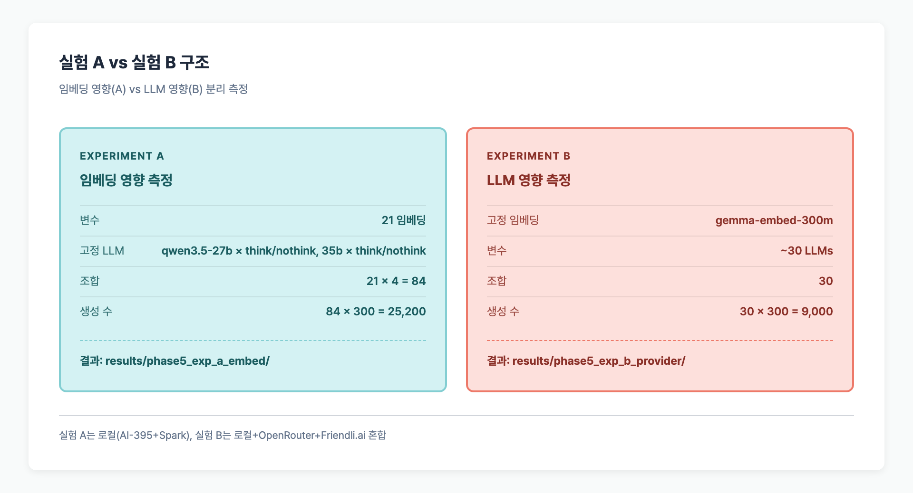
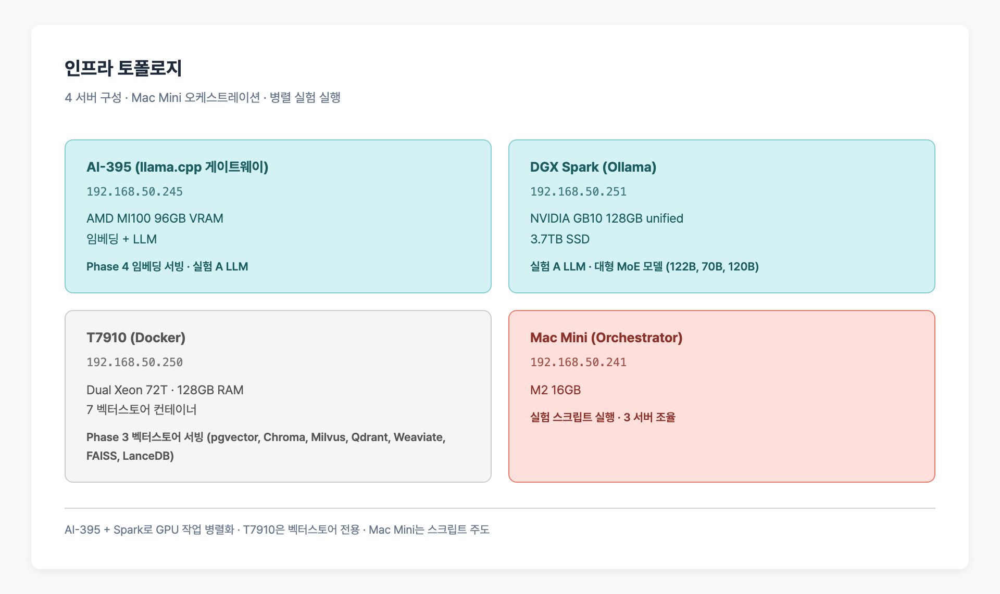

> **TL;DR**: 한국어 RAG 파이프라인을 5단계(파서→청킹→벡터스토어→임베딩→LLM)로 분해해 각각 단일 변수 실험으로 돌렸다. **27개 임베딩**, 7개 벡터스토어, **12개 LLM**(로컬+DGX Spark ollama)을 교차 평가하는 구조다. 임베딩 1위는 **nlpai-lab/KoE5 (MRR 0.6871)** — 한국어 파인튜닝된 600M 모델이 7B~27B 대형 모델을 전부 이겼다. Qwen3.5 계열은 `chat_template_kwargs: {enable_thinking: false}`로 thinking을 꺼야 토큰 27배 절감.

## Table of contents

## 왜 또 RAG 벤치마크를 돌리는가

한국어 RAG 분야의 기존 벤치마크는 범위가 제한적이었다.

| 기존 연구 | 데이터 | Parser | Chunking | Embedding | VectorStore | LLM |
|-----------|--------|--------|----------|-----------|-------------|-----|
| allganize RAG-Evaluation-Dataset-KO | 300 Q&A | PyPDF 고정 | 1000/200 고정 | OpenAI ada-002 1종 | Chroma | gpt-4-turbo |
| AutoRAG-example | 비공개 | 미명시 | 미명시 | **16종** (API 혼합) | 미비교 | 미사용 |
| ssisOneTeam | 106 Q&A | 미명시 | 미명시 | **24종** (API 혼합) | 미비교 | 미사용 |
| **본 실험** | 300 Q&A | **3종** | **4종** | **27종 로컬 GGUF** | **7종** | **12종 (AI-395 llama.cpp + DGX Spark ollama)** |

기존 실험들은 단일 컴포넌트만 바꾸거나 데이터가 작거나 상용 API 위주였다. 이 프로젝트는 **각 컴포넌트를 독립 변수로 잡고 나머지를 고정**하는 Phase 구조로, 어떤 구성 요소가 얼마나 기여하는지 측정한다.

## 실험 데이터셋

[allganize/RAG-Evaluation-Dataset-KO](https://huggingface.co/datasets/allganize/RAG-Evaluation-Dataset-KO) 300 Q&A를 사용했다. 5개 도메인(금융, 공공, 의료, 법률, 상거래) 각 60건씩이고, 정답 PDF(58개)와 정답 페이지가 모두 주어진다.

### 데이터 구성

| 항목 | 수량 |
|------|------|
| 질문 | 300 |
| PDF | 58 |
| 도메인 | 5 (각 60 Q&A) |
| Context type | paragraph 148, image 57, table 50, text 45 |

## 실험 Phase 구조

각 단계의 **최적 설정은 이전 Phase 결과**에서 고정한다. 한 번에 한 변수만 바꿔 인과를 분리한다.



### Phase 1: Parser 비교 (3종)

**고정:** Chunking=1000/200, Embedding=qwen3-embed-8b, VectorStore=pgvector  
**변수:** PyPDF, pymupdf4llm, pymupdf

| Parser | MRR | Hit@5 | 청크 수 |
|--------|-----|-------|---------|
| **pymupdf4llm** (1위) | 0.4715 | 58.3% | 1,920 |
| pymupdf | 0.4663 | 63.3% | 1,263 |
| pypdf | 0.4472 | 60.7% | 1,224 |

마크다운 변환 기반 pymupdf4llm이 MRR 1위. 이후 Phase는 이것으로 고정.

### Phase 2: Chunking 비교 (4종)

**고정:** Parser=pymupdf4llm, 나머지는 Phase 1과 동일  
**변수:** chunk_size × overlap

| 전략 | chunk_size | overlap | MRR | 청크 수 |
|------|-----------|---------|-----|---------|
| **small** (1위) | 500 | 100 | **0.5315** | 3,166 |
| baseline | 1,000 | 200 | 0.4713 | 1,920 |
| medium | 1,500 | 200 | 0.4458 | 1,468 |
| large | 2,000 | 300 | 0.4302 | 1,370 |

작은 청크가 MRR에서 압도적 1위. llama.cpp 임베딩 서버의 512 토큰 제한과도 맞물려 정보 손실이 가장 적다.

### Phase 3: VectorStore 비교 (7종)

**고정:** Parser=pymupdf4llm, Chunking=500/100, Embedding=qwen3-embed-8b  
**변수:** 벡터스토어 7종

| VectorStore | MRR | Insert | Query Latency |
|-------------|-----|--------|--------------|
| **FAISS** | 0.5304 | **0.8s** | **0.7ms** |
| LanceDB | 0.5304 | 6.0s | 6.3ms |
| Qdrant | 0.5304 | 58.6s | 112.8ms |
| Milvus | 0.5304 | 22.4s | 53.7ms |
| Weaviate | 0.5298 | 12.0s | 23.3ms |
| Chroma | 0.5271 | 16.7s | 40.0ms |
| pgvector | 0.5304 | 92.3s | 142.9ms |

**검색 정확도는 7종 전부 동일 (MRR 0.527~0.530)**. 같은 벡터를 넣으면 같은 결과가 나온다. 차이는 오직 속도다. FAISS가 insert 0.8초 · 지연 0.7ms로 압도적.

### Phase 4: Embedding 비교 (27종)

**고정:** Parser=pymupdf4llm, Chunking=500/100, VectorStore=FAISS  
**변수:** 27개 임베딩 모델 (전부 로컬 GGUF)

MRR 1위: **nlpai-lab/KoE5 (0.6871, 600M 파라미터)** — 고려대 NLP&AI Lab이 multilingual-e5-large를 한국어 triplet 70만+ 쌍으로 파인튜닝. 2위 google/gemma-embed-300m (0.6650), 3위 PIXIE/Rune-v1.0 (0.6627). 대형 7~8B 모델들은 모두 중하위권. 자세한 결과는 [임베딩 벤치마크 결과 포스트](/posts/rag-embedding-benchmark-results) 참조.

### Phase 5: LLM 생성 비교 (12종)

**고정:** Parser=pymupdf4llm, Chunking=500/100, Embedding=gemma-embed-300m, VectorStore=FAISS  
**변수:** LLM

| 카테고리 | 모델 수 | 실행 위치 |
|----------|--------|----------|
| 로컬 (AI-395) | 4 (qwen3.5-27b/35b-a3b, qwen3.6-35b-a3b × think/nothink) | llama.cpp |
| 로컬 (DGX Spark) | 12 (qwen3.5 9b/27b/122b, exaone3.5, gpt-oss 20b/120b, phi4, mistral-small, lfm2, deepseek-r1) | Ollama |

**실험 A**: 27 임베딩 × 고정 LLM → 임베딩이 답변 품질에 미치는 영향 측정  
**실험 B**: gemma-embed-300m 고정 × 12 LLM × 300 Q&A = 3,600 답변 → LLM 성능 비교 (진행 중)



## 인프라 구성

| 서버 | 역할 | 사양 |
|------|------|------|
| AI-395 | 임베딩 + LLM (llama.cpp 게이트웨이) | MI100 96GB VRAM |
| DGX Spark | LLM (Ollama) | GB10 128GB unified, 3.7TB SSD |
| T7910 | 벡터스토어 7종 Docker | Dual Xeon 72T, 128GB RAM |
| Mac Mini | 실험 스크립트 오케스트레이션 | M4 16GB |



## 핵심 함정 3가지

### 1. llama.cpp 임베딩 서버 ctx-size 명시 필요

기본값을 쓰면 대형 임베딩 모델(4096dim 이상)에서 context 범위가 자동 조정되어 긴 청크 일부가 silent 절단된다. 초기 실험에서 500자 트렁케이트로 이를 피했으나 **대형 모델에 불공정한 조건**이어서 다음 설정을 표준으로 정했다.

```bash
llama-server ... -b 8192 -ub 8192 -c 8192
```

`-c 8192`를 명시하면 기본 모델 파라미터와 무관하게 컨텍스트를 8K로 통일 → 트렁케이트 제거 가능. 500자 청크라면 한국어 ~250 토큰이라 이 범위 내 안전하게 처리된다.

### 2. Qwen3.5 thinking 모드 비활성화

Qwen3.5 계열은 기본적으로 thinking을 강제 수행해 output 토큰 2,000개를 낭비한다.

```python
# 잘못된 방법 (시스템 프롬프트)
messages = [{"role": "system", "content": "/no_think"}, ...]
# → reasoning_content에 thinking이 남아 토큰 낭비

# 올바른 방법 (chat_template_kwargs)
req = {
    "model": "qwen3.5-27b",
    "messages": [...],
    "chat_template_kwargs": {"enable_thinking": False},
}
```

llama.cpp + Qwen3.5에서 `chat_template_kwargs`를 써야만 thinking이 실제로 꺼진다. nothink 모드에서 출력 토큰 ~90개, think 모드 ~2,500개 (차이 27배).

### 3. pgvector의 HNSW 2000차원 제한

Qwen3-Embed-8B는 4096차원. pgvector의 HNSW · IVFFlat 인덱스는 둘 다 2000차원 제한이라 인덱스 없이 순차 검색이 불가피했다.

```sql
-- 2000차원 이하일 때만 인덱스 사용
CREATE INDEX ON bench_chunks USING hnsw (embedding vector_cosine_ops)
WITH (m = 16, ef_construction = 200);
```

## 병렬화 설계

GPU 활용 극대화를 위해 llama.cpp는 `-np 8` (8 슬롯), Ollama는 `OLLAMA_NUM_PARALLEL=8`로 설정했다.

```python
# LangChain 기반 배치 호출
llm = ChatOpenRouter(model="openai/gpt-5.4-mini", max_tokens=4096)
results = llm.batch(prompts, config={"max_concurrency": 20})
```

양쪽 서버에서 `ThreadPoolExecutor(max_workers=8)`로 동시 요청, 300개 생성 1조합당 평균 20~50분. 총 52 LLM × 300건은 AI-395와 Spark에 분산하면 약 3~4일이면 끝난다.

## 자주 묻는 질문

### Phase를 왜 순차적으로 고정하나?

전체 조합(3×4×7×21×30=5,292)을 다 돌리면 소요 시간·비용이 현실적이지 않다. 각 Phase에서 1위만 다음 단계로 넘겨 실험 수를 선형(3+4+7+21+30=65)으로 줄인다.

### Phase 4 임베딩 1위가 왜 7B가 아니라 600M (KoE5)인가?

한국어 RAG에서는 **모델 크기보다 훈련 목적과 도메인 데이터가 중요**하다. KoE5(600M, 1024dim)는 multilingual-e5-large를 한국어 query-document-hard_negative 70만+ 쌍으로 파인튜닝했다. qwen3-embed-8b(4096dim)는 범용 MTEB 최적화이며 Korean 비중이 낮다. 같은 베이스(multilingual-e5-large)의 Korean 파인튜닝이 **MRR +0.099**를 준다 (0.5882 → 0.6871). 스케일보다 정렬된 데이터가 답.

### 왜 FAISS가 속도 1위인가?

FAISS는 인-프로세스 라이브러리라 **네트워크 오버헤드가 없다**. Chroma/Qdrant/Milvus/Weaviate는 HTTP/gRPC 왕복이 추가된다. 검색 정확도가 같다면 RAG 파이프라인에서 FAISS가 최적.

### 왜 LLM을 로컬로만 돌렸나?

현재 Phase 5 범위는 **로컬 환경(AI-395 + DGX Spark) 내 12개 LLM**으로 한정했다. 이유:
- **재현성**: 누구나 같은 GGUF/ollama 모델로 검증 가능
- **양자화 영향 측정**: Q4/Q8 quantized 모델이 full precision과 얼마나 차이 나는지 보려면 통제된 환경 필요
- **비용 0**: 300 × 12 = 3,600 답변 생성하면 API 비용 폭발

OpenRouter/Friendli.ai 등 상용 API 비교는 LLM-as-judge 평가 단계 이후 확장 예정.

## 다음 단계

1. 임베딩 결과 상세 분석 → [임베딩 벤치마크 결과 포스트](/posts/rag-embedding-benchmark-results)
2. 파서/청킹/벡터스토어 비교 → [전처리가 임베딩보다 중요한 이유](/posts/rag-preprocessing-comparison)
3. 실험 B LLM 비교 결과 (진행 중)
4. RAGAS 기반 LLM-as-judge 평가
5. 도메인별 최적 조합 분석

---

## 코드 및 원본 데이터

- **GitHub**: [github.com/BAEM1N/RAG-Evaluation](https://github.com/BAEM1N/RAG-Evaluation)
- **실험 설계 문서**: [docs/experiment-design.md](https://github.com/BAEM1N/RAG-Evaluation/blob/main/docs/experiment-design.md)
- **전체 모델 인벤토리**: [docs/model-inventory-full.md](https://github.com/BAEM1N/RAG-Evaluation/blob/main/docs/model-inventory-full.md)
- **결과 JSON**: `results/phase1~4_*/` — Phase별 원본 데이터 전부 공개
- **분석 CSV**: `results/retrieval_analysis/` — 히트맵, 실패 모드, 합의 분석

모든 벤치마크는 재현 가능하다. 스크립트 한 줄로 Phase 재실행 가능.
