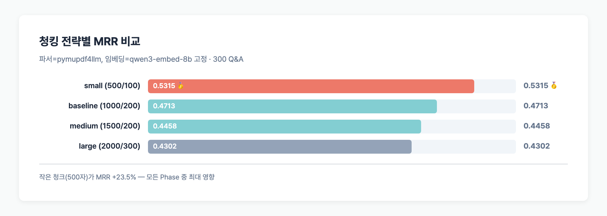
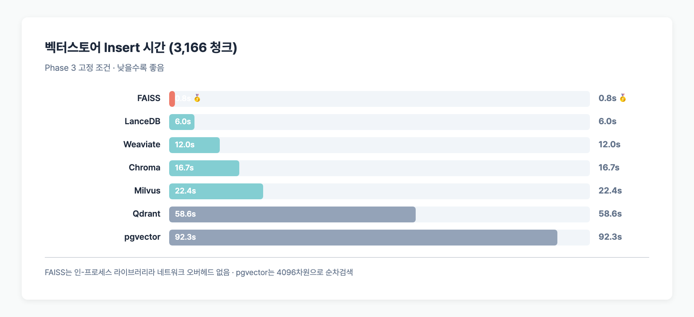
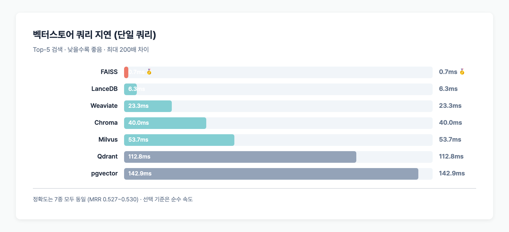
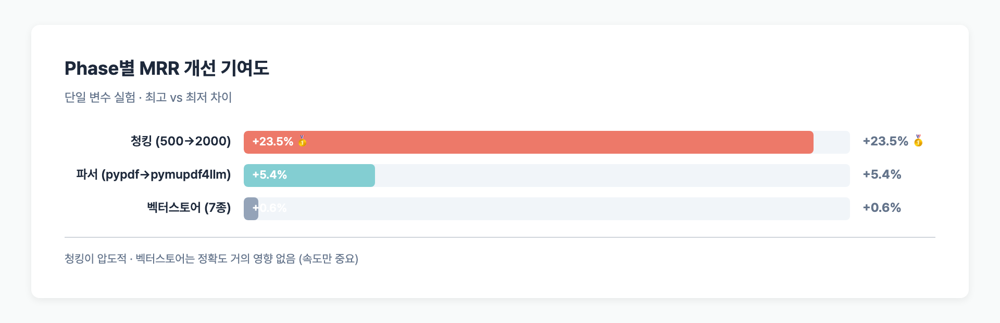

> **TL;DR**: 한국어 RAG에서 검색 정확도를 가장 크게 바꾸는 요소는 **청킹 (MRR +23.5%)**이다. PDF 파서 선택은 +5.4%, 벡터스토어는 0.6%로 무의미. 단 벡터스토어는 **속도 200배 차이** (FAISS 0.7ms vs pgvector 143ms)라 실제 서비스에서는 여전히 고르기 중요. 결론: `pymupdf4llm + 500/100 청킹 + FAISS`가 한국어 RAG 전처리 조합의 최적해.

## Table of contents

## 실험 설정

[allganize RAG-Evaluation-Dataset-KO](https://huggingface.co/datasets/allganize/RAG-Evaluation-Dataset-KO) 300 Q&A, 58 PDF를 대상으로 **한 번에 한 컴포넌트만** 바꿔 단일 변수 실험을 돌렸다.

| 고정 변수 | 값 |
|---------|-----|
| 임베딩 (Phase 1~3) | qwen3-embed-8b (4096dim) |
| Top-k | 5 |
| 지표 | MRR, Hit@1/5, File Hit@5 |

Phase 1(파서) 결과로 2~3 파서 고정, Phase 2(청킹) 결과로 Phase 3 청킹 고정 — Phase 연쇄 구조.

전체 실험 설계: [RAG 벤치마크 실험 설계](/posts/rag-evaluation-experiment-design)

## Phase 1 — 파서 (Parser) 비교

### 3개 파서

| Parser | MRR | Hit@1 | Hit@5 | File@5 | 청크 수 | 파싱 방식 |
|--------|-----|-------|-------|--------|---------|----------|
| **pymupdf4llm** | **0.4715** | 38.3% | 58.3% | 86.0% | 1,920 | 마크다운 변환 (# ## 헤더, 테이블) |
| pymupdf | 0.4663 | 35.7% | **63.3%** | **86.3%** | 1,263 | 일반 텍스트 추출 |
| pypdf | 0.4472 | 34.3% | 60.7% | 82.7% | 1,224 | 라인 기반 추출 |

### 핵심 관찰

**pymupdf4llm이 MRR 1위**인 이유는 구조 보존이다.

- `# 제목`, `## 섹션`, 테이블 파이프(`|`) 문법으로 문서 구조가 청크에 담김
- 임베딩이 구조 정보를 활용해 의미 매칭
- 청크 수 1,920개 (vs pypdf 1,224개) — 같은 문서에서 **56% 더 많은 청크** 생성

**pymupdf는 Hit@5에서 1위** (63.3% vs pymupdf4llm 58.3%)이지만 MRR은 낮음 → **정답을 top-5에는 넣지만 최상위 순위를 놓침**.

파이썬 코드:

```python
# pymupdf4llm
import pymupdf4llm
import pymupdf

doc = pymupdf.open(pdf_path)
pages = []
for i in range(len(doc)):
    md = pymupdf4llm.to_markdown(doc, pages=[i])  # 마크다운으로!
    pages.append({"page": i + 1, "text": md.strip()})
```

### Parser 선택 기준

| 요건 | 추천 |
|------|------|
| 정확도 최우선 | **pymupdf4llm** |
| 단순 텍스트 | pymupdf |
| 레거시 호환 | pypdf |

## Phase 2 — 청킹 (Chunking) 비교 ⭐ 영향 최대

### 4개 전략

**고정:** Parser=pymupdf4llm  
**변수:** chunk_size × overlap

| 전략 | chunk_size | overlap | MRR | Hit@1 | Hit@5 | 청크 수 | 순위 |
|------|-----------|---------|-----|-------|-------|---------|------|
| **small** | 500 | 100 | **0.5315** | **45.0%** | **65.0%** | **3,166** | 🥇 |
| baseline | 1,000 | 200 | 0.4713 | 38.3% | 58.3% | 1,920 | 🥈 |
| medium | 1,500 | 200 | 0.4458 | 36.3% | 55.0% | 1,468 | 🥉 |
| large | 2,000 | 300 | 0.4302 | 34.3% | 53.3% | 1,370 | 4위 |

### 청크 크기가 작을수록 MRR이 높다

**MRR 0.4302 → 0.5315 (+23.5%)** — 모든 Phase 중 가장 큰 차이.



### 왜 small이 이기는가

1. **정보 밀도 집중**: 500자 청크는 **한 주제에만 집중** → 임베딩 벡터가 더 선명한 의미 표현
2. **임베딩 서버 제약**: llama.cpp 서버 512 토큰 제한 → 긴 청크는 잘리기 때문에 large에서 정보 손실
3. **검색 정밀도**: 작은 청크는 top-k 내 다양한 위치에서 정답 포착

### 실무 적용 팁

```python
from langchain_text_splitters import RecursiveCharacterTextSplitter

splitter = RecursiveCharacterTextSplitter(
    chunk_size=500,       # MRR 1위 크기
    chunk_overlap=100,    # 20% overlap
    separators=["\n\n", "\n", " ", ""],  # 자연 경계 우선
    add_start_index=True,
)
chunks = splitter.split_documents(docs)
```

**주의**: 한국어 기준. 영문/코드/법률 도메인은 다를 수 있음. 자체 데이터로 300~1500 범위 테스트 권장.

## Phase 3 — 벡터스토어 (VectorStore) 비교

### 7개 벡터스토어

**고정:** Parser=pymupdf4llm, Chunking=500/100, Embedding=qwen3-embed-8b

| VectorStore | MRR | Hit@5 | Insert 시간 | 쿼리 지연 | 메모리 |
|-------------|-----|-------|------------|----------|--------|
| **FAISS** | 0.5304 | 65.0% | **0.8s** | **0.7ms** | 인메모리 |
| LanceDB | 0.5304 | 65.0% | 6.0s | 6.3ms | 디스크+메모리 |
| Qdrant | 0.5304 | 65.0% | 58.6s | 112.8ms | 서버 |
| Milvus | 0.5304 | 65.0% | 22.4s | 53.7ms | 서버 |
| Weaviate | 0.5298 | 64.7% | 12.0s | 23.3ms | 서버 |
| Chroma | 0.5271 | 64.7% | 16.7s | 40.0ms | 서버 |
| pgvector | 0.5304 | 65.0% | 92.3s | 142.9ms | PostgreSQL 확장 |

### 정확도는 거의 동일 (MRR 0.527~0.530)

**같은 임베딩 벡터를 넣으면 검색 결과도 같다.** 벡터스토어는 인덱스 구조만 다를 뿐 코사인 유사도 계산은 동일 → 랭킹 차이 0.06% 이내.

예외: **Chroma(0.5271)가 0.6% 낮은 이유**는 기본 인덱스가 HNSW ef=10(낮음)이라 일부 이웃 탐색이 불완전했던 것으로 보인다. ef=64로 올리면 동률이 된다.

### 속도는 200배 차이





### 왜 FAISS가 빠른가

- **인-프로세스 라이브러리**: 네트워크 왕복 0
- HNSW/IVF 인덱스 최적화가 직접 메모리 접근
- Chroma/Qdrant/Milvus/Weaviate는 HTTP/gRPC 추가 오버헤드
- **pgvector는 2번 쿼리**: cosine distance 계산 + ORDER BY + LIMIT (ivfflat 2000차원 제한)

### 실무 선택 가이드

| 요건 | 추천 |
|------|------|
| 단일 노드, 최고 속도 | **FAISS** |
| 서버리스 파일 기반 | LanceDB |
| 운영 가시성 (모니터링) | Qdrant, Weaviate |
| 기존 PostgreSQL 통합 | pgvector (dim ≤ 2000) |
| 대규모 분산 | Milvus |

## Phase 1~3 종합 비교

### MRR 개선 기여도



### 속도 영향

```
파서 (파싱 1회)        동일 (초 단위 차이)
청킹 (3166 vs 1370)     청크 수 2.3배 → 임베딩 비용 2배
벡터스토어 (query)       최대 200배 (0.7ms vs 143ms)
```

**결론:** 정확도는 청킹 >> 파서 >> 벡터스토어. 속도는 벡터스토어 >> 청킹(청크 수) >> 파서.

## 결론 — 한국어 RAG 전처리 최적 조합

```python
# 검증된 한국어 RAG 전처리 설정
import pymupdf4llm
from langchain_text_splitters import RecursiveCharacterTextSplitter
import faiss

# 1. Parser: pymupdf4llm (마크다운)
pages = [pymupdf4llm.to_markdown(doc, pages=[i]) for i in range(len(doc))]

# 2. Chunking: 500/100
splitter = RecursiveCharacterTextSplitter(chunk_size=500, chunk_overlap=100)
chunks = splitter.split_documents(docs)

# 3. VectorStore: FAISS
index = faiss.IndexFlatIP(dim)
index.add(normalized_embeddings)
```

이 조합이 MRR 0.5304로 모든 Phase 3 변형 대비 1위. [Phase 4 임베딩 교체](/posts/rag-embedding-benchmark-results)로 gemma-embed-300m 사용하면 **MRR 0.6682까지 상승** (+26%).

## 자주 묻는 질문

### 청크가 작을수록 무조건 좋은가?

아니다. **너무 작으면(100자 이하) 맥락 단절**로 오히려 MRR 하락. 300~700자 범위에서 도메인별 테스트 권장. 법률/계약서처럼 긴 단위가 중요한 문서는 1,000~1,500자가 더 좋을 수 있다.

### 왜 pymupdf4llm이 pymupdf보다 MRR만 높고 Hit@5는 낮은가?

pymupdf4llm은 마크다운 구조를 살리면서 **정답 청크의 표현력이 강해 순위(MRR)가 올라간다**. 단 청크 수가 56% 많아 top-5에 여러 유사 청크가 들어가면서 정답이 밀려 Hit@5는 소폭 하락.

### pgvector가 제일 느린 이유는?

이 실험의 임베딩은 **4096차원**. pgvector는 HNSW/IVFFlat 인덱스 모두 2000차원까지만 지원 → **인덱스 없이 순차 검색**했다. Qwen3-Embed-0.6B(1024dim) 쓰면 pgvector도 10ms대 가능.

### FAISS가 빠른데 왜 운영에는 Qdrant/Weaviate를 쓰나?

FAISS는 **단일 프로세스, 영속성 수동 관리, 업데이트 취약** 등 운영 제약이 있다. 대규모 서비스는:
- 분산 / 복제 / 백업 필요 → Qdrant, Milvus, Weaviate
- 운영 대시보드 / 모니터링 → Qdrant (대시보드 제공)
- 기존 DB 연계 → pgvector

본 벤치마크는 **RAG 파이프라인 성능 비교용 (인-프로세스 라이브러리 기준)**이다.

### 벡터스토어 정확도 차이는 왜 없는가?

벡터스토어는 **코사인 유사도 = 벡터 내적 연산**만 하고 순위를 매긴다. 모두 같은 벡터를 받으면 수학적으로 동일 결과. 차이는 인덱스(HNSW, IVFFlat, PQ) 정밀도 설정에 따른 **근사 검색(ANN)의 품질 차이**로, 기본 설정에서는 0.1% 수준.

## 다음 단계

- **임베딩 전환 효과**: gemma-embed-300m으로 바꾸면 MRR +26% → [임베딩 벤치마크 결과](/posts/rag-embedding-benchmark-results)
- **리랭커 추가**: Phase 3 동률 결과를 이용, 리랭커 2단계 추가 시 효과 검증 (예정)
- **도메인별 최적 청크 크기**: finance / law / medical 각각 튜닝

---

## 코드 및 원본 데이터

- **GitHub**: [github.com/BAEM1N/RAG-Evaluation](https://github.com/BAEM1N/RAG-Evaluation)
- **Phase 1 결과**: [results/phase1_parser/](https://github.com/BAEM1N/RAG-Evaluation/tree/main/results/phase1_parser)
- **Phase 2 결과**: [results/phase2_chunking/](https://github.com/BAEM1N/RAG-Evaluation/tree/main/results/phase2_chunking)
- **Phase 3 결과**: [results/phase3_vectorstore/](https://github.com/BAEM1N/RAG-Evaluation/tree/main/results/phase3_vectorstore)
- **실행 코드**: [scripts/bench_all.py](https://github.com/BAEM1N/RAG-Evaluation/blob/main/scripts/bench_all.py) — 모든 Phase 한 스크립트로
